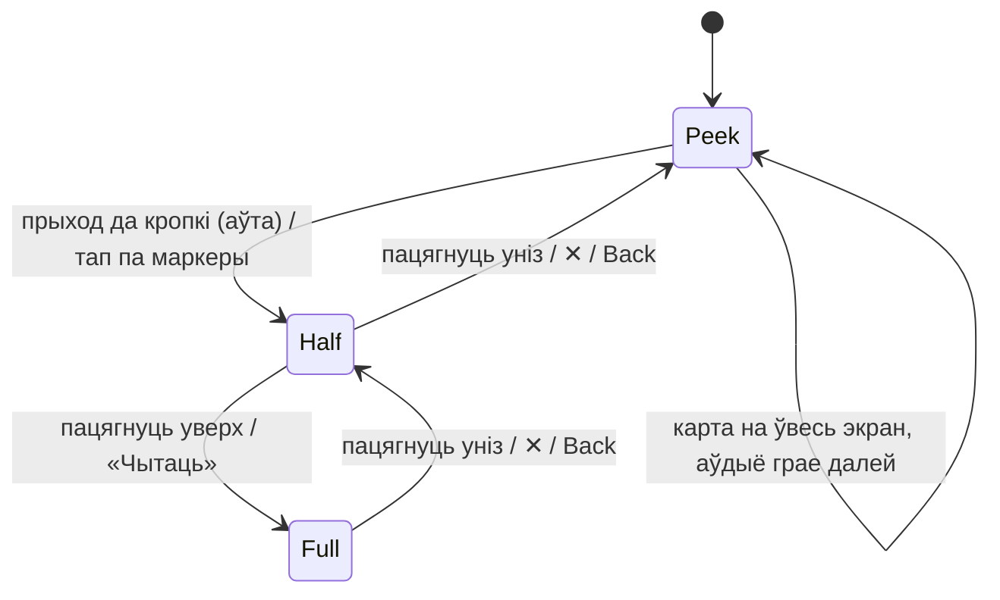
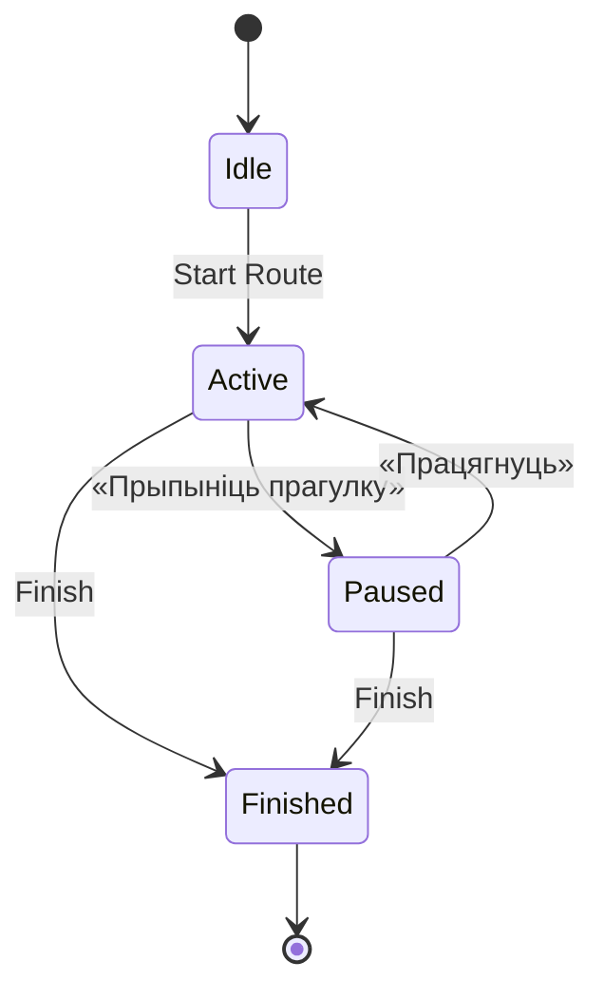

# KUDY — мадэль узаемадзеяння Run (карта + панэль гісторыі)

Удакладненні пра меню **Горад → Гіды**, асобныя аўдыё і ручныя Moments — [15](15_guide_decisions.md); рэалізацыя раскладзена ў [16](16_delivery_backlog.md). P01 прынятая 2026-09-14 (варыянт A, [ADR G01.01](architecture/decisions/G01.01-narration-progress.md)) і сінхранізаваная ў гэтым файле; P02 застаецца прапановай да G01.02.

Выканальныя праверкі логікі на этапе дакументацыі: [мадэль, запуск і межы пакрыцця](run-model/README.md). Яны не замяняюць прыёмку на прыладзе.

Гэты файл фіксуе, як фізічна ўладкаваны экран прагулкі па маршруце (`Run`) і як ён паводзіць сябе ў кожным стане. Ён не адмяняе `01_product_structure.md` (IA і кантэнт-мадэль) і `03_user_journeys.md` (Journey 2), а дадае ім прапушчаны пласт: **узаемадзеянне і станы адной паверхні**.

**Сфера:** правілы Run датычацца абранай аўдыёпрагулкі, не ўсіх гарадскіх рубрык. Пачатак з любой кропкі і любы парадак дазволены; рэкамендаваны шлях неабавязковы.

Прычына існавання файла: спрэчка «карта ці гісторыя галоўная» — гэта не пытанне візуальнага густу, а пытанне навігацыйнай мадэлі. Няправільны выбар дае два розныя спосабы «выйсці», разыходжанне сістэмнай кнопкі Back і крыжыка, і аўдыё, прывязанае да экрана замест сесіі.

---

## 1. Змена IA: два месцы + адзін скразны рэжым

**Было** (`01`): тры раўнапраўныя раздзелы EXPLORE / MAP / MY KUDY.

**Стала:** у ніжняй навігацыі толькі два сапраўдныя месцы — **Explore** і **My KUDY**. Карта не таб, а **рэжым горада**, даступны з любога месца адной кнопкай, якая мяняе сэнс разам са станам:

| Стан | Подпіс кнопкі | Куды вядзе |
|---|---|---|
| Да старту маршруту | **Побач** | вольная прагулка + Moments (Journey 3) |
| Актыўная або прыпыненая прагулка | **Прагулка** | `Run`: карта маршруту + панэль гісторыі |
| Вяртанне падчас прайгравання | **Прагулка** | `Run` у тым становішчы панэлі, у якім чалавек яго пакінуў — не ў Explore |

Journey 3 ад гэтага не хаваецца: «Walk around Gdańsk» застаецца адной з галоўных куратарскіх прапаноў Explore і адкрывае вольную карту адным націскам.

**Дзве карты — адна аснова, розная мова.** Не называць абедзве «Map»:

|  | Вольная прагулка («Побач») | Маршрут (`Run`) |
|---|---|---|
| Пытанне карыстальніка | «што вакол мяне» | «што цікава ў гэтай прагулцы побач» |
| Маркеры | усе побач, раўнапраўныя | адкрытыя і замкнёныя кропкі; станы з разд. 3 |
| Панэль у Peek | «Побач: 3 месцы» | плэер: што грае, назва гісторыі |
| Галоўнае дзеянне | «Пачаць прагулку» | «Адкрыць кропку» |

---

## 2. Адна паверхня, тры становішчы

`Run` — **адзін экран**. Карта — прастора арыентацыі; гісторыя і плэер — пастаянны жывы пласт над ёй. Пераходаў між «рэжымам карты» і «рэжымам гісторыі» не існуе: ёсць адна панэль (bottom sheet) з трыма фіксаванымі вышынямі.

**Праблема, якую гэта здымае:** асобная старонка гісторыі стварыла б стос навігацыі і два розныя выхады (✕ і сістэмны Back) з рознай семантыкай. Тут выхад адзін і заўсёды азначае «на адно становішча ніжэй».

### Патрабаванні да становішчаў

| Становішча | Вышыня | Змест | Карта |
|---|---|---|---|
| **Peek** | вышыня плэер-паласы (72–88 pt) + safe area | што грае, play/pause, назва гісторыі, прагрэс тонкай лініяй, меню сесіі | галоўная візуальна, поўнасцю інтэрактыўная |
| **Half** | ≈45% вышыні экрана | прэв'ю кропкі: фота, назва, 1–2 радкі, працягласць, асноўнае дзеянне | верхняя палова бачная, панараваць можна |
| **Full** | увесь экран мінус статусны радок і ручка панэлі | поўная Story: тэкст, **транскрыпт**, відэа/Then&Now, гартанне зместу | схаваная, але не выгружаная |

**Абавязкова:**

- Плэер-паласа ў Peek **ніколі не знікае**, пакуль сесія не `finished`. Гэта якар: чалавек можа схаваць тэкст, паглядзець на карту, выйсці ў Explore — гучанне не перарываецца.
- Стан прайгравання належыць **сесіі**, не экрану (`09`, разд. 6.3: стан вылічваецца з плэера, не дублюецца).
- ✕ і сістэмны Back робяць адно і тое ж: `Full → Half → Peek`. З Peek Back выходзіць з `Run` у месца, адкуль прыйшлі, **не спыняючы аўдыё і не мяняючы сесію** — гэта навігацыя, а не кіраванне прагулкай (кіраванне — разд. 4).
- Жэст «пацягнуць» і кнопка ✕ — раўнапраўныя шляхі; ✕ існуе для тых, хто не цягне, і для дасяжнасці.
- Ніякага свайпу ад левага краю: на iOS ён забраны сістэмай пад «назад».
- Транскрыпт — **частка Full**, не пункт меню і не «accessibility feature». Прысутнічае заўсёды, калі ёсць аўдыё.

---

## 3. Слоўнік стану (нарматыўны)

Слоўнік адрознівае спрацоўванне, праслухоўванне і доступ да кантэнту. Тут тры незалежныя вымярэнні: **статус кропкі**, **што грае / што разглядаюць**, **стан сесіі**.

### 3.1 Статус кропкі — вылічаецца, не захоўваецца

Захоўваюцца **два манатонныя наборы** (толькі дадаюцца, ніколі не сціраюцца) і **адзін зменлівы паказальнік** плэера:

| Поле | Від | Значэнне | Ставіцца |
|---|---|---|---|
| `auto_fired: Set<stop_id>` | манатонны | аўтаматычная спроба гэтай кропкі скончана | толькі калі спроба сапраўды скончана: пры фактычным запуску або пры пераводзе ў ручны доступ (разд. 5.1.1). Пастаноўка ў чаргу і ігнараванне трыгера яго **не** чапаюць |
| `heard: Set<story_id>` | манатонны | канкрэтны наратыў (story) хоць раз дайшоў да канца | на прынятым `AudioFinished` гэтага story. Паўтор, перапыненне, паўза, пакупка, AccessReady і End яго не выдаляюць |
| `playing: { stop_id, story_id, play_id } \| null` | зменлівы | гучыць зараз: кропка `playing.stop_id`, наратыў `playing.story_id` | на кожным `PlayStory`, здымаецца на любым спыненні |

Адзінкі — [ADR G01.01](architecture/decisions/G01.01-narration-progress.md) §4.1–4.2: `auto_fired`, `queued` і статус кропкі — `stop_id`; `heard` — `story_id` (base і extended адной кропкі — незалежныя факты). Забароненыя сінонімы: `consumed`; захоўваны статус `played`; `heard` як набор `stop_id` (гісторыя да 2026-09-14).

Статус, які бачыць чалавек, **выводзіцца** з іх у гэтым парадку:

| Статус | Умова | Аўтазапуск адсюль |
|---|---|---|
| `locked` | не `story_accessible(primary_story_id)` — асноўны наратыў кропкі недаступны (paid-only кропка мае асноўным extended) | не; толькі адкрытае прэв’ю |
| `playing` | `playing.stop_id == stop_id` | — |
| `played` | `primary_story_id ∈ heard` | не |
| `available` | `stop_id ∈ auto_fired` і асноўны не ў `heard` | не |
| `pending` | інакш: `stop_id ∉ auto_fired` і `primary_story_id ∉ heard` | **так** |

**Чаму не захоўваць статус як зменлівае поле.** Папярэдняя версія рабіла `played → playing → available` пры перарваным паўторы — і даслуханая гісторыя станавілася прапушчанай на фінішы. Прычына была структурная: адно поле спрабавала апісваць і мінулае («чуў»), і цяперашняе («грае»). Тут яны разведзеныя, і перарваны паўтор фізічна не можа сцерці факт `heard`.

`available` — не памылка і не «прапушчана назаўсёды». Сюды кропка трапляе, калі аўтатрыгер быў выдаткаваны, а асноўная гісторыя цалкам не прагучала: выцеснена з чаргі, адкладзены запуск адхілены праз нясвежую пазіцыю, аўтаматычна запушчанае аўдыё спынена рукамі або іншай кропкай. Калі перарвана першае ручное прайграванне (кропка яшчэ не ў `auto_fired`, яе асноўны story не ў `heard`), статус вяртаецца ў pending.

**Ручны паўтор даступнага загружанага кантэнту дазволены заўсёды**, у тым ліку для `played` — кнопка называецца «Паслухаць яшчэ раз». Ён не чапае ні `heard`, ні `auto_fired`; перарваны паўтор проста вяртае кропку да таго статусу, які быў. Дадатковы наратыў («Яшчэ пра гэтае месца») запускаецца толькі яўным ручным Play (`UserSelectedStory`); яго праслухоўванне лічыцца ў `heard` асобна і не мяняе маркер кропкі, бо той крыніцу мае ў асноўным story (ADR §4.3, §4.5).

**«Яшчэ можна адкрыць»** — на `Finish`: усе `story_id` з `story_accessible`, што належаць кропкам маршруту і не ў `heard`; замкнёныя выключаныя. Гэта магчымасці, не пропускі або памылкі. Адзінка спісу — story: калі ў кропкі ёсць дадатковы наратыў, ён з'яўляецца асобным радком нават пры маркеры `played` кропкі. Гісторыя: да 2026-09-14 спіс быў stop-level («даступныя кропкі не ў heard») і мог існаваць толькі пры адным наратыве на кропку; адзінку пераведзена на story прынятым ADR G01.01 (§4.6).

### 3.2 Што грае і што разглядаюць — розныя рэчы

Два незалежныя паказальнікі:

- **`nowPlaying`** (вытворны з `playing`: кропка — `playing.stop_id`, назва гісторыі — `playing.story_id`) — чый наратыў гучыць. Ім кіруе плэер-паласа ў Peek і lock-screen.
- **`inspected: stop_id?`** — чыя картка адкрытая ў панэлі. Ім кіруе Half/Full: тэкст, фота, транскрыпт, гартанне.

Правілы:

| Сітуацыя | Плэер-паласа (Peek) | Панэль (Half/Full) |
|---|---|---|
| Аўтатрыгер кропкі 2 | кропка 2 | `inspected = 2`, Peek → Half |
| Нічога не грае | «побач: Назва · 300 м» | `inspected` — што апошняе адкрывалі |
| Грае 2, чалавек тапнуў 7 | застаецца кропка 2 | `inspected = 7`, зверху радок **«Зараз грае: 2 · Назва»** з тапам вяртання |

- **Транскрыпт заўсёды належыць `inspected`**, не `nowPlaying`. Інакш чалавек чытае адно, а бачыць другое.
- **Play на кропцы 7 пры граючай 2:** 2 спыняецца адразу (інварыянт «два наратывы ніколі адначасова»), 7 → `playing`. Кропка 2 вяртаецца да вылічанага статусу: `played`, калі heard; `available`, калі auto_fired; іначай `pending` (перарванае першае ручное прайграванне). Без дыялогу-падцвярджэння: дзеянне бачнае і зваротнае, а мадальнае акно тут — шум.
- **Кнопка «далей» у Full гартае змест** (наступны элемент рэкамендаванага спіса) і **не** з'яўляецца камандай плэеру. Кіраванне прайграваннем жыве толькі ў паласе Peek і на lock-screen (prev/next = яўны выбар даступнага аўдыё ў рэкамендаваным спісе; не каманда ісці туды).

### 3.3 Стан сесіі

Адначасова актыўнай можа быць **толькі адна** сесія маршруту.

---

## 4. Пачатак, паўза, завяршэнне

### 4.1 Start

`Start Route` — адзінае месца, дзе ўключаецца аўтаматыка. Ён: ставіць сесію ў `Active`, узбройвае акно геафенсаў, бярэ wakelock паводле правіла разд. 6, і адзін раз агучвае абяцанне пра аўтазапуск (разд. 5).

**Старт іншага маршруту пры актыўнай або прыпыненай сесіі** дае адзін дыялог: «Завяршыць “Royal Gdańsk” і пачаць “The Shipyard”?» — з выбарам **Завяршыць і пачаць** / **Скасаваць**. Ціхае перамыканне забаронена: чалавек страціў бы кантэкст бягучай прагулкі.

### 4.2 Паўза ўсёй прагулкі

Кнопка **«Прыпыніць прагулку»** — у меню сесіі ў паласе Peek (побач з «Завяршыць»). Гэта не тое самае, што паўза аўдыё.

Паўза сесіі робіць усё адразу: спыняе аўдыё, **ачышчае чаргу**, здымае геафенсы і падпіску на пазіцыю, адпускае wakelock, захоўвае прагрэс. Панэль у Peek паказвае «Прагулка прыпынена» і адно дзеянне **«Працягнуць»**.

Сэнс: чалавек сеў абедаць ці паехаў у гатэль — батарэя і GPS яму зараз не патрэбныя, а маршрут губляць нельга. Аўтазапуск у `Paused` немагчымы паводле разд. 5.

### 4.3 Finish

«Завяршыць прагулку» даступна ў любы момант, нават пасля адной гісторыі. Няма патрабавання дайсці да апошняга нумара або пацвярджаць «прапушчаныя» кропкі. Другі шлях — пацверджаны старт іншай прагулкі (разд. 4.1). AudioFinished ніколі не завяршае сесію сам.

`Finish` спыняе аўдыё, геафенсы і падпіску на пазіцыю, адпускае wakelock, ачышчае чаргу, захоўвае вынік і паказвае экран завяршэння. «Яшчэ можна адкрыць» вылічаецца толькі з даступных загружаных непраслушаных гісторый (адзінка — `story_id`); замкнёныя не ўваходзяць.

`Finished` **не рэактывуецца**. Паўторны праход таго ж маршруту — новая сесія (новы `session_id`) з чыстымі наборамі; папярэдні праход застаецца ў гісторыі My KUDY.

**Сама сесія не завяршаецца па таймеры.** Але пры адкрыцці дадатку з сесіяй старэйшай за 24 гадзіны пытаемся адзін раз: «Прагулка “X” пачатая ўчора — працягнуць ці завяршыць?». Вечна актыўная сесія, якая трымае геафенсы, — горшы варыянт, чым адно пытанне.

---

## 5. Аўтазапуск: адно абяцанне, потым цішыня

**Рашэнне:** аўтаматычнае прайграванне ўключаецца **толькі пасля яўнага Start Route** і абвяшчаецца адзін раз, на картцы гатоўнасці:

> «Гісторыі будуць запускацца самі, калі вы падыдзеце да кропкі.»

Пасля гэтага — ніякіх пытанняў. Мадальнае «прайграць гісторыю? Так/Не» перад кожнай кропкай забівае ўсю каштоўнасць прадукту: сэнс KUDY у тым, што горад пачынае гаварыць сам, а не ў тым, што ў чалавека ёсць плэйліст.

**Да старту і ў вольнай прагулцы аўтазапуску няма.** Тап па кропцы адкрывае толькі прэв'ю.

### 5.1 Умовы неадкладнага аўтазапуску (усе адначасова)

1. Сесія ў стане `Active` (не `Idle`, не `Paused`, не `Finished`).
2. **`autoplay_suspended = false`** (разд. 5.2).
3. Нічога не грае (`playing = null`).
4. Кропка мае вылічаны статус `pending`, то бок `stop_id ∉ auto_fired` і яе **асноўны** story не ў `heard` (ADR G01.01 §4.8.4). Праверка `heard` тут абавязковая: ручное прайграванне `auto_fired` не чапае, і без яе гісторыя, паслуханая рукамі загадзя, зайграла б яшчэ раз пры падыходзе. Дадатковы наратыў кропкі, які быў у `heard`, аўтазапуск асноўнага **не** блакуе.
5. Пазіцыя, па якой прынята рашэнне, **свежая**: узрост фіксу ≤ 30 с і `accuracy ≤ trigger_radius`.
6. Кропка мае гатовы дазволены кантэнт у версіі сесіі; геалакацыя пацвердзіла знаходжанне ў радыусе і dwell. Нумар кропкі і кірунак падыходу не з’яўляюцца ўмовамі.

### 5.1.1 Што адбываецца, калі ўмова не выканана

Раней тут быў адзін адказ на ўсе выпадкі — «кропка → `available` + `auto_fired`». Ён і ламаў чаргу: адкладзены трыгер патрабаваў `pending`, а сам жа сябе з `pending` і выводзіў. Выпадкі разведзеныя:

| Умова, што не выканана | Вынік | `auto_fired` |
|---|---|---|
| **6** — замкнёная кропка або кантэнт не гатовы | ігнаруецца; адкрытае прэв’ю даступнае | не ставіцца |
| **3** — плэер заняты | у **чаргу** (разд. 5.3); кропка застаецца `pending` | **не** ставіцца |
| **2** — аўтаматыка прыпыненая (паўза, званок) | **ручны доступ:** кропка → `available`, у паласе радок «Кропка 5 гатовая — паслухаць» | ставіцца |
| **1** — сесія не `Active` | трыгер **ігнаруецца** цалкам; папярэдні статус не мяняецца | не ставіцца |
| **5** — пазіцыя нясвежая | трыгер ігнаруецца; чакаем наступны прыдатны фікс | не ставіцца |
| **4** — ужо ў `auto_fired`, або асноўны story кропкі ўжо ў `heard` | трыгер ігнаруецца (інварыянт «не двойчы» / «ужо чуў») | ужо там або не патрэбны |

Пры некалькіх няўдалых умовах спачатку адхіляем неактыўную сесію, непрыдатную кропку/доступ і пазіцыю; затым правяраем suspended, толькі пасля — занятасць плэера. Ігнараванне захоўвае папярэдні статус, не ператварае played або locked у pending.

Ключавое правіла: **`auto_fired` ставіцца толькі там, дзе аўтаматычная спроба сапраўды скончана** — то бок пры фактычным запуску або пры пераводзе ў ручны доступ. Чарга і ігнараванне яго не чапаюць, таму кропка застаецца прыдатнай для наступнага спрацоўвання. Усюды, дзе сказана «кропка → `available`», маецца на ўвазе запіс `stop_id` у `auto_fired`; бачны статус заўсёды вылічаецца паводле разд. 3.1, таму пры асноўным story ў `heard` кропка паказваецца як `played`, а не як `available`.

### 5.2 Блакіроўка аўтазапуску (`autoplay_suspended`)

Раней «нічога не грае» было адзінай умовай — і гэта ламала абяцанне «пасля званка аднаўленне па тапе»: наступная кропка магла загаварыць сама пасярод размовы.

**Ставіцца ў `true`:** ручная паўза або стоп аўдыё · `FocusLoss` (званок, іншае аўдыё) · пераход сесіі ў `Paused`.

**Здымаецца толькі яўным дзеяннем чалавека:** Play / Resume у паласе або на lock-screen · ручное прайграванне любой кропкі (асноўны або дадатковы наратыў) · «Працягнуць» пасля паўзы сесіі.

Пакуль сцяг стаіць, `Run` не маўчыць моўчкі: у паласе Peek бачны радок «Аўтаматычныя гісторыі прыпыненыя — Працягнуць».

### 5.3 Чарга: адна ячэйка, найноўшы трыгер

Трыгер, які прыйшоў падчас іншага наратыву, кладзецца ў чаргу з **адной** ячэйкі.

- **Прыйшоў другі, іншы stop, пакуль чарга занятая** — у ячэйцы застаецца **найноўшы** (па часе; не гарантыя найменшай адлегласці); выцеснены трапляе ў `auto_fired` (яго аўтаматычная спроба скончана, застаецца ручны доступ), а статус — вылічаны паводле разд. 3.1.
- **Пасля `AudioFinished`** адкладзены трыгер грае толькі калі выкананыя ўмовы 1, 2, 4, 5 разд. 5.1 і чалавек усё яшчэ ў межах `2 × trigger_radius`, а кантэнт па ўмове 6 даступны. Пры запуску кропка трапляе ў `auto_fired`. Калі за час у чарзе чалавек даслухаў яе асноўны наратыў рукамі, умова 4 ужо не трымаецца: чарга не грае, `stop_id` дадаецца ў `auto_fired`, а статус кропкі застаецца вылічаным паводле разд. 3.1 — `played`, бо асноўны story ўжо ў `heard` (ADR G01.01 §4.9).
- **Калі праверка не прайшла** (нясвежая пазіцыя, чалавек адышоў, аўтаматыка прыпыненая) — кропка пакідае чаргу: `stop_id` трапляе ў `auto_fired`, а статус застаецца вылічаным паводле разд. 3.1 (звычайна `available`, але `played`, калі асноўны story за час у чарзе ўжо ў `heard`). Тут спроба сапраўды скончана, у адрозненне ад пастаноўкі ў чаргу.
- **Пасля страты GPS** адкладзены запуск немагчымы: старая каардыната не з'яўляецца доказам, што чалавек яшчэ там. Гэта прамая ўмова 5.1.5.
- **Паўза сесіі і `Finish`** ачышчаюць чаргу: `stop_id` з ячэйкі трапляе ў `auto_fired`, а статус застаецца вылічаным паводле разд. 3.1 (звычайна `available`, але `played`, калі асноўны story за час у чарзе ўжо ў `heard`).

Прычына ўсяго блока: у нас пешаход, а не аўтобус. Але пешаход, які ўжо адышоў на квартал, не мусіць раптоўна пачуць «паглядзіце направа» пра будынак за спіной. Маўчанне менш шкоднае, чым няправільны кантэкст.

### 5.4 Перарыванне і кіраванне звонку

Кожная гісторыя кропкі — асобны аўдыёфайл. Ручны паўтор з пачатку дапушчальны; пасля закрыцця працэсу дакладны offset не патрабуецца. Гэта не дазвол паўтарыць аўтатрыгер або залічыць перапынены файл як heard. Пазіцыя звычайнай паўзы ў жывым плэеры і адзіны плэер для Moments удакладняюцца ў G01.02 (`16`); не блытаць паўзу сесіі з выхадам з экрана.

- Званок / іншае аўдыё: аўдыясесія ў **speech**-рэжыме, ducking і focus аддаём OS. Пасля званка — **не аўтапрацяг**: паласа паказвае «паўза», `autoplay_suspended = true`, аднаўленне па тапе.
- `FocusRegain` пазней за 10 хвілін не аднаўляе кропку, а пакідае яе ў вылічаным статусе (`played`, калі ўжо heard) (`09`, інварыянт 5).
- Lock-screen: prev/next = яўны выбар даступнага аўдыё ў рэкамендаваным спісе (locked прапускаецца без змены прагрэсу), не перамотка ўнутры файла. Гэта яўныя дзеянні — яны здымаюць `autoplay_suspended`.
- Пазіцыя ў мілісекундах, не 0..1 (`09`, урок TourForge: 0..1 дало NaN).

---

## 6. Карта ў Run

- **Два віды маркераў, візуальна розныя.** Кропка, якая гаворыць (stop маршруту), і кропка, якая проста ёсць (кава, прыбіральня, транспарт). Аднолькавы выгляд = чалавек тапае па кавярні і чакае гісторыі — прама названая памылка TourForge.
- **Пяць станаў stop'а на карце (без абавязковага next)**, кожны мяняецца ў рэальным часе па падзеі engine:

| Стан маркера | Крыніца | Момант змены |
|---|---|---|
| `playing` | `playing.stop_id == stop_id` | каманда `PlayStory` |
| `played` | `primary_story_id ∈ heard` (асноўны story кропкі праслуханы) | `AudioFinished` асноўнага (назаўсёды ў сесіі) |
| `available` | `stop_id ∈ auto_fired`, але асноўны не ў `heard` | выцясненне з чаргі, адхілены адкладзены запуск, ручны доступ пры прыпыненай аўтаматыцы |
| `pending` | гатовая да аўтазапуску кропка | пасля загрузкі / адкрыцця доступу |
| `locked` | кантэнт яшчэ не даступны | аплата сама не здымае замок; толькі пацверджаны доступ + поўная загрузка |

Маркер — адзінка кропкі з крыніцай у асноўным story (ADR G01.01 §4.5): непраслуханы дадатковы **не** вяртае маркер у `pending` і не робіць кропку «недаслуханай». Картка кропкі з дадатковым наратывам паказвае стан абедвух гісторый, напрыклад «асноўная праслуханая · дадатковая яшчэ не».

Усе `pending` раўнапраўныя для запуску. Рэкамендаваная паслядоўнасць — падказка, не асобны статус. `available` — спакойны намёк, не чырвань і не «памылка». Слова «прапушчана» на карце не ўжываецца (разд. 3.1).

- **Рэкамендаваны шлях** можна паказаць на карце як неабавязковы. Прайсці яго назад або сысці з яго — тая самая прагулка.
- **`deviated` не будуецца:** чалавек не абавязаны трымацца лініі; паведамлення «вы збочылі» няма.
- **Атрыбуцыя ODbL** — бачная на экране карты і клікальная. Гэта ліцэнзійны абавязак, не дэкор.
- **Wakelock** — толькі ў `Active`, толькі калі экран `Run` на пярэднім плане. `Paused`, `Finished` і фон яго адпускаюць.

---

## 7. Дэградацыя: тая ж паверхня, чэсны стан

Прынцып з `09`, разд. 9.1: **сказаць уголас + ручны шлях + аднаўленне сесіі**. Ніякіх новых экранаў — тая ж карта і тая ж панэль.

| Збой | Што бачыць чалавек | Дзеянні |
|---|---|---|
| Дазвол «у фоне» не дадзены / забраны | у Peek радок «аўтаматычныя гісторыі не працуюць — я не бачу вашай пазіцыі» | панэль у Half паказвае спіс кропак, кожная прайграецца рукамі |
| Працэс быў забіты (force-stop, перазагрузка) | пры вяртанні: «Працягнуць захаваную прагулку?» | чытаем `session` з durable-зоны, перазбройваем акно геафенсаў; статусы кропак адноўленыя |
| Страта GPS падчас Run | пазіцыя на карце пазначана як састарэлая + радок у Peek | **не мадальнае акно**; аўтазапуск і чарга заблакаваныя (5.1.5), ручное прайграванне даступнае |
| Battery saver / нізкі зарад | папярэджанне **да** старту на картцы гатоўнасці | не блакуе, але тлумачыць наступствы |
| Няма месца ў сховішчы | на этапе загрузкі, з лічбай «трэба яшчэ N МБ» | кіраванне сховішчам — у My KUDY |

**Ручны рэжым — паўнавартасны шлях, не аварыйны.** Той самы код, што і GPS-трыгер (`09`: адзін шлях для GPS і для ручнога тапу).

### Картка гатоўнасці перад стартам

Адна картка **«Гатова да прагулкі»**, не чатыры забароны:

- **Крытычнае блакуе старт:** выбраны пакет не загружаны і не правераны цалкам. Закрыты extended не патрабуецца для бясплатнага Start. Частковы старт магчымы толькі пасля асобнага будучага рашэння.
- **Астатняе папярэджвае і прапускае:** няма фонавага дазволу (→ ручны рэжым апісаны тут жа), battery saver, нізкі зарад, няма сеткі.
- Тут жа адзін раз гучыць абяцанне пра аўтазапуск (разд. 5).

---

## 8. Камерцыйны пласт унутры панэлі

Спакойная картка дазволена **ўнізе апісання кропкі, апісання маршруту і экрана завяршэння**. Не патрабуе папярэдняга AudioFinished. Не адкрывае панэль сама і не перапыняе аўдыё. У Run паказваецца толькі ў адкрытым Full пры `nowPlaying = null`, калі пашырэнне яшчэ не куплена і чалавек не выбраў Continue free ў гэтай сесіі.

- Замкнёная кропка мае толькі публічнае прэв'ю: назва, месца, кароткі анонс. Поўны тэкст, транскрыпт і медыя не загружаюцца ў бясплатны пакет. Пазнака замка застаецца незалежна ад бачнасці камерцыйнай карткі.
- Два выхады прапановы: **Continue free** і **Unlock**. Яўная адмова хавае прапанову да канца сесіі; свядома адкрыць пакупку з замка можна зноў.
- Аўтатрыгер мае прыярытэт: аўдыё запускаецца, картка хаваецца. Факт рэальнага паказу не сціраецца з аналітыкі; гэта не адмова чалавека. Пасля аўдыё картка можа быць бачная пры выкананні тых самых умоў, без аўтаадкрыцця панэлі.
- Памылка аплаты: **Try again** / **Continue free**, без страты прагрэсу і без новай логікі пасля трэцяй спробы.
- Пасля аплаты: **«Куплена · трэба загрузіць»**, пакуль сервер не выдаў доступ і загрузка цалкам не правераная. Паўтор загрузкі не патрабуе паўторнай аплаты. Толькі давераны сэрвіс загрузкі выдае `AccessReady(version, stop_ids)`; UI не можа выдаць доступ сам.
- Пашырэнне мусіць супадаць з версіяй сесіі. Версія захоўваецца да завяршэння, у тым ліку пасля рэстарту і на наступны дзень. Іншая версія патрабуе новай сесіі; адсутнасць патрэбнай версіі паказваецца як недаступная загрузка, без падмены кантэнту.
- Адкрыццё доступу не скідае прагрэс і не запускае аўдыё. Геафенсы пералічваюцца для новых даступных кропак; наступная свежая пазіцыя і dwell могуць запусціць іх паводле агульных правілаў, без патрабавання выйсці з зоны і вярнуцца.
- Restore Purchases — у My KUDY праз акаўнт крамы. Магчымая будучая рэклама і асобны прадукт без рэкламы яшчэ не спраектаваныя; пакупка маршруту сама па сабе купляе кантэнт, не адключэнне рэкламы.

---

## 9. Дракон, дасяжнасць, дэталі

- Дракон **не паведамляе нічога крытычнага самастойна**. Ён узмацняе тэкставы стан, ніколі не замяняе яго. Пры `prefers-reduced-motion` — нерухомая версія з тым самым тэкстам.
- Мінімальная зона тапу 44 pt; усе асноўныя дзеянні ў ніжняй трэці экрана (адна рука).
- Транскрыпт заўсёды, не па запыце.
- UI-лакалізацыя (`be`, `en`) — з першага экрана, ніводнага зашытага радка.
- Пры завяршэнні — цёплы вынік паводле рэальна адкрытых гісторый, без сцвярджэння, што чалавек прайшоў увесь маршрут. «Яшчэ можна адкрыць» — неабавязковая прапанова.

---

## 10. Пласты станаў

Не адзін плоскі спіс з дваццаці экранаў, а пяць незалежных пластоў, якія складаюцца:

1. **Стан дадатку:** першы запуск, мова, згода на аналітыку, сетка.
2. **Гатоўнасць маршруту:** дазволы, батарэя, загрузка, новая версія кантэнту.
3. **Сесія прагулкі:** `Idle` · `Active` · `Paused` · `Finished` (разд. 3.3).
4. **Прайграванне:** `playing` · `inspected` · `autoplay_suspended` · `heard` / `auto_fired` (разд. 3).
5. **Камерцыйны пласт:** прапанова пашырэння · пакупка · памылка · аднаўленне пакупак.

«Актыўны маршрут + няма фонавага дазволу + аўдыё перарвана званком» — не новы экран, а тры адначасовыя ўмовы аднаго `Run`.

---

## 11. Адлюстраванне на код

| Элемент | Дзе жыве |
|---|---|
| Становішча панэлі (Peek/Half/Full), `inspected` | UI-стан у `useRunController`; **не** ў engine |
| Стан сесіі `Idle/Active/Paused/Finished` | `core/engine`; персістуецца ў durable-зоне |
| `auto_fired: Set<stop_id>`, `heard: Set<story_id>` (манатонныя), `playing` (зменлівы) | `core/engine` + SQLite; наборы перажываюць force-stop |
| `autoplay_suspended` | `core/engine`: ставіцца на `PauseAudio`/`FocusLoss`/`Pause`, здымаецца толькі `UserCommand` |
| `play_id` — ідэнтычнасць запуску ў пары з `session_id` | `core/engine`: расце на кожны `PlayStory`; `AudioFinished` з іншай парай `(session_id, play_id)` ігнаруецца |
| Чарга (адна ячэйка, найноўшы) | `core/engine`: `queued`; кропка ў чарзе **не** трапляе ў `auto_fired` да зыходу з яе |
| Яшчэ можна адкрыць | пры `Finish`: даступныя загружаныя непраслушаныя гісторыі, адзінка `story_id`, без locked |
| Ручное прайграванне і паўтор | той самы `UserSelectedStop` (асноўны) або `UserSelectedStory` (названы наратыў), што і GPS-трыгер; `heard` не сціраецца |
| Гісторыя праходаў | асобны радок `session` на кожны праход, ключ `session_id` (`09`, разд. 7) |
| Умовы паказу карткі пашырэння | UI вылічае з адкрытага апісання, прайгравання, пакупкі і адмовы; engine не камандуе паказваць рэкламу |

Становішча панэлі наўмысна **не** ў engine: сімулятар (`09`, разд. 11) тэстуе логіку прагулкі, а не вышыню шухляды. Мадэль правярае толькі пераходы engine; UI, сховішча і серверны доступ патрабуюць асобнай рэалізацыі і праверак.

---

## 12. Крытэрыі прыёмкі

Правяраецца на прыладзе або ў сімулятары, кожны пункт — так/не.

**Асноўны праход**

1. Тап па маркеры ніколі не запускае аўдыё сам.
2. Пасля Start Route уваход у зону кропкі запускае аўдыё без ніводнага дадатковага пытання.
3. ✕ і сістэмны Back з Full абодва даюць Half; з Half абодва даюць Peek.
4. Аўдыё не спыняецца пры змене становішча панэлі і пры выхадзе з `Run`.

**Статусы і паўтор**

5. Кропка, чый аўтатрыгер выдаткаваны без прайгравання, паказваецца як `available` **адразу**, а не толькі на фінішы.
6. Аўтаматычна кропка не запускаецца двойчы ніколі; рукамі яна прайграецца колькі заўгодна, у тым ліку пасля `played` («Паслухаць яшчэ раз»).
7. **Перарваны паўтор не сцірае факт праслухоўвання:** даслухаў кропку 3 → запусціў яе зноў → спыніў на сярэдзіне → яна застаецца `played`, і праслуханая гісторыя **не** з'яўляецца зноў у «Яшчэ можна адкрыць».
8. Кропка, пастаўленая ў чаргу, **не** трапляе ў `auto_fired` да зыходу з чаргі: пасля заканчэння бягучай гісторыі яна яшчэ можа зайграць.
9. Трыгер пры неактыўнай сесіі ігнаруецца цалкам — пасля Resume той самы ўваход у зону запускае гісторыю.
10. Спозненае `AudioFinished` не завяршае чужы запуск — ні паўтор той самай гісторыі ў гэтай сесіі, ні аднолькавы `play_id` з папярэдняй прагулкі (правяраецца пара `(session_id, play_id)`).
11. На экране завяршэння «Яшчэ можна адкрыць» змяшчае роўна даступныя загружаныя непраслушаныя гісторыі (адзінка — `story_id`, у тым ліку дадатковыя наратывы кропак); locked не ўваходзяць.
12. Гісторыя, паслуханая рукамі загадзя (яе `story_id` у `heard`), пры фізічным падыходзе да кропкі **не** запускаецца аўтаматыкай паўторна.

**Сесія**

13. «Прыпыніць прагулку» спыняе аўдыё, здымае геафенсы і wakelock, ачышчае чаргу; уваход у зону кропкі пасля гэтага нічога не запускае.
14. «Працягнуць» вяртае аўтаматыку без страты набораў.
15. Старт іншага маршруту пры актыўнай сесіі паказвае дыялог і не перамыкае ціха.
16. `Finished` не рэактывуецца; паўторны праход таго ж маршруту стварае **новы радок сесіі** і чыстыя наборы, а папярэдні праход застаецца ў гісторыі My KUDY.
17. Забіты працэс → рэстарт → «Працягнуць захаваную прагулку?», `heard` і `auto_fired` на месцы.

**Блакіроўка аўтазапуску**

18. Пасля ручной паўзы ўваход у зону новай кропкі **не** запускае аўдыё; кропка становіцца `available` і бачная ў паласе.
19. Пасля званка тое самае; аўдыё аднаўляецца толькі тапам.
20. Любое яўнае Play (панэль, паласа, lock-screen) здымае блакіроўку.

**Чарга і пазіцыя**

21. Два трыгеры падчас адной гісторыі: грае найноўшы, выцеснены трапляе ў `auto_fired`, а яго статус вылічаецца паводле разд. 3.1.
22. Пры страчаным або састарэлым (> 30 с) фіксе адкладзены трыгер не грае наогул.

**Плэер супраць панэлі**

23. Пры граючай кропцы 2 і адкрытай кропцы 7: паласа паказвае 2, транскрыпт — 7, зверху радок «Зараз грае: 2».
24. Play на кропцы 7 спыняе 2; 2 вяртаецца да вылічанага played/available/pending паводле набораў, 7 грае.
25. «Далей» у Full гартае змест і не мяняе тое, што гучыць.

**Камерцыя і дэталі**

26. Спакойная прапанова ўнізе апісання даступная і да першага праслухоўвання; у Run яна не паказваецца ў Peek або падчас аўдыё і паважае Continue free.
27. Аўтатрыгер падчас паказу прапановы хавае яе і запускае гісторыю.
28. Памылка пакупкі пакідае абодва выхады — Try again і Continue free — і не губляе кропку.
29. Транскрыпт даступны для кожнага аўдыё без захаду ў налады.
30. Пры reduced motion дракон нерухомы, увесь тэкст на месцы.

**Свабода, доступ і версія**

31. Усе перастаноўкі трох кропак запускаюцца без праверкі парадку; апошні нумар не завяршае сесію.
32. Завяршэнне пасля адной гісторыі — нармальны вынік; астатнія толькі прапануюцца.
33. Locked не прайграецца ні рукамі, ні аўтаматычна і не трапляе ў `auto_fired` або спіс непраслуханых даступных.
34. Доступ пасля поўнай загрузкі пашырэння той самай версіі адкрывае кропкі, захоўвае сесію і прагрэс, не запускае аўдыё сам.
35. Пашырэнне іншай версіі не падмешваецца ў сесію; адзін факт пакупкі і невядомыя stop_id не адкрываюць кантэнт.
36. Base-гісторыя даслухана → пашырэнне адкрыта той самай версіі: base застаецца `played`, дадатковая не гучыць сама і не лічыцца праслуханай; у «Яшчэ можна адкрыць» з'яўляецца дадатковая гісторыя, аўдыё ад unlock не запускаецца.
37. Дадатковая гісторыя запускаецца толькі яўнай кнопкай «Яшчэ пра гэтае месца»: ні dwell, ні чарга, ні AccessReady, ні lock-screen prev/next яе не запускаюць; яе праслухоўванне лічыцца ў `heard` асобна ад асноўнай і не мяняе маркер кропкі.

---

## 13. Адкрытыя пытанні

- Ці мае Half паказваць тэкст першых радкоў Story, ці толькі анонс — залежыць ад рэальнай даўжыні сцэнараў (правяраецца на першым маршруце M2).
- Парог свежасці фіксу (30 с) і `accuracy ≤ trigger_radius` — пачатковыя лічбы, каліброўка ў полі на M8.
- Ці патрэбны прамежкавы стан панэлі паміж Half і Full на вялікіх экранах — вырашаецца пасля M5.
- **Закрыта: аўтаголас Moments падчас Run адсутнічае.** Moments можна адкрываць рукамі, а ў «Побач» яны прапануюць адкрыцці без аўтазапуску. Дэталі размяшчэння і ручнога пераключэння плэера — G01.02/G07 (`15`, P02).
- Дакладныя вышыні Peek/Half у пікселях — пасля першага прататыпа.

**Зачыненыя, каб не вярталіся:** частковы старт з недаспелай загрузкай забаронены ўмовай гатоўнасці (разд. 7) — кантэнт не загружаны блакуе Start; асобнага правіла для трэцяй памылкі пакупкі запар няма — Try again і Continue free ужо даюць выхад.

---

## 14. Наступствы для іншых файлаў

- `01_product_structure.md` — раздзел IA перапісаны з «3 раздзелы» на «два месцы + рэжым горада».
- `03_user_journeys.md` — у Journey 2 дададзены раней адсутныя станы: аднаўленне сесіі, страта GPS, перарыванне званком, недахоп сховішча, Restore Purchases.
- `architecture/09_technical_architecture.md`, разд. 6.1 і 7 — `consumed` разышоўся на манатонныя `auto_fired` + `heard`, дададзены `Paused`, `autoplay_suspended`, ідэнтычнасць запуску `(session_id, play_id)`, правіла найноўшага трыгера, умова свежасці фіксу; ключ табліцы `session` — `session_id`, а не `route_id`.

## 15. Ціхая падказка іншага гіда

Нарматыўныя правілы — R07 у `15`. Гэта не ShowArrivalCard, аўдыёчарга або картка пашырэння. Падказка не адкрывае панэль сама і не змяняе inspected/playing. Пры аўдыё, FocusLoss, autoplay_suspended або аперацыі пакупкі не паказваецца. Пасля заканчэння аўдыё пераправяраюцца свежая пазіцыя, блізкасць і ліміт паказу; страчаная актуальнасць не адкладаецца далей. У Paused і ў фоне MVP яна выключаная.

Дадатковая прыёмка (не перанумароўвае C1–C35): N1 — адсутнасць аўтастарту; N2 — цішыня пры аўдыё/паўзе/ў фоне; N3 — аб'яднанне і адсутнасць паўтораў; N4 — адкладзеная картка не паказваецца пасля адыходу; N5 — прэв'ю і вяртанне захоўваюць сесію; N6 — без свежай пазіцыі або дазволу няма аўтапрапановы; N7 — каталог/locked-preview не выдае прыватнае медыя. Пакрыццё — G07.05/G07.06 і G11.01; `run-model` гэтага UI-пласта не мадэлюе.

## Дапаўненне 2026-09-13: падбор і ўласная ацэнка

«Чым заняцца» і Collection адкрываюць прэв'ю без Start, без пераўключэння GPS/гуку або змены version/locale актыўнай сесіі. Кантракты D01–D07 і L01–L02 — [20](20_discovery_and_feedback.md). Непублічная ацэнка гіда выкарыстоўвае фактычную версію/мову гэтага досведу.

На End пасля выкарыстання гіда можа быць адно неабавязковае немадальнае запрашэнне ацаніць яго; не патрабуе ўсіх кропак, не перарывае аўдыё і не канкуруе з модальнай пакупкай. Прапуск не блакуе завяршэнне. Захаванне/адпраўка/памылка водгуку не змяняюць Run. My KUDY дазваляе змяніць/выдаліць уласную ацэнку; пры адсутнасці сеткі чэсна паказваецца чаканне. F01–F04 і схемы — `20/21`.
