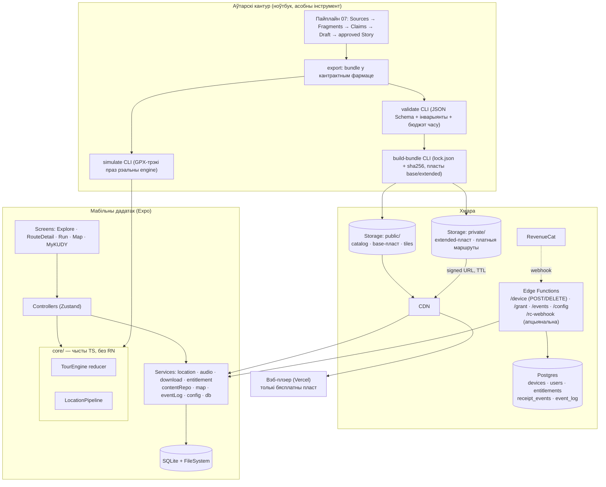

# KUDY — тэхнічная архітэктура (v1.1, сола-распрацоўка з LLM)

**Пашырэнне 2026-09-13:** [21 — падборкі і непублічныя ацэнкі](21_discovery_feedback_architecture.md) вызначае discovery-index, selector, feedback API/сховішча і лакалізацыю. Гэтыя дапаўненні — праектны кантракт; production-рэалізацыі няма. Run/гук/доступ застаюцца паводле гэтага файла і зацверджаных G01-рашэнняў.

**Актуалізацыя 2026-09-15 (G01.03.c):** прыняты кананічны кантракт durable-сесіі і даступнасці — [ADR G01.03-session-access](decisions/G01.03-session-access.md) (issue #18). Раздзелы 4, 6.1, 7, 18 і 20 сінхранізаваныя з ім: поўная ідэнтычнасць даверанага `AccessReady` праз канал `services/download`, `play_seq` write-through, нязменная версія сесіі, частковы ўнікальны індэкс жывой сесіі, табліцы R07-лімітаў і правілы міграцый зоны B.

**Актуалізацыя 2026-09-16 (G01.02.c):** прыняты кантракт уладальніка гуку — [ADR G01.02-audio-ownership](decisions/G01.02-audio-ownership.md) (§3 прыняты заснавальнікам 2026-09-16; выканальная мадэль — G01.02.b у `run-model`). Раздзелы 3, 6.1, 6.3, 7 і 20 сінхранізаваныя з ім: `playing` мае варыянты ўладальніка `guide`/`moment`, кожны запуск нясе токен `play_token`, усе callback'і тэгаваныя з адзіным правілам адхілення, паўза аўдыё — жывая, парог FocusRegain 10 хв мае адзін сэнс, яўны Play Moment ачышчае чаргу і блакуе аўтаматыку да «Працягнуць гід». Durable-палёў кантракт не дадае (разд. 7).

Схема кампанентаў, уладальнікаў даных і асноўных паслядоўнасцей — [18](18_component_blueprint.md). Дэталізацыя першай хвалі — [атамарныя заданні](../agent-tasks/atomic/README.md); канчатковыя G01-тыпы не выдумляюцца асобнымі сэрвісамі.

Рабочы кантракт распрацоўкі: што за што адказвае, якія сэрвісы і API існуюць, дзе жыве стан, што свядома **не** будуецца і ў якім парадку пісаць.

Уваходныя: `05_architecture_review.md` (заўвагі, у т.л. п. 19 — наступствы новых рашэнняў), `08_stack_and_reference_projects.md` (выбар стэку), разбор чатырох рэферэнсных праектаў у `refs/`, і прадуктовыя файлы на ўзровень вышэй: `../04_scope_and_roadmap.md` (склад MVP, двухузроўневы наратыў, вэб-трэк), `../06_brand_and_promotion.md` (дракон-голас, гейміфікацыя), `../07_content_pipeline.md` (вытворчасць кантэнту).

Далей у тэксце скарачэнні `01`–`04`, `06`, `07` азначаюць прадуктовыя файлы ў `docs/`, а `05`, `08`, `09`, `10` — файлы гэтай тэчкі.

Рэферэнсы прачытаныя, код **не** запазычаны: Tramio пад AGPL, TourForge без ліцэнзіі. Узятыя толькі архітэктурныя ідэі; кожная пазначана, адкуль.

**Правіла для LLM-асістэнта:** гэты файл мае прыярытэт над «як звычайна робяць». Раздзел 17 — забаронены спіс.

---

**Актуалізацыя 2026-09-06:** прадуктовыя правілы `01`, `03`, `04`, `11` улічваюць свабодную хаду і гарадскія рубрыкі. `05`, `08`, `10` і разд. 19 ніжэй — гісторыя даследавання, не канкуруючыя патрабаванні. Гэта кантракт першай аўдыёпрагулкі; мадэль артыкулаў, рубрык і іх доступу будзе ў асобным тэхнічным спецыфікаванні. Стэк гэтай праўкай не пераабіраецца.

**Наступнае планаванне:** [15](../15_guide_decisions.md) змяшчае прынятыя ўдакладненні і незавершаныя прапановы; [16](../16_delivery_backlog.md) — эпікі, задачы і залежнасці да гэтага кантракту. Гід у UI адпавядае цяперашняму Route; асобныя аўдыёфайлы захоўваюцца. Ручныя Moments не атрымліваюць фонавай аўтаматыкі выбранай прагулкі. Будучы лакальны імпарт патрабуе ізаляванага origin/namespace і не з’яўляецца маркетплэйсам або правам на grant.

## 0. Статус рашэнняў

**Не ўсё тут «замарожана», і называць гэта так было памылкай першай версіі.** Тры градацыі:

- **Прынята** — мяняем толькі пры новым факце.
- **Прынята да M0/M0b** — кірунак выбраны, але пацвярджаецца замерам на прыладзе. Калі замер супярэчыць — мяняем без сораму.
- **Адкрыта** — разд. 18.

| Рашэнне | Значэнне | Статус |
|---|---|---|
| Кліент | Expo SDK (new architecture), TypeScript, Expo Router | **да M0.** Асноўныя рызыкі — фонавы GPS і аўдыё — гэта натыўны бок, і **EAS Update іх не паправіць**: OTA працуе толькі ў межах сумяшчальнай натыўнай версіі (runtime version). Значыць «памылку выправім за гадзіны» стасуецца да JS-логікі, а не да таго, што нас найбольш палохае |
| Другі кліент | вэб-аўдыёверсія (Vercel) — тая ж крыніца кантэнту, толькі бясплатны пласт | прынята |
| Кантэнт | версіяваныя **bundles** (JSON + Markdown + медыя) на CDN; фармат — публічны кантракт з JSON Schema | прынята |
| Аўтарынг | асобны інструмент (`07`), не частка дадатку; яго выхад — бандл | прынята |
| Дынамічны бэкенд | 6 эндпоінтаў (разд. 5), з іх webhook — апцыянальны | прынята |
| Пакупкі | Apple/Google IAP праз RevenueCat; сервер правярае права **запросам да RevenueCat**, не чакаючы webhook | **да M0b** (sandbox-спайк) |
| Платная адзінка | **пласт наратыву** (`base` / `extended`), не толькі маршрут | прынята (`04`) |
| Абарона медыя | падпісаныя URL з кароткім TTL, мінтуюцца порцыямі; без DRM і без Ed25519 | прынята, з запісаным рызыкам (разд. 4) |
| Карта | MapLibre RN; спосаб офлайн-дастаўкі — варыянты A/B/C у разд. 6.3.1 | **да M0b** |
| Аўдыё | начытаны голас (не TTS), фонавае прайграванне, lock-screen кантролі | **да M0** |
| Мовы | **`be` + `en`**; `authoring_locale = be`, `fallback_locale = en`. Далей: `pl` → `de` → `es` | прынята (`04`) |
| LLM | толькі ў вытворчасці кантэнту, **ніколі ў рантайме** — ні мадэлі, ні API-ключа ў дадатку | прынята |
| Прыватнасць | каардынаты не пакідаюць прыладу; у лог ідзе `stop_id`. Лог — **псеўданімізаваныя звязваемыя** дадзеныя: згода, тэрмін 14 мес, выдаленне па запросе (разд. 10) | прынята |

---

## 1. Агульная карціна



Чатыры незалежныя кантуры. Аўтарскі жыве на ноўтбуку і **не мае з дадаткам ні агульнага коду, ні агульнай БД, ні агульнага дэплою** (`05`, п. 19) — ён можа ламацца як заўгодна, і гэта не даходзіць да прадакшну. Хмара — амаль уся статыка плюс пяць шляхоў API (шэсць аперацый; webhook апцыянальны). Дадатак — тонкі кліент з чыстым ядром, якое тэстуецца без тэлефона. Вэб — другі чытач той самай статыкі.

---

## 2. Межы даверу

| Зона | Што трымае | Хто чытае |
|---|---|---|
| `public/` | `catalog.json`, **base**-пласт бясплатных маршрутаў, вокладкі, тайлы | усе, кэшуецца CDN |
| `private/` | **extended**-пласт і поўнасцю платныя маршруты | толькі па падпісаным URL, TTL 10 хв |
| Postgres | `devices`, `users`, `entitlements`, `receipt_events`, `event_log` | толькі Edge Functions (service role) |
| Прылада | бандлы на дыску, SQLite, `device_secret` у SecureStore | толькі дадатак |

**Галоўная межа:** платны байт не вісіць на пастаянным URL. Гэта прама выпраўляе дэфект TourForge (публічныя незаўтэнтыфікаваныя аўдыёфайлы: хто ведае base URL, качае ўсё) і адначасова дазваляе не будаваць DRM Tramio.

**Крытычная дэталь пласцістасці:** манifest бясплатнага пласта **не змяшчае шляхоў extended-ассетаў** (`05`, п. 19). Інакш платнае аўдыё відно ў бясплатным манifest, і падпісаныя URL губляюць сэнс. Lock для extended выдае толькі `/v1/grant`.

**Вэб і платнае — рашэнне:** вэб-плэер аддае **толькі бясплатны base-пласт**. Прычына: у вэбе ўсё відно ў devtools, а web-checkout па-за MVP (`04`), значыць ніякай патрэбы трымаць там платны кантэнт няма. Умова перагляду: калі з'явіцца web-checkout — вэбу патрэбны свой сеансовы кантур і той самы серверны грант, і толькі тады.

**Свядомы трэйд-оф:** прайграванне ўжо загружанага бандла **не** правярае entitlement (файлы на дыску = купленае). Пасля рэфанду кантэнт застаецца. Прыняў: заснавальнік. Плюс: нуль логікі offline-верыфікацыі і нуль рызыкі «плацельнік застаўся без доступу ў роўмінгу» — правільны бок збою для спажывецкага кантэнту. Умова перагляду: вымяральныя злоўжыванні рэфандамі.

---

## 3. Мадэль кантэнту

База — Place/Story асобна (ідэя Terrastories: месца існуе незалежна ад наратыву, таму адна кропка нясе і тызер, і базавы, і extended-пласт без дублявання геаметрыі), плюс **`RouteStop` з рэкамендаваным парадкам**, якога ў Terrastories няма, плюс `locale` як вымярэнне радка.

```
bundle/<route_id>/<version>/
  route.json                     # геаметрыя (encoded polyline) + упарадкаваныя stops
  places.json                    # локаль-нейтральныя геа-факты
  voices.json                    # даведнік галасоў (дракон у розных мовах)
  <locale>/base/
     stops.json                  # тэксты, транскрыпты, sources
     audio/<story_id>.m4a
     img/<hash>.webp
     lock.json
  <locale>/extended/
     stops.json  audio/  img/  lock.json     # у private/, шляхі не публікуюцца
```

**Сутнасці і палі**

- `Place`: `id`, `lat`, `lng`, `trigger_radius_m`, `district`, `kind`, `photo`, `name_audio_refs` (`locale → media_id`) — **мапа спасылак на лакалізаваныя `Media`**, а не адзін файл: вымаўленне «Żuraw» па-беларуску і па-англійску — розныя запісы (ідэя Terrastories, папраўленая: у іх `name_audio` адзін, бо ў іх адна мова). **Без назвы і апісання** — яны ў пер-локальным `stops.json`.
- `Story`: `id`, `place_id`, `tier` (`base` | `extended`), `duration_s`, `voice_id`, `sources[]`, `review` (`by`, `at`, `decision`), `tone` (`standard` | `memorial`).
  - `tier` — **асобныя радкі**, не варыянты аднаго. Тады «што бясплатна» — трывіяльны запрос, а платнае фізічна не дасяжна з бясплатнага манifest.
  - `sources[]` запаўняе пайплайн (`05`, п. 19; `04` — факт-дысцыпліна). Не для UI — для ўласнай праверкі і для адказу, калі гісторыка публічна паправяць.
  - `tone: memorial` — не дэкарацыя: сцішае тэмп начытвання і забараняе ставіць побач trivia. Вестэрплатэ, Пошта, стачня — гэта не той самы голас, што «дзе выпіць кавы». Найбольшая рэпутацыйная рызыка кантэнту, і яна вырашаецца полем.
- `Route`: `id`, `access` (`free_base` | `paid`), `product_id_route`, `product_id_extension`, `distance_m`, `duration_min`, `cover`, `polyline`, `published`, `free_stop_count`.
- `RouteStop`: **`id` (стабільны, генеруецца адзін раз і не мяняецца ніколі)**, `route_id`, `position`, `place_id`, `access_tier` (`base` | `extended`), `preview` (публічныя назва, месца, анонс), `story_base_id?`, `story_extended_id?`, `trigger_radius_m?` (перакрывае Place), `optional?`.
  - `position` — **толькі рэкамендаваны парадак паказу, ніколі ўмова прайгравання**. Ён мяняецца, калі ў сярэдзіну маршрута ўстаўляецца кропка.
  - `id` — **адзіная ідэнтычнасць кропкі** ва ўсёй сістэме: `auto_fired`, `queued`, `session.last_stop`, акно геафенсаў, падзеі логу, дасягненні. Выключэнне — `heard`: праслухоўванне ідэнтыфікуе `story_id`, не кропка (ADR [G01.01-narration-progress](decisions/G01.01-narration-progress.md), §4.1). Гэта прама выпраўляе памылку TourForge (там ідэнтычнасць кропкі = індэкс у масіве, і ўстаўка кропкі цішком перанумароўвае прагрэс усіх карыстальнікаў).
  - `validate` правярае: `id` унікальны ў межах маршрута і **не змяніўся ў парэўнанні з папярэдняй апублікаванай версіяй** бандла. Змена `id` = новая кропка, а не тая ж перасунутая.
- `Moment`: `id`, `place_id`, `story_id` (звычайна тызер), `kind`, `cooldown_min`. Moment — **трэйлер, не поўная гісторыя** (`04`). Прайграванне тэйзера — толькі яўны Play чалавека праз адзіны плэер з уладальнікам `moment` (ADR [G01.02-audio-ownership](decisions/G01.02-audio-ownership.md) §3.1); Moment сам ніколі не гаворыць і яго `story_id` не залічваецца `heard` гіда.
- `Recommendation`: `id`, `kind`, `lat`, `lng`, `external_place_id` (Google/OSM), `route_id?`. Гадзіны працы **не трымаем** — лінк вонкі (`05`, п. 14).
- `Media`: `sha256`, `bytes`, `mime`, `duration_s`, `locale`, `voice_id`, `license`, `credit` (`05`, п. 15).
- `Voice`: `id`, `locale`, `narrator_credit`, `character` — дракон мусіць пазнавацца ва ўсіх мовах (`06`, п. 1).

**Інварыянты, якія правярае `validate`:**

1. Аўдыё **ніколі** без транскрыпту (даступнасць + субтытры).
2. `locale` — з фіксаванага allowlist (BCP-47), не вольны тэкст. Вольны тэкст ператварае «English/english/en/en-GB» у чатыры мовы (памылка Terrastories).
3. Кожны `RouteStop` мае прынамсі адзін наратыў. Кропка толькі з extended дазволена; у base яна прадстаўлена толькі публічным прэв’ю. `access_tier` узгадняецца з даступным наратывам; поўны платны тэкст і медыя не трапляюць у public.
4. Ніводнае `claim` з вердыктам `refuted`; кожнае `confirmed` мае крыніцу.
5. `review.decision = approved` для ўсяго, што публікуецца.
6. Каардынаты і радыусы валідныя. Перакрыццё геафенсаў — папярэджанне для палявой праверкі, не забарона дзвюх гісторый на адной плошчы.
7. Даўжыня аўдыё і адлегласці правяраюцца на карэктнасць. Параўнанне з часам хады па рэкамендаваным шляху — дыягностыка, не забарона доўгай гісторыі: чалавек можа стаяць і выбіраць іншы парадак.
8. Пер-локальная поўнасць — **вылічальны запрос**, не сцяг у файле.
9. Ніводзін шлях `extended` не згадваецца ў `base`-манifest.
10. `RouteStop.id` унікальны і стабільны між версіямі (разд. 3, `RouteStop`).

**Fallback моў** вызначаны ў адным месцы і прымяняецца пры зборцы бандла, не ў UI.

---

## 4. Bundle: адзінка дастаўкі

Адзінка аўдыёпрагулкі — `route_id@version`, пласт `locale × tier`. `Route.polyline`, `distance_m` і `duration_min` апісваюць неабавязковы рэкамендаваны шлях. Бандл нязменны: новы кантэнт = новая версія = новы запіс у каталогу.

- Сесія замацоўвае `version` пры Start да End, у тым ліку пасля паўзы, рэстарту і на наступны дзень (кананічны кантракт — [ADR G01.03](decisions/G01.03-session-access.md) §3.4). Абнаўленне каталога не падмяняе яе файлы. Актыўная або прыпыненая версія абаронена ад лакальнага выдалення; перад ручным выдаленнем трэба завяршыць сесію. Апублікаваныя версіі не перазапісваюцца; серверны тэрмін захавання і паведамленне аб недаступным старым пашырэнні трэба ўлічыць у эксплуатацыйным плане. Серверная аналітыка не вызначае бяспечны момант абнаўлення.
- `lock.json` (`[{path, bytes, sha256}]`) **генеруецца**; хэшы рукамі не абслугоўваюцца.
- **Праверка `sha256` — трохузроўневая, не «заўсёды ўсё».** Прагон 50–300 МБ пры кожным адкрыцці — гэта секунды затрымкі і выдаткі батарэі там, дзе яны найменш дарэчныя (перад стартам прагулкі). Таму:
  1. **на загрузцы** — поўная праверка кожнага файла (тут яна і так бясплатная: хэш лічыцца ў патоку);
  2. **на адкрыцці** — толькі JSON-файлы бандла (яны дробныя і іх мы парсім) + дэшавая праверка метаданых медыя (наяўнасць і размер з `lock.json`);
  3. **поўны перапрагон** — толькі пры трох умовах: змянілася версія дадатку (сцэнар Kuratour), плэер або парсер вярнуў памылку дэкадавання, або карыстальнік натыснуў «праверыць загрузку» у MyKUDY.
  Кантэнт па-ранейшаму **не парсіцца, пакуль не праверана** — але «праверана» азначае адпаведны ўзровень, а не самы дарагі.
- **Без Ed25519 — гэта прыняты риск, а не закрытая пагроза.** Раней тут было сказана «ад чаго бароніць — закрыта HTTPS». Гэта няправільна: HTTPS закрывае **транспарт**, але не закрывае **узламаны origin або CDN-акаунт** — у гэтым выпадку падпісаны кліентам ключ адрозніў бы падменены бандл, а `sha256` з таго ж узламанага origin — не.
  - Мадэль пагрозы: атакер з доступам да нашага Storage/CDN. Для сола-праекта той самы ноўтбук трымае і ключ падпісу, і ключ дэплою, таму падпіс не дадае незалежнага фактару — але гэта аргумент «не акупляецца», а не «пагрозы няма».
  - Наступства, якое прымаем: пры ўзломе хостынгу мы можам раздаць падменены кантэнт і не даведаемся пра гэта з кліента.
  - Кампенсацыя, якая нічога не каштуе: доступ да Storage — толькі праз service-key у Edge Functions і асобны deploy-акаўнт з 2FA; `catalog.json` і бандлы ніколі не пішуцца з CI без ручнога кроку.
  - Умова перагляду: чужы ліцэнзаваны кантэнт, другі чалавек з доступам да дэплою, або першы інцыдэнт.
- **Rollback — робім.** Раней тут было «не будуем». Гэта было памылкай: бандлы нязменныя, таму папярэдняя версія на CDN **ужо лежыць**, і адкат — гэта вярнуць `catalog.json` на папярэдні запіс. Каштуе амаль нічога і ратуе, калі новая версія кантэнту паламаная. Адкат **на прыладзе** не патрэбны: кліент проста бачыць у каталогу папярэднюю версію як актуальную.
- **Фармат — публічны кантракт** (`05`, п. 19): JSON Schema ў `contracts/`, адна крыніца для `validate`, дадатку і вэба. Два кліенты чытаюць адну крыніцу — значыць фармат не можа быць «як склалася».
- `public/catalog.json` — спіс усяго, што існуе: `route_id`, версія, локалі, наяўныя пласты, размеры, `product_id`. **Спіс адкрыты; закрытая — загрузка.** Апцыянальная версіяваная спасылка `discovery_index` і public-праекцыі месцаў/падборак зададзеныя ў `21`, §3; G02.01 правярае envelope і legacy reader. Аўтарскі парадак у асобным індэксе не патрабуе перавыпуску ўсіх бандлаў.
- **Base-URL indirection** (ідэя TourForge): бінарнік паказвае на маленькі дакумент, які называе рэальны хост кантэнту → CDN мяняецца без рэлізу. Але з **абмежаванымі** спробамі і фолбэкам на кэш: у TourForge гэта бясконцы retry, які вешае холадны старт офлайн.
- Каталаг абнаўляецца пры кожным старце, але **збой фатальны толькі калі кэшу няма** (ідэя TourForge).
- `valid_until` у маніфесце: сезонныя сцвярджэнні («адкрыта да 18:00») гніюць.

---

## 5. API — усё, што ёсць

| Метад | Шлях | Прызначэнне | Аўтарызацыя |
|---|---|---|---|
| `POST` | `/v1/device` | Рэгістрацыя ўстаноўкі: сервер генеруе `device_id` (UUID) і `device_secret` (32 байты, вяртаецца **адзін раз**), хэш сакрэту — у `devices`. Кліент трымае сакрэт у `expo-secure-store` | няма, rate-limit па IP |
| `POST` | `/v1/grant` | `{route_id, version, locale, tier, paths[]}` → праверка права **запросам да RevenueCat** → `{lock_url, urls:[{path,url,expires_at}]}`. Няма права → `403 no_entitlement`; RevenueCat недаступны і кэшу няма → `503 entitlement_unavailable` (з `Retry-After`) | `Bearer <device_secret>` |
| `POST` | `/v1/events` | Батч падзей `{event_id (UUID, генеруе кліент), type, at, payload}`. Ідэмпатэнтна па `event_id` (unique index) | `Bearer <device_secret>` |
| `POST` | `/v1/feedback/read` | Чытанне толькі ўласнай ацэнкі па вядомай мэце, §5 у `21` | `Bearer <device_secret>` |
| `PUT` | `/v1/feedback` | Ідэмпатэнтная CAS-запіс/замена непублічнай ацэнкі, валідацыя target/version/locale | `Bearer <device_secret>` |
| `POST` | `/v1/feedback/delete` | Выдаленне ўласнай ацэнкі з аховай ад позняга перазапісу, §5–6 у `21` | `Bearer <device_secret>` |
| `GET` | `/v1/config` | `trigger_radius_default`, `dwell_ms`, `accuracy_gate_m`, `moment_cooldown_min`, `moments_per_session_max`, `min_app_version` | няма |
| `DELETE` | `/v1/device` | Выдаленне дадзеных прылады: `devices`-радок, `event_log`, кэш правоў, `feedback_current` і `feedback_mutations` (каскадна паводле `21`). Пасля `204` кліент выдаляе `device_id`, `device_secret`, лакальную `event_queue`, `feedback_local`, `feedback_outbox` і стан згоды/disclosure; загружаныя бандлы застаюцца. Правы на кантэнт **не** выдаляюцца (яны ў сторы і ў RevenueCat) | `Bearer <device_secret>` |
| `POST` | `/v1/rc-webhook` | **Апцыянальна** (RevenueCat Pro Integration; Pro цяпер бясплатны да парога выручкі). Рэфанды, экспірацыі, `TRANSFER` → бухгалтэрыя і аналітыка. **Не** на крытычным шляху выдачы гранта | HMAC-падпіс па сырым целе (ніжэй) |

**Мяжа `/grant`:** сервер сам знаходзіць прадукт для `route_id × tier`, правярае entitlement патрэбнага асяроддзя (sandbox не дае production-доступу) і адкрывае толькі апублікаваны маніфест дакладнага `route_id × version × locale × tier`. Кожны запытаны `path` павінен дакладна ўваходзіць у гэты маніфест. Адсутны файл, чужы маршрут/пласт/версія, абсалютны шлях, `..`, URL або неадназначнае кадаванне адхіляюцца да падпісання; не дастаткова праверыць толькі бяспечны prefix. Кліент не выбірае product_id або storage bucket. Ліміты памеру спіса і запыту задаюцца кантрактам. У base дазволены толькі асобна серыялізаваны публічны анонс locked-кропак.

*Пазней:* `POST /v1/link` — прывязка Apple/Google identity да `user_id` (крос-**платформенны** перанос і прагрэс, што перажывае пераўстаноўку). Да рэалізацыі праверкі identity-токена эндпоінт **не існуе**, а не «прымае, што дадуць». Наступства для абяцанняў MVP — ніжэй.

### 5.1 Пакупка і права — выпраўлены флоў

Першая версія гэтага дакумента будавала выдачу гранта на webhook: «пакупка → RevenueCat webhook → радок у `entitlements` → грант». Гэта было **няправільна ў трох месцах**, і вось што замест:

**Праблема 1: гонка.** Webhook прыходзіць звычайна за 5–60 с пасля падзеі (цалкам легальна і да некалькіх гадзін для скасаванняў), з 5 паўторамі па 5/10/20/40/80 хв пры памылцы. Значыць адразу пасля паспяховай аплаты `/grant` вярнуў бы `403` — карыстальнік заплаціў і атрымаў адмову.

**Праблема 2: аліасы.** Дакументацыя RevenueCat прама кажа шукаць карыстальніка **і па `original_app_user_id`, і па масіве `aliases`**, а не толькі па `app_user_id`. Пасля рэстору на новай прыладзе прыходзіць падзея `TRANSFER` з `transferred_from` / `transferred_to`: права пераязджае з аднаго `app_user_id` на іншы. Мая мадэль «`app_user_id` = `device_id`, значыць webhook кладзе права на правільную прыладу» гэтага не трымала.

**Праблема 3: залежнасць ад апцыянальнай інтэграцыі.** Webhooks у RevenueCat — **Pro Integration**. Pro зараз не каштуе грошай да парога выручкі, але крытычны шлях усё роўна не павінен залежаць ад асінхроннай інтэграцыі, якую можна не ўключыць або страціць праз памылку дастаўкі.

**Рашэнне: сервер пытае RevenueCat напрамую ў момант гранта.**

```
Пакупка ў дадатку (RevenueCat SDK, app_user_id = device_id)
   ↓ SDK сам адпраўляе чэк у RevenueCat сінхронна
Кліент просіць POST /v1/grant
   ↓ Edge Function: GET /subscribers/{device_id}  (RevenueCat REST, Secret API key)
RevenueCat сам разбірае аліасы і трансферы і вяртае актуальныя entitlements
   ↓ ёсць права → мінтуем падпісаныя URL
Загрузка
```

Чаму так лепш, а не «дадаць `purchase_pending` і паўторную праверку»:

- **Няма залежнасці ад затрымкі webhook.** Пасля пацверджання SDK сервер правярае актуальнае права. Пры часовым збоі праверкі кліент захоўвае «куплена, доступ рыхтуецца» і прапануе паўтор праверкі/загрузкі, не паўторную аплату; сервер не выдае файлы без праверанага права.
- **Аліасы і трансферы разбірае RevenueCat**, бо гэта яго задача. Нам не патрэбная ні табліца `alias → device`, ні ўласная логіка зліцця — а значыць няма і класа памылак, які з ёй прыходзіць.
- **Няма залежнасці ад webhook-інтэграцыі** на крытычным шляху.
- Мінус, які прымаем: `/grant` залежыць ад даступнасці RevenueCat. Кампенсацыя — кэш **пазітыўнага** адказу на `(device_id, route_id, tier)` з TTL 24 г (рэзюмаванне загрузкі і паўторныя спробы працуюць), і `503` з `Retry-After` замест `403`, калі RevenueCat не адказвае і кэшу няма. Адрозніваць «не купляў» ад «не змаглі праверыць» — абавязкова: інакш плацельнік бачыць «у вас няма права».
- Ужо загружаны бандл грае **незалежна** ад усяго гэтага (разд. 2).

**Webhook застаецца, але як бухгалтэрыя, а не як брама:** рэфанды, экспірацыі, `TRANSFER`, аналітыка выручкі. Калі інтэграцыя не ўключана або часова не дастаўляе падзеі — выдача гранта ўсё роўна працуе.

**HMAC трэба яўна ўключыць у інтэграцыі; без наладжанага сакрэту endpoint не разгортваецца.** Крыніца правераная 2026-09-06: [RevenueCat Webhooks](https://www.revenuecat.com/docs/integrations/webhooks#webhook-signature-verification-hmac).

**Праверка webhook — HMAC па сырым целе, не «shared secret у загалоўку».** RevenueCat умее подпіс: загаловак `X-RevenueCat-Webhook-Signature: t=<unix>,v1=<hmac_sha256_hex>`, HMAC-SHA256 над `"<t>.<сырое цела>"`. Правілы: лічыць HMAC **да** парсінгу JSON (перасерыялізацыя ломае подпіс), параўнанне constant-time, адкідаць `|now − t| > 5 хв`, ідэмпатэнтнасць па `id` падзеі (дастаўка — «хаця б адзін раз»), да адказу `200` надзейна захаваць падзею або скончыць яе ідэмпатэнтную апрацоўку; не пакідаць яе толькі ў памяці працэсу пасля адказу.

### 5.2 Што гэта значыць для абяцанняў MVP

`04` абяцае «апцыянальны акаўнт пры крос-прыладным пераходзе». Пасля разбору тут трэба быць дакладным, бо гэта два розныя сцэнары:

- **Тая ж крама, іншая прылада** (новы iPhone, той самы Apple ID) — працуе **без акаўнта**: RevenueCat `restorePurchases()` праз store-акаўнт, права пераязджае (`TRANSFER`). Гэта ў MVP.
- **Іншая платформа** (iPhone → Android) — **без акаўнта немагчыма**, бо гэта дзве розныя крамы з рознымі чэкамі. Патрэбны `/v1/link`, а значыць праверка Apple/Google identity-токена на серверы.

Рашэнне: `/link` **не** ў MVP, а формулёўка ў `04` уточняецца — «рэстор праз store-акаўнт без рэгістрацыі; перанос між платформамі — Phase 2». Абяцаць у складзе MVP тое, чаго няма, горш, чым не абяцаць.

Прадукты `ROUTE` і `ROUTE_EXTENSION` у сторах ствараюцца як **non-consumable one-time purchases**. Consumable-пакупка не адпавядае мадэлі «купіў маршрут назаўсёды» і можа не аднавіцца пасля пераўсталёўкі.

**Правілы, якія не абмяркоўваюцца:**

- **Кліент ніколі не сцвярджае, што ён нешта купіў.** Ён просіць грант; вырашае сервер, спытаўшы RevenueCat. Лакальны сцяг «купілі» — не крыніца праўды.
- `/v1/grant` **fail-closed**, але з правільным кодам: `403` — права няма; `503` — не змаглі праверыць.
- `tier: base` для `access: free_base` маршрута гранта не патрабуе — гэта публічны URL. Грант патрэбны для `extended` і для ўсяго ў `paid`-маршруце.
- **Падпісаныя URL мінтуюцца порцыямі, а не ўсе адразу.** Загрузка 300 МБ на слабай сетцы перажыве 10-хвілінны TTL; таму кліент просіць URL на чарговую пачку файлаў (`paths[]`) і **пераміньвае** іх, калі `expires_at` наблізіўся. Дадатковы факт, які трэба ведаць: падпісаны URL Supabase **нельга адклікаць датэрмінова**, а CDN нейкі час аддае закэшаваны адказ і пасля сканчэння токена. Значыць TTL — гэта абмежаванне «не раздаць спасылку назаўсёды», а **не** механізм адзыву. Адзыву ў нас няма і ён не патрэбны.
- Заглушка верыфікацыі — толькі пры яўнай env-змене і з крыклівым папярэджаннем у лог.
- Памылкі — закрыты спіс кодаў, без шляхоў файлаў.

---

## 6. Слаі дадатку

Жорсткае правіла: **`core/` не імпартуе нічога з React Native.** Гэта тое, што робіць прадукт тэставальным без Гданьска.

```
app/                 # Expo Router
  (tabs)/explore.tsx  (tabs)/my.tsx  map.tsx
  route/[id].tsx      run/[id].tsx     demo/reviewer.tsx
controllers/         # Zustand — адзінае месца мутабельнага стану UI
  useRunController.ts  useCatalogController.ts  useLibraryController.ts
services/            # усё, што дакранаецца OS, сеткі, дыска
  location.ts audio.ts download.ts entitlement.ts
  contentRepo.ts map.ts eventLog.ts config.ts db.ts
core/                # ЧЫСТЫ TS
  engine/{reducer,events,commands,state}.ts
  pipeline/pipeline.ts  geo/{haversine,polyline}.ts
contracts/           # JSON Schema бандла — агульная з вэбам і CLI
tools/               # validate · build-bundle · simulate · readiness
```

### 6.1 `core/engine` — TourEngine

Чысты рэдуктар: `(state, event, now, config) → { state, commands[] }`. Гадзіннік не чытаецца ўнутры, эфектаў няма. Галоўная ідэя, узятая з Tramio, і адзіная прычына, чаму цэлы маршрут прайграецца на ноўтбуку.

**States:** `Idle` · `Active` · `Paused` · `Ended`. Чатыры. У Tramio шэсць, з якіх тры недасягальныя — не паўтараем; `Paused` дададзены таму, што без яго няма спосабу спыніць геафенсы і чаргу, не завяршаючы маршрут (`11`, разд. 4.2).

`Active` трымае: `session_id`, `route`, `version`, `locale`, `accessible_stop_ids` (толькі гатовы дазволены кантэнт), `tier_available`, `auto_fired: Set<stop_id>`, `heard: Set<story_id>`, `autoplay_suspended: bool`, `playing?: { owner: 'guide', stop_id, story_id, play_id } | { owner: 'moment', moment_id, story_id, seq } | null` — люстра **фізічнага** плэера і адзіная крыніца яго занятасці для аўтазапуску, чаргі і камерцыйнай карткі (ADR [G01.02-audio-ownership](decisions/G01.02-audio-ownership.md) §3.3); кожны запуск нясе токен `play_token = { kind: 'guide' | 'moment', ref, seq }` — для guide гэта пара `(session_id, play_id)`, для moment — `moment_id` + працэсны лічыльнік (ADR §3.2), `queued?: { stop_id, radius, at }`, `last_fix`, `focus_lost_at?`. Тыпы палёў прагрэсу — [ADR G01.01-narration-progress](decisions/G01.01-narration-progress.md) §4.1–4.2: `heard` ключуецца `story_id`, `auto_fired` — `stop_id`, асноўны наратыў кропкі вытворны. Start падчас гучання ручнога кантэнту не спыняе яго: кантролер ін'ектуе фактычны стан плэера (`playingNow`) у новы стан сесіі, і першы аўтазапуск чакае свабоды плэера (ADR [G01.02-audio-ownership](decisions/G01.02-audio-ownership.md) §3.3, §3.8); у `Idle` ручны запуск жыве ў кантролеры адзінага плэера — без фіктыўнай сесіі, чаргі і `auto_fired` (§3.8).

**Статус кропкі не захоўваецца — ён вылічаецца** паводле [ADR G01.01](decisions/G01.01-narration-progress.md) §4.5, спачатку паводле доступу: не `story_accessible(primary_story_id)` → `locked`; затым `playing.stop_id == stop_id` → `playing`; `primary_story_id ∈ heard` → `played`; `stop_id ∈ auto_fired` пры не-heard асноўным → `available`; іначай `pending` (`11`, разд. 3.1). Маркер — адзінка кропкі з крыніцай у асноўным story; непраслуханы дадатковы не вяртае кропку ў `pending`.

**Чаму два манатонныя наборы замест аднаго `consumed` і замест зменлівага статусу:** `auto_fired` адказвае «ці спрацоўваў аўтатрыгер» і забараняе паўторны аўтазапуск; `heard` адказвае «ці чуў чалавек канкрэтную гісторыю да канца» і дае спіс яшчэ непраслуханых даступных гісторый, без ацэнкі паспяховасці прагулкі. `heard` — набор `story_id`, таму base і extended адной кропкі застаюцца незалежнымі факты. Зменлівае поле статусу тут не працуе: перарваны ручны паўтор ператварыў бы `played` у `available` і зрабіў бы даслуханую кропку прапушчанай.

**Events:** `Start` · `Pause` · `Resume` · `End` · `LocationAccepted` · `DwellCompleted(stop_id)` · `AudioFinished(session_id, play_id, story_id?)` · `MomentFinished(play_token, moment_id, story_id)` · `AudioFailed(play_token, reason)` · `UserSelectedStop(stop_id)` · `UserSelectedStory(stop_id, story_id)` · `PlayMoment(moment_id, story_id, play_token)` · `UserPausedAudio` · `UserStoppedAudio` · `FocusLoss` · `FocusRegain` · `ResumeAudio(play_token)` · `GuideResume` («Працягнуць гід») · `Timer(id)` · `AccessReady(route_id, version, locale, tier, stop_ids[], issuer='services/download')`.

**Commands:** `PlayStory(story_id, path, session_id, play_id)` · `PlayMoment(moment_id, path, play_token)` · `StopAudio` — дзеянне над бягучым токенам · `PauseAudio` · `ResumeAudio(play_token)` · `SetGeofenceWindow(stop_ids[])` · `ClearGeofences` · `ScheduleTimer(id, ms)` · `CancelTimer(id)` · `PersistProgress` · `EmitEvent(type, payload)` · `ShowArrivalCard(stop_id)`.

**Межа плэера — тэгаваныя callback'і (ADR [G01.02-audio-ownership](decisions/G01.02-audio-ownership.md) §3.5):** кантролер — адзіны выдаец токенаў і адзіны ўладальнік плэера; `services/audio` токены не стварае і не тлумачыць, ён іх эха. Правіла адхілення адзінае для finished/error/focus/resume: callback, чый токен не супадае з бягучым фізічным запускам, ігнаруецца цалкам — ніякага заліку `heard`, ніякага спынення, ніякага старту чаргі. `FocusLoss`/`FocusRegain` — фізічныя падзеі плэера, токену не падлягаюць; `MomentFinished` ніколі не мутуе `heard` і не аднаўляе аўтаматыку гіда. Кантрактнае імя error-callback — `story_play_failed(token, reason)`; у мадэлі `run-model` яму адпавядае падзея `AudioFailed`, а назва палёў там camelCase (`momentId`, `storyId`) — адзін пункт мапінгу, [README мадэлі](../run-model/README.md).

Прапанова пашырэння вылічаецца ў UI паводле `11`, разд. 8, без каманды engine і без абавязковага AudioFinished. `AccessReady` паступае толькі праз тыпізаваны capability-канал `services/download` пасля сервернага гранта, пер-файлавай праверкі `sha256` і атамарнай актывацыі; радковае поле `issuer` у падзеі — апісальная адзнака ўладальніка канала, сапраўднасць дае сам канал (кананічны кантракт — [ADR G01.03](decisions/G01.03-session-access.md) §3.5). Engine прымае падзею толькі калі **ўся** ідэнтычнасць супадае з жывой сесіяй: `route_id`, `version` і `locale` дакладна, `tier` адпавядае сапраўды загружанаму пласту, `stop_ids` — падмноства замацаванага пакета. Пры адмове падзея ігнаруецца цалкам, ніводнае поле не мутуе. Прыняцце пашырае `tier_available`, пералічвае `accessible_stop_ids` і акно геафенсаў; Play няма, `heard`/`auto_fired` не чапаюцца; паўтор той самай ідэнтычнасці — no-op; загрузка, завершаная пасля End, не мае жывога адрасата і мяняе толькі дыск.

**Інварыянты (кожны — property-тэст):**

1. Кропка ніколі не запускаецца **аўтаматычна** двойчы (`auto_fired` манатонна расце). Ручны `UserSelectedStop` дазволены для гатовага даступнага кантэнту, у тым ліку пасля `played`; названы наратыў запускаецца праз `UserSelectedStory(stop_id, story_id)` (ADR §4.3).
2. Ніколі не гучыць два наратывы адначасова.
3. Аўтаматычны наратыў не пачынаецца раней за dwell. Ручны Play dwell і геалакацыі не патрабуе.
4. `AudioFinished` прымаецца, толькі калі пара **`(session_id, play_id)`** супадае з бягучым запускам. `play_id` — лічыльнік запускаў унутры сесіі, ён пачынаецца нанова з кожнай прагулкай, таму сам па сабе не адрознівае запуск №1 старой сесіі ад запуску №1 новай; спозненае завяршэнне пасля `Finish` + `Start` завяршыла б чужую гісторыю. Адной `story_id` таксама недастаткова: ручны паўтор дае два запускі той самай гісторыі. Калі ў падзеі ёсць `story_id`, ён мусіць супадаць з `playing.story_id` — стары `stop_id`, чужы story або чужая сесія не залічваюць бягучы наратыў (ADR §4.11). Лічыльнік працягваецца і праз restart тае самай сесіі: `play_id` пішацца write-through у durable `play_seq` (ADR G01.03 §3.1), таму спознены callback да крэшу не супадае з новым запускам пасля аднаўлення. Тое ж правіла адхілення дзейнічае для ўсіх тэгаваных callback'аў: стары або чужы `play_token` ігнаруецца цалкам — ніякага заліку, ніякага спынення, ніякага старту чаргі (ADR G01.02 §3.5).
5. `FocusRegain` пазней за 10 хв → не аднаўляем, а закрываем кропку: чалавек фізічна пайшоў далей, і расказ пра будынак праз тры кварталы — гэта скарга, а не фіча. Парог — адзін для ўсіх уладальнікаў запуску і мера жывасці жывой паўзы пасля знешняга перапынення: лічыцца ад `focus_lost_at` плэера; звычайная ручная паўза парога не мае (ADR G01.02 §3.7).
6. Знешняе перапыненне (званок) — гэта `FocusLoss`, **ніколі не `AudioFinished`**, для любога ўладальніка запуску; інакш званок назаўсёды з'ядае кропку.
7. Аўтазапуск немагчымы, калі `autoplay_suspended = true` або стан ≠ `Active`. Сцяг ставяць `UserPausedAudio`, `UserStoppedAudio`, `FocusLoss`, яўны `PlayMoment` (спыненне гіда камандай) і `Pause`. Здымка — толькі яўнае дзеянне чалавека: `Resume` сесіі, `ResumeAudio` жывой паўзы guide-запуску (для moment-запуску `ResumeAudio` сцяг **не** здымае), ручной Play кропкі (`UserSelectedStop`, `UserSelectedStory`, lock-screen prev/next) і `GuideResume` «Працягнуць гід» (ADR G01.02 §3.5–3.6).
8. Аўтазапуск (у тым ліку адкладзены з `queued`) патрабуе свежай пазіцыі: узрост `last_fix` ≤ 30 с і `accuracy ≤ trigger_radius`. Пасля правалу GPS старая каардыната не дае права граць.
9. `Pause` і `End` ачышчаюць `queued` і эміцяць `ClearGeofences`; той самы зыход чаргі (`stop_id` → `auto_fired`) мае яўны Play Moment (ADR G01.02 §3.6.2). `Ended` не вяртаецца ў `Active` — паўторны праход стварае новую сесію.

**Рашэнне, якога ў Tramio няма** (у іх аўтобус, у нас пешаход): трыгер, які прыйшоў пад час іншага наратыву, кладзецца ў `queued` (адна ячэйка) і **не трапляе ў `auto_fired`** — інакш ён сам сябе зрабіў бы непрыдатным да запуску. Прыйшоў яшчэ адзін — у ячэйцы застаецца **найноўшы** (па часе трыгера; гэта не гарантыя найменшай адлегласці), выцеснены ідзе ў `auto_fired` (спроба скончана, застаецца ручны доступ). Пасля `AudioFinished` адкладзены трыгер грае толькі пры выкананні ўмоў аўтазапуску (інварыянты 7–8 і асноўны story кропкі яшчэ не ў `heard` — ADR §4.8.4, §4.9) і калі чалавек усё яшчэ ў межах `2 × radius`; інакш — таксама ў `auto_fired`. Аўтобус праехаў — пешаход часцей яшчэ стаіць побач.

**Трыгер, які не прайграўся, мае тры розныя зыходы** (`11`, разд. 5.1.1), і зліваць іх нельга: плэер заняты → `queued`, `auto_fired` не чапаецца; аўтаматыка прыпыненая → `auto_fired` + ручны доступ; сесія не `Active` або пазіцыя нясвежая → трыгер ігнаруецца цалкам, папярэдні статус захоўваецца.

**Свабодная хада:** нумар, кірунак і лінія маршруту не абмяжоўваюць трыгер. `Run` — абраная падборка і аўтазапуск пасля Start; `Map` — агляд горада. Прагляд Map не стварае другога ўладальніка геалакацыі. Moments у MVP адкрываюцца рукамі; у «Побач» прапануюцца без аўтагуку. Рашэнне пра фон і адзіны ручны плэер прынята — [ADR G01.02-audio-ownership](decisions/G01.02-audio-ownership.md) §3: плэер адзін, уладальнік `guide` або `moment`; яўны Play Moment спыняе гід камандай (не finished), ачышчае чаргу і блакуе аўтаматыку да «Працягнуць гід»; пасля заканчэння Moment аўтаматыка сама не аднаўляецца; паўза сесіі і End не спыняюць ручны кантэнт і ўтоенага Resume сесіі праз яго няма. На End «Яшчэ можна адкрыць» паказвае даступныя загружаныя непраслушаныя гісторыі — адзінка `story_id`, у тым ліку дадатковыя наратывы; замкнёныя выключаныя (ADR §4.6). Усе кропкі слухаць неабавязкова. `deviated` і патрабаванне вярнуцца на лінію не будуюцца.

**Мадэль прагрэсу:** прыняты [ADR G01.01-narration-progress](decisions/G01.01-narration-progress.md) (варыянт A, 2026-09-14). `heard` — манатонны `Set<story_id>` па прынятых `AudioFinished`; `auto_fired` — `Set<stop_id>`; асноўны наратыў кропкі вытворны (`story_base_id`, для paid-only — `story_extended_id`) і не мяняецца пасля unlock; дадатковы гучыць толькі праз ручны Play. Выканальная мадэль адпавядае ADR ад G01.01.b; гэты дакумент сінхранізаваны G01.01.c. Гісторыя: да прыняцця ADR `heard` быў `Set<stop_id>` і апісваў адзін наратыў на кропку — тая мяжа закрытая, старыя радкі лічацца гісторыяй. Дадатковыя locked-кропкі апісваюцца асобнымі stop_id.

### 6.2 `core/pipeline` — LocationPipeline

Пяць стадый; парадак важны; **адкідаем да мутацыі стану** — дрэнны фікс не мусіць атруціць ні акно згладжвання, ні гадзіннікі dwell.

1. **Accuracy gate** — адкід фіксу з заяўленай пагрэшнасцю > 40 м. У вулічных каньёнах Długiego Targu і Mariackiej гэта галоўны фільтр. TourForge выкідае accuracy ўвогуле, таму фікс з памылкай 200 м спрацоўвае так само ўпэўнена, як 5-метровы.
2. **Spike rejection** — пры нарастаючым часе адкід імпліцытнай швідкасці > 12 км/г (пешаход, не аўтобус). Пры **не**нарастаючым часе (Android батчыць і перастаўляе фіксы, швідкасць не вызначаная) — адкід зрушэння > 5 м.
3. **Smoothing** — сярэдняе па 3 апошніх прынятых каардынатах. Сярэдняе, не EMA: ніколі не выходзіць за межы ўваходу.
4. **Dwell** — кандыдаты па **згладжанай** кропцы; акумулятар расце, пакуль кропка застаецца кандыдатам. Старт `dwell_ms = 6000`, каліброўка ў полі.
5. **Direction filter** не абмяжоўвае пешую прагулку: падыход з любога боку законны. Пры некалькіх адначасовых кандыдатах парадак апрацоўкі дэтэрмінаваны: адлегласць, затым стабільны stop_id; engine ўсё роўна прымяняе чаргу і правіла аднаго аўдыё.

**Адзіны ўладальнік набораў — рэдуктар.** У Tramio `consumed` жыве і ў pipeline, і ў рэдуктары; забыты сінк дае бясконцы паўтор адной кропкі (іх рэальны баг, выпраўлены двойчы). Pipeline пра `auto_fired`/`heard` не ведае і атрымлівае спіс кандыдатаў звонку.

### 6.3 Сэрвісы

| Сэрвіс | Адказнасць | Крытычныя дэталі |
|---|---|---|
| `location` | дазволы, акно геафенсаў, падпіска, watchdog | OS-геафенс = **кандыдат/будзільнік**, рашэнне заўсёды ў JS. Акно ≤ 20 рэгіёнаў (жорсткі ліміт iOS): бліжэйшыя прыдатныя stops з усяго абранага набору, не наступныя па position; пералічэнне па свежай пазіцыі, пасля спрацоўкі і адкрыцця доступу. Падпіска на пазіцыю правярае кандыдатаў незалежна ад гэтага акна. Moments ніколі не аўтазапускаюць аўдыё; прагляд іх картак не перазбройвае геафенсы Run. Ручны Play ідзе праз адзіны плэер па прынятым кантракце ўладальніка гуку ([ADR G01.02](decisions/G01.02-audio-ownership.md) §3); у `Paused` ні Moment, ні R07 не аднаўляюць геалакацыю. Watchdog асобна ловіць «фіксы перасталі прыходзіць» — гэта **іншы** збой, чым «фіксы дрэнныя», і галоўны рэальны боль Tramio: станы `acquiring → live → recovering → stalled`, парог 15 с, перазапуск падпіскі з абмежаваным backoff, generation counter выкідае callback'і мінулай сесіі |
| `audio` | прайграванне, фон, lock-screen, перапыненні | Адзіны фізічны плэер; уладальнік (`guide`/`moment`) і токен запуску — па [ADR G01.02](decisions/G01.02-audio-ownership.md) §3: каманда нясе `play_token`, кожны callback вяртае яго без змен, чужы/стары токен ігнаруецца цалкам. Сесія ў **speech**-рэжыме → ducking і focus аддаём OS, а не пішам самі. `UIBackgroundModes: audio`. Prev/next на lock-screen = яўны выбар даступнага аўдыё ў рэкамендаваным спісе, locked прапускаецца без змены прагрэсу; гэта не загад рухацца, і lock-screen не запускае ручны кантэнт. Стан прайгравання **вылічаецца** з плэера, не дублюецца. Пазіцыя ў мілісекундах, не 0..1 (у TourForge гэта дало NaN у трох месцах). Плэер пасля dispose — перастварэнне, не reset. Гучнасць начытанага нармалізуецца (мэта −16 LUFS) |
| `download` | грант → загрузка → верыфікацыя → атамарная актывацыя | Стрым у `.part`, хэш на ляту, атамарны rename. Рэзюмаванне **па хэшы, не па афсеце**. `staging/` — сусед фінальнай дырэкторыі (rename атамарны толькі ў межах тома). Backoff з jitter, дэдуплікацыя адначасовых запросаў. **Пласты незалежныя**: `extended` дадаецца пасля пакупкі без перазагрузкі `base`. Пры двухзначнасці пасля крэшу — выдаліць staging і перакачаць. Асобную кліенцкую backup-копію не трымаем; адкат апублікаванай версіі робіцца праз `catalog.json` (разд. 4) |
| `entitlement` | RevenueCat SDK + запрос гранта | Кліент не вырашае. Лакальна — толькі «пласт на дыску = даступны» |
| `contentRepo` | каталог, stops, тэксты, fallback моў | Кантракт з `contracts/`; той самы, што чытае вэб |
| `map` | MapLibre, offline-рэгіён, аверлеі | Гл. 6.3.1 — спосаб офлайну яшчэ не выбраны. Незалежна ад выбару: style/sprites/**glyphs** копіруюцца з бандла ў файлавую сістэму (нативны рэндэрар не чытае бандл фрэймворка); гліфы — рэальная offline-залежнасць, без іх карта без назваў вуліц. Атрыбуцыя **ODbL** — юрыдычнае абавязацельства, не дэкор |
| `eventLog` | лакальная чарга + батчавая адпраўка | **Крыніца праўды прадукту, не толькі статыстыка** (`05`, п. 19): стабільныя ID, ідэмпатэнтнасць, offline-чарга, сінк пры сетцы. Ніякіх каардынат |
| `config` | remote config + кэш | Радыус/dwell/кулдаўны мяняюцца без рэлізу |
| `db` | SQLite | Адкрыццё — module-level singleton promise: двойчы адкрыты файл пасля force-quit вешае намёртва, трыгер — Fast Refresh |

#### 6.3.1 Карта: што менавіта не вырашана

«MapLibre + свае тайлы + OfflineManager» — гэта **кірунак**, а не рашэнне. Не вызначана галоўнае: **што фізічна кладзецца на прыладу**. Варыянты, і ў іх розныя наступствы:

| Варыянт | Як працуе | Плюс / мінус |
|---|---|---|
| **A. `OfflineManager` па нашым style URL** | MapLibre сам сцягвае рэсурсы стылю ў свой offline-сховішча па bbox і дыяпазоне zoom | Штатны шлях бібліятэкі; але трэба свой тайл-хост, і паводзіны абнаўлення/квот трэба замерыць |
| **B. Гатовы файл тайлаў у бандле** (MBTiles/PMTiles) | адзін файл кладзецца як звычайны ассет, стыль паказвае на `file://` | Просты і прадказальны; але MapLibre Native не чытае PMTiles без пласта-адаптара — гэта і трэба праверыць у M0b |
| **C. Тайлы ў бандле маршрута** | кожны маршрут нясе свой кавалак карты | Дробныя загрузкі; але дублюе тайлы між маршрутамі |

**Крытэрыі выбару ў M0b:** памер для bbox Гданьска да z16; ці працуе ў авіярэжыме **з назвамі вуліц** (гліфы!); ці абнаўляецца без рэлізу; колькі кода патрабуе.

**Ліцэнзійная папраўка да `08`.** Там было сказана «нуль ліцэнзійных абмежаванняў» — **гэта няправільна**, і фразу трэба чытаць так:

- **MapLibre** (код) — MIT, тут праблем няма.
- **Дадзеныя OSM** — **ODbL**, з абавязковай атрыбуцыяй. Атрыбуцыя мусіць быць бачная на экране карты і клікальная. Гэта не «дэкор», а ўмова выкарыстання.
- **Публічныя тайл-серверы OSM забараняюць** масавае/офлайн-спампоўванне (tile usage policy). Значыць тайлы мы **генеруем самі** з OSM-экстракта (Protomaps/OpenMapTiles) і хостім самі — або бяром ліцэнзаванага правайдара. «Скачаць з тайл-сервера OSM» — не варыянт нi тэхнічна, нi юрыдычна.
- Правільная формулёўка: **няма платы за карыстальніка**, але **ёсць ліцэнзійныя абавязкі** (атрыбуцыя ODbL) і **ёсць кошт хостынгу** сваіх тайлаў.

Фолбэк, калі A/B/C у M0b не даюць прымальнага выніку: Mapbox з гатовым offline-пакетам — платна і з залежнасцю ад MAU, але гэта працоўны шлях, і адкідаць яго да замеру нельга.

### 6.4 Кантролеры

- `useRunController` — уладальнік сесіі прагулкі: прымае падзеі ад `location`/`audio`, кліча `reduce`, выконвае каманды, персістуе прагрэс. **Адзінае месца, дзе engine стыкуецца са светам.**
- `useCatalogController` — каталог, прэв'ю, наяўныя локалі і пласты, стан «купленае/загружанае».
- `useLibraryController` — MY KUDY: загрузкі, размеры, выдаленне, незавершаныя маршруты, мова.

**Правіла TourForge, вартае капіравання:** ручны тап па кропцы і GPS-трыгер ідуць **адным шляхам** (абодва — падзея ў engine). Таму логіка прайгравання застаецца маленькай, а «не спрацавала, дай я сам націсну» працуе заўсёды. У вулічных каньёнах гэта не запасны, а рэгулярны сцэнар.

### 6.5 Экраны

| Экран | Змест | Заўвага |
|---|---|---|
| `Explore` | куратарскія варыянты, не каталог | правіла першых 30 с з `01` |
| `RouteDetail` | вокладка, stops, «5 гісторый · 3 аўдыё · 42 МБ», пласты | **адна галоўная кнопка, якая мяняе сутнасць**: `Download` пакуль не ўсё на дыску → `Start` калі гатова (TourForge; здымае неадназначнасць цалкам) |
| `Run` | карта як фон + адна панэль у трох становішчах (Peek / Half / Full): плэер, прэв'ю кропкі, поўная Story з транскрыптам | карта тут — **рэжым, не таб**; нарматыўны кантракт узаемадзеяння — `11_run_interaction.md` (аўтазапуск толькі пасля Start Route; Back ≡ ✕; чарга не грае састарэлае) |
| `Map` | вольная прагулка («Побач»), Moments, бліжэйшае | асобна ад `Run`, іншая мова інтэрфейсу (`11`, разд. 1) |
| `MyKUDY` | загрузкі, прагрэс, мова, налады | кіраванне сховішчам тут, а не long-press'ам (памылка TourForge) |
| `demo/reviewer` | сімуляваны маршрут для рэвю ў сторы | без гэтага рэцэнзент нічога не праверыць (`05`, п. 16) |

---

## 7. Лакальны стан

**SQLite — дзве зоны з рознымі правіламі жыцця.** Першая версія дакумента называла ўсю базу «кэшам» і дазваляла перастварыць яе пры разыходжанні схемы. Гэта была памылка: у той самай базе жывуць прагрэс маршрута і неадпраўленыя падзеі, якіх **няма больш нідзе**. Перастварэнне знішчыла б платную прагулку на паўдарозе.

**Зона A — аднаўляльнае (`derived`).** Можна выдаліць і адбудаваць з дыска і з каталогу. Пры разыходжанні схемы — дапушчальна дропнуць і перастварыць.

| Табліца | Ключ | Змест |
|---|---|---|
| `bundle_asset` | (route_id, version, locale, tier, path) | `status` (pending/partial/complete), `bytes_total`, `bytes_done`, `sha256`. Рэестр рэзюмавання. Адбудоўваецца перахэшаваннем таго, што ляжыць на дыску — таму і аднаўляльны |
| `catalog_cache` | route_id | копія `catalog.json` для офлайн-старту |

**Зона B — незаменнае (`durable`).** Толькі **міграцыі**, ніколі аўтаматычнае выдаленне. Калі міграцыя немагчымая — паказваем памылку, а не чысцім.

| Табліца | Ключ | Змест |
|---|---|---|
| `session` | `session_id` | `route_id`, `version` (нязменная), `state` (`active`/`paused`/`finished`), `auto_fired[]` (спіс `RouteStop.id`, не пазіцый) і `heard[]` (спіс `Story.id` — [ADR G01.01](decisions/G01.01-narration-progress.md) §4.2; міграцыя старых stop-элементаў — кантракт G01.03), `last_stop_id`, `started_at`, `finished_at?`, `locale`, `tier` (інфармацыйны запіс пластоў, правераных да старта), `play_seq` (write-through лічыльнік запускаў — ADR G01.03 §3.1). **Тое, чаго няма ні ў Tramio, ні ў TourForge**. Ключ — **прагулка, не маршрут**: паўторны праход стварае новы радок, і гісторыя праходаў у My KUDY становіцца магчымай. Індэкс па `(route_id, state)` дае «незавершаная прагулка гэтага маршруту»; інварыянт — **не больш за адзін `active`/`paused` радок на ўвесь дадатак** (`11`, разд. 4.1) — замацаваны частковым унікальным індэксам на ўзроўні схемы; адзіны пісьменнік радка — `useRunController` (ADR G01.03 §3.1, §3.3) |
| `guide_hint_state` · `guide_hint_last` | `(scope, session_id, guide_id)` · `guide_id` | R07-ліміты: факт паказу/адхілення падказкі гіда па сесійным scope («адзін паказ гіда за сесію») і foreground-cooldown паміж адкрываннямі; запіс толькі праз nearby controller (ADR G01.03 §3.9) |
| `migration_log` | (version, applied_at) | зваротны запіс пераўтварэнняў зоны B (напр. міграцыя `heard` stop→story): кожны зыходны элемент захаваны, аднаўленне адваротным прабегам па логу; памылка міграцыі ніколі не сцірае базу (ADR G01.03 §3.8) |
| `event_queue` | event_id | тып, час, payload, `sent`. Лакальны прагрэс не залежыць ад адпраўкі аналітыкі. Дэдуплікацыя і захаванне падзей не патрабуюць згоды на іх адпраўку |
| `settings` | ключ | мова, дазволы паказаныя, згода на аналітыку |
| `device` | адзін радок | `device_id`; сакрэт — у `expo-secure-store`, не тут |

**Правіла, якое трэба зафіксаваць у кодзе:** дроп-і-перастварыць дазволена **толькі** для зоны A, і гэта асобная функцыя, якая фізічна не бачыць табліц зоны B. Інакш аднойчы «ачыстка кэшу» забярэ з сабой прагрэс.

**Поля ўладальніка гуку (G01.02) — transient.** `play_token` (`{kind, ref, seq}`), абодва варыянты `playing`, жывая паўза з яе offset, `focus_lost_at?`, `queued` і `autoplay_suspended` у SQLite **не пішуцца**: пасля аднаўлення сесіі `playing = null`, `autoplay_suspended = true`, чарга пустая, гук сам не стартуе (ADR [G01.03-session-access](decisions/G01.03-session-access.md) §3.2, [G01.02-audio-ownership](decisions/G01.02-audio-ownership.md) §3.3). Адзінае durable-поле, звязанае з запускамі, — `play_seq`, яно ўжо ёсць у радку сесіі (ADR G01.03 §3.1). Поўны спіс persisted/transient палёў з праверкай супраць ADR — у выніковым файле [G01.02.c](../agent-tasks/results/G01.02.c.md).

**Бэкап зоны B — не робім** (сервер не мае прагрэсу да `/link`), і гэта прыняты трэйд-оф: пераўстаноўка дадатку губляе лакальны прагрэс маршруту. Серверны лог старой устаноўкі застаецца прывязаным да старога `device_id`, таму будучыя дасягненні таксама **не перажываюць пераўстаноўку** да з'яўлення `/link`.

**Файлы:** `{documentDirectory}/bundles/<route_id>/<version>/<locale>/<tier>/`, побач `…staging/`. Усе сегменты правяраюцца як **безпечныя адзінкі шляху** (без раздзяляльнікаў, без `..`, без NUL) на ўваходзе, а не на выкарыстанні: ідэнтыфікатары, што даходзяць да файлавай сістэмы, — недавераны ўвод.

**Стан загрузкі — 4, і ўсе паказваюцца:** `not_downloaded` → `partial (N файлаў не хапае)` → `ready` → `stale`. «Спінер» — не стан.

**Пасля абнаўлення дадатку** — прагон праверкі наяўнасці файлаў, пры недахопе фонавая перакачка. На iOS файлы ў `Documents` могуць «асіратэць» пры зруху шляхоў, тады як SQLite выжывае (урок Kuratour). Без гэтага чалавек адкрывае «загружаны» маршрут і не чуе аўдыё — а гэта адзінка ў рэйтынгу платнага дадатку.

---

## 8. Мовы і голас

- `locale` — вымярэнне: локаль-нейтральнае ядро + пер-локальныя тэксты + **асобны** пер-локальны аўдыё-запіс. Аўдыё і тэкст на адной мове робяцца ў розны час; адно можа выйсці раней.
- Бандл — `(route, locale, tier)`. Купіў — качаеш **толькі сваю мову і свой пласт**.
- `voice_id` на наратыўных ассетах + даведнік `voices.json`: дракон мусіць пазнавацца ва ўсіх мовах (`06`, п. 1). «Tone of voice» мусіць існаваць **да** запісу першага аўдыё, інакш маршруты будуць рознагалосымі.
- Пераклад — **новы Draft, не копія** (`07`): claims тыя ж, рэвю паўторнае. Пры перакладзе мадэль дадае «упэўненыя» дэталі, якіх не было.
- UI-лакалізацыя ставіцца **да** першага экрана. Зашытыя англійскія радкі (як у TourForge) потым выкорчваюцца балюча.

**Прынятае рашэнне: арыгінал `be`, fallback `en`; аўдыё на старце толькі беларускае** (`04`). Тэхнічныя наступствы, якія трэба зафіксаваць у кодзе, а не трымаць у галаве:

- **Два розныя паняцці, якія лёгка зліць у адно і потым доўга разграбаць:**
  - `authoring_locale = be` — мова, на якой пішацца арыгінал. Claims, крыніцы і рэвю жывуць тут; астатнія мовы — паходныя Draft'ы (`07`).
  - `fallback_locale = en` — куда падае прылада, чыя мова нам невядомая. Немец у Гданьску мусіць атрымаць англійскую, а не беларускую.
- **Ланцужок выбару мовы** (адно месца ў `contentRepo`, не ў экранах): яўны выбар карыстальніка ў MyKUDY → мова прылады, калі яна ёсць у бандле → `en` → `be`. Беларуская стаіць у канцы ланцужка **менавіта таму, што яна арыгінал**: калі англійскай яшчэ няма, лепш аддаць беларускую, чым нічога.
- **`be` для прылад з `ru`/`uk`-локалью не падстаўляем аўтаматычна.** Гэта не тэхнічнае, а прадуктовае рашэнне: аўтаматычная падстаўка «блізкай» мовы — гэта здагадка пра чалавека, а мы іх не робім (`01`). Мова прапануецца ў MyKUDY і запамінаецца.
- **Публікацыя — пер-локальная.** Маршрут можа быць гатовы на `be` і не гатовы на `en`; каталог паказвае наяўныя локалі па факце (поўнасць — вылічальны запрос, разд. 3, інварыянт 8). Значыць беларускі маршрут можна выпусціць, не чакаючы англійскага запісу.
- **Два галасы, адзін характар.** `voices.json` разлічаны мінімум на два запісы (`be`, `en`); на старце запоўнены толькі `be`. Крытэрый выбару англійскага дыктара, калі да яго дойдзе, — не «добры голас», а «пазнаецца як той самы дракон» (`06`, п. 1).
- **Памер:** дзве мовы не падвойваюць загрузку ў карыстальніка (бандл — `(route, locale, tier)`), але падвойваюць **вытворчасць**. Гэта і ёсць прычына, чаму польская адкладзена, а не «забытая».
- **Вэб-плэер** аддае беларускае аўдыё бясплатнага пласта і **англійскі тэкст** гісторый: беларуская працуе на першае ядро аўдыторыі, англійская — на SEO і на QR у Гданьску (`04`, вэб-трэк). Англійскае аўдыё з'яўляецца тут жа, як толькі будзе запісана, — кантракт бандла не мяняецца.
- **UI-лакалізацыя** ставіцца адразу на два файлы радкоў (`be`, `en`); ніводнага зашытага радка нідзе.

---

## 9. GPS, батарэя, дазволы

- Дазвол «у фоне» просім **у момант старту маршруту**, з тлумачэннем; не на першым экране.
- Тэлефон у кішэні з навушнікамі — **асноўная поза**, не крайні выпадак. Без фонавай лакацыі трыгеры замаўкаюць, як толькі блакуецца экран (дакладна тое, што адбываецца ў TourForge). На Android гэта foreground service з нотыфікацыяй.
- Ліміт iOS у 20 рэгіёнаў → слізгальнае акно (6.3).
- Wakelock — **толькі** на экране `Run`, і толькі калі экран патрэбны. Трымаць яго ўвесь тур = забіць батарэю.
- Перад стартам — праверка зараду і папярэджанне. GPS-тур, які памёр пасярод дарогі, у платным дадатку канвертуецца ў адзінку ў рэйтынгу; арганіка — наш галоўны канал.
- Push-сервер не патрэбны: геатрыгер — гэта **local notification** (`05`, п. 8).

### 9.1 Рэжымы адмовы фонавай лакацыі (тое, чаго watchdog не ратуе)

Watchdog з 6.3 ловіць адзін сцэнар: працэс жывы, а фіксы перасталі прыходзіць. Ён **прынцыпова нічога не можа**, калі працэс забіты — а гэта не рэдкасць, а звычайнае паводзіна Android:

- дадатак **знята з recent apps** свайпам;
- **force-stop** праз налады;
- **battery saver** або агрэсіўны менеджар вытворцы (Samsung, Xiaomi — паводзіны адрозніваюцца ад «чыстага» Android);
- **перазагрузка** тэлефона.

Дакументацыя Expo кажа гэта прама: пасля спынення праграмы Android **не** перазапусціць яе па геафенсе. На iOS модэль іншая (сістэма можа абудзіць дадатак па рэгіёне), але і там гэта не гарантыя.

**Значыць «маршрут працягвае вадзіць чалавека, што б ні было» — абяцанне, якога мы выканаць не можам.** Замест яго — тры канкрэтныя рэчы:

1. **Прызнаць уголас, а не схаваць.** Калі аўтатрыгеры мёртвыя (дазвол забраны, працэс быў забіты, battery saver), экран `Run` паказвае відавочны стан: «аўтаматычныя гісторыі не працуюць — я не бачу вашай пазіцыі», з кнопкай «прайграць гэтую кропку» і спісам кропак. Ручны шлях у нас той самы, што GPS-шлях (6.4), таму гэта не запасны рэжым, а той самы прадукт з ручным пераключэннем.
2. **Аднаўленне сесіі.** Пры вяртанні ў дадатак: чытаем `session` (зона B, разд. 7), паказваем «Працягнуць захаваную прагулку?» і перазбройваем акно геафенсаў. Прагрэс не губляецца, бо ён у durable-зоне.
3. **Папярэджанне да старту, а не пасля.** Перад пачаткам маршруту праверыць: дазвол «у фоне» ёсць? battery saver выключаны? зарад дастатковы? Адзін экран са спісам — і чалавек ідзе падрыхтаваным, а не даведваецца праз гадзіну.

**М0 правярае гэта матрыцай, а не адным сцэнарам:** заблакаваны экран · фон · зняцце з recent apps · force-stop · battery saver · перазагрузка · вяртанне ў маршрут пасля забойства працэсу — на iOS, «чыстым» Android і на прыладзе Samsung або Xiaomi. Вынік гэтай матрыцы — **прадуктовае рашэнне**, а не тэхнічная деталь: ён вызначае, што дадатак можа абяцаць у сторы і на першым экране.

---

## 10. Лог падзей (аналітыка + гейміфікацыя)

Адна схема на дзве ролі — інакш давядзецца заводзіць другі паралельны лог (`05`, п. 19).

`app_open` · `explore_option_tap(route_id)` · `route_preview(route_id)` · `purchase_started/succeeded/failed(attempt_id, route_id, tier, reason?)` · `download_started/completed/failed(download_id, attempt_id?, route_id, version, locale, tier, bytes)` · `session_started/resumed/paused(session_id, route_id, version)` · `session_ended(session_id, route_id, version, reason: user_stop | switch_walk, heard_stories_count)` · `stop_reached(session_id, stop_id)` · `story_play_started/story_play_failed(session_id, stop_id, story_id, play_id, trigger: gps|manual)` · `story_audio_completed(session_id, stop_id, story_id, play_id)` · `extension_offer_shown/accepted(offer_id, route_id, stop_id?)` · `moment_shown/opened/dismissed(kind)` · `location_stalled(duration_bucket)` · `autotriggers_unavailable(reason)`.

`session_ended` нясе ў полі `reason` прычыну (`user_stop` / `switch_walk`) і ў полі `heard_stories_count` колькасць праслуханых даступных гісторый (stories); не азначае ўсе кропкі або фізічнае праходжанне. `stop_reached` — толькі пацверджаная геалакацыяй прысутнасць, ручны Play яе не стварае. `purchase_started` захоўвае offer_id, калі пакупка прыйшла з прапановы. Адно accepted не даказвае аплату. Паказ — толькі фактычная бачнасць.

Правілы:

- `event_id` генеруе кліент (UUID) → **ідэмпатэнтнасць**: адна падзея = адзін залік пры паўторнай адпраўцы; новы ручны паўтор — новая падзея, не дубль.
- Агульныя палі — event_id, type, at і версія схемы. `session_id`, `route_id`, `version`, `locale`, `tier` патрэбныя толькі адпаведным падзеям; app_open, рубрыкі і пакупка да Start не атрымліваюць выдуманай сесіі.
- **Кропка ідэнтыфікуецца `stop_id`, не `position`** (разд. 3). Пазіцыя мяняецца пры рэдагаванні маршрута, і аналітыка па ёй цішком пераклейвае лічбы на іншыя кропкі.
- **Ніякіх каардынат, ніякіх імён, ніякага вольнага тэксту.** Дыягностыка — бакетаваная accuracy і адносны час.
- **Але гэта не «ананімныя» дадзеныя, і называць іх так — самападман.** `device_id` + `session_id` + гісторыя маршрутаў — гэта **псеўданімізаваныя звязваемыя** дадзеныя, і GDPR прымяняецца да іх цалкам. Таму ў кантракце тры рэчы, а не адна:
  - **Згода** пытаецца **да першай адпраўкі** (не пры першым запуску наогул, а перад тым, як лог пойдзе на сервер). Адмова = лог жыве толькі лакальна, дадатак працуе цалкам. Стан згоды — у `settings` (durable).
  - **Тэрмін захавання:** сырыя падзеі — 14 месяцаў, потым выдаляюцца заданнем; агрэгаты (лічбы па маршрутах) застаюцца без `device_id`.
  - **Выдаленне па запросе:** `DELETE /v1/device` (разд. 5) чысціць `event_log` і радок прылады. Кнопка ў MyKUDY, не ліст на пошту.
- Ачыўкі ў першы рэліз **не ўваходзяць**. Пазней яны лічацца над лакальным логам незалежна ад згоды на аналітыку; серверная сінхранізацыя толькі са згодай, але да з'яўлення `/link` застаюцца прывязанымі да канкрэтнага `device_id` і не перажываюць пераўстаноўку.
- Anti-cheat не будуем; але ачыўка за фізічную прысутнасць правяраецца **паслядоўнасцю** `stop_reached`, не адным тапам (`06`, п. 2).

---

## 11. Інструменты на ноўтбуку

Без іх сола-праца немагчымая.

| CLI | Што робіць | Чаму не «потым» |
|---|---|---|
| `validate` | JSON Schema + інварыянты з разд. 3 + бюджэт часу гаварэння | Структурная праверка; праўдзівасць фактаў застаецца за аўтарам і крыніцамі (`07`) |
| `build-bundle` | хэшуе, генеруе `lock.json`, раскладае пласты ў `public/`/`private/`, абнаўляе `catalog.json` | Рукамі хэшы не абслугоўваюцца; і толькі скрыпт гарантуе, што `extended` не сцёк у публічны манifest |
| `simulate` | праганяе GPS-трэк праз **тыя самыя** `pipeline` і `reduce`, што ў прадакшне | Каб не хадзіць па Гданьску пасля кожнай змены |
| `readiness` | на кожны stop: даўжыня начытанага супраць часу хады да наступнага + перакрыццё радыусаў | Ловіць найбольш верагодны кантэнтны баг: наратыў яшчэ гаворыць, а наступны ўжо спрацаваў |

**Дэтэрмінізм сімулятара — абавязковы:** адна чарга адкладзеных дзеянняў (таймеры + завяршэнне аўдыё), час спрацоўкі плюс парадак устаўкі як tie-break; ніякага `Date.now()`, ніякага `Math.random()`. Сімулятар **імпартуе** прадакшн-функцыі; сімулятар, які перапісвае логіку, не тэстуе нічога.

Трэйс — просты JSON: `GpsFix` · `AppBackground/Foreground` · `UserCommand`, плюс інжэктары збояў: дэградацыя accuracy, скачок таймстампа, правал сігналу, перапыненне званком. Генератары: чысты праход, стаянне на кожнай кропцы, хуткі праход, старт з сярэдзіны.

Справаздача: якія кропкі спрацавалі, паток каманд, `stuck_playing` (сегмент гучыць у канцы = памылка), таймеры, што не спрацавалі, латэнцыя трыгера па кожнай кропцы. CI параўноўвае запускі з чаканнямі канкрэтнага трэка: не патрабуе ўсіх кропак у частковай прагулцы. Аўтапаўтораў і завісанняў няма; Ended толькі пасля яўнага End, без яго сесія застаецца Active/Paused.

**Два пласты трэйсаў:** генераваныя — на кожны коміт; **адзін запісаны рэальны праход на маршрут** — як регрэсійная фікстура. Другое ловіць вулічныя каньёны, чаго генератар не ўмее.

---

## 12. Тэсты — толькі там, дзе абараняюць кантракт

- Property-тэсты на інварыянты з 6.1 — ядро якасці.
- Юніты на pipeline: кожная стадыя адкідае тое, што мусіць, і **не мутуе стан пры адкіданні**.
- Юніты на `validate`: кожны код памылкі ловіцца, у тым лiку **стабільнасць `RouteStop.id` між версіямі** і **адсутнасць `extended`-шляхоў у публічным манifest**.
- Сімуляцыя ў CI на кожны апублікаваны маршрут.
- **Інтэграцыйныя тэсты грашовай мяжы** (у першай версіі дакумента іх не было — гэта была дзірка: engine пакрыты, а адзінае месца, дзе бяруцца грошы і выдаецца платны файл, не пакрыта нічым). Мінімальны набор супраць лакальнага стэка:
  1. `grant` без права → `403`; з правам → URL-ы, якія рэальна аддаюць байты;
  2. RevenueCat недаступны, кэшу няма → `503` з `Retry-After`, **не** `403`;
  3. пратэрмінаваны URL → адказ адхілены, кліент пераміньвае і дацягвае;
  4. рэстор на «іншай прыладзе» (іншы `device_id`, той самы store-акаўнт) → права знаходзіцца;
  5. webhook: правільны HMAC → апрацоўка; сапсаваны подпіс → `401`; той самы `id` двойчы → адзін эфект;
  6. `DELETE /v1/device` → серверныя падзеі і радок прылады зніклі; пасля `204` кліент ачысціў ідэнтыфікатар, сакрэт, чаргу падзей і стан згоды, але не загружаныя бандлы;
  7. grant адхіляе файл з чужога маршруту/пласта/версіі/локалі, невядомы шлях, path traversal і sandbox-права ў production; пакупка без праверанай загрузкі не адкрывае stop.
  8. **негатыўны тэст выцекання:** у нічым з `public/` няма ні аднаго шляху, які вядзе да `extended`-ассета.
- **Не пішам** тэсты на экраны, стылі і «сэрвіс кліча сэрвіс». Смок-праверка = запусціць дадатак і прайсці маршрут на mock-GPS.

---

## 13. Парадак пабудовы

Падрабязнае выкананне гэтых мілстоўнаў — [16](../16_delivery_backlog.md); кожны мае адпаведны эпік, вынік і залежнасці. Дат няма (`04`), таму мілстоўны вызначаюцца складам. Парадак такі, каб самая рызыкоўная невядомасць памерла першай, а кантэнт — доўгі полюс праекта — пачаўся рана.

| # | Мілстоўн | Прыёмка |
|---|---|---|
| **M0** | **Спайк платформы.** Expo-праект; фонавае аўдыё + фонавая лакацыя + геафенс на **рэальных** iOS і Android, па **матрыцы адмоў з разд. 9.1** (блакіроўка · фон · recent apps · force-stop · battery saver · перазагрузка), мінімум на «чыстым» Android і на Samsung/Xiaomi | Аўдыё гучыць з кішэні; вядома **дакладна**, у якіх з гэтых станаў трыгеры жывуць, а ў якіх не; напісаны спіс таго, што дадатак мае право абяцаць. **Пакуль не даказана — далей не ідзем** |
| **M0b** | **Два тонкія спайкі, якія нельга адкладаць да M6.** (а) **Карта:** выбраць спосаб офлайну (гл. разд. 4 і `08`) і замерыць памер Гданьска; (б) **пакупка:** sandbox-пакупка праз RevenueCat + `GET /subscribers` з сервера — тонкая вертыкаль без UI | (а) карта адкрываецца ў авіярэжыме з назвамі вуліц, памер вядомы; (б) sandbox-чэк відзён серверу праз RevenueCat праз секунды, і `403` ператвараецца ў `200` без webhook. Абодва спайкі — выкідныя, іх код не пераносіцца ў прадукт |
| **M1** | `contracts/` (JSON Schema бандла) + `core/`: engine, pipeline, сімулятар, property-тэсты | `simulate` праходзіць прыдуманы маршрут з 5 кропак: усе спрацавалі, ніводнай двойчы, нічога не завісла |
| **M2** | `validate` + `build-bundle` + `readiness`; **адзін рэальны маршрут на 4 кропкі** з аўдыё, экспартаваны пайплайнам `07` | `validate` зялёны; бандл на CDN; `readiness` з разгледжанымі папярэджаннямі; `extended` фізічна адсутнічае ў публічным манifest |
| **M3** | **Вэб-плэер** бясплатнага пласта (Vercel) | Лінк адкрываецца, аўдыё грае, тэкст індэксуецца. Гэта і першы канал прасоўвання, і доступ без устаноўкі (`04`); не ўмова праверкі попыту перад мабільным UI |
| **M4** | Загрузка + SQLite + аўдыё + `useRunController`; прагон на mock-GPS | Маршрут праходзіцца ў эмулятары да канца; kill дадатку → рэстарт → прагрэс на месцы |
| **M5** | Карта і экраны (Explore / RouteDetail / Run / MyKUDY), лакалізацыя UI, `eventLog` | Праход маршрута на прыладзе з экрана Explore, поўнасцю офлайн; да першай сервернай адпраўкі запытваецца згода; пры адмове падзеі не пакідаюць прыладу |
| **M6** | Прадакшн-версія спайка M0b: RevenueCat, `/device` (POST/DELETE), `/grant`, `/events`, падпісаныя URL, пласт `extended`; `/rc-webhook` — толькі калі інтэграцыя ўключана | Купля пашырэння ў sandbox → грант → дазагрузка **без** перазагрузкі base. Без права → `403`; RevenueCat недаступны без кэшу → `503`. Рэстор non-consumable на новай прыладзе ў той самай краме працуе. Пастаянных URL на платнае аўдыё не існуе |
| **M7** | Crash reporting, remote config, `demo/reviewer`, формы прыватнасці, deep links | Рэвю-рэжым праходзіць маршрут без хады; у падзеях няма каардынат |
| **M8** | **Поле: рэальны праход па Гданьску.** Каліброўка `trigger_radius`, `dwell_ms`, шчыльнасці Moments; запіс трэйсу ў фікстуры | Два праходы падрад: усе кропкі спрацавалі там, дзе трэба, ніводнага ілжывага спрацоўвання. Трэйс у CI |

Два наўмысныя парадкі: **вэб перад мабільным UI** — гэта прадуктовы прыярытэт (канал, без праверкі попыту), а не архітэктурная залежнасць; **поўная IAP-інтэграцыя пасля кантэнту**, але яе рызыкоўная вертыкаль праверана загадзя ў M0b.

---

## 14. Рызыкі з рэферэнсаў, не з тэорыі

1. **Фіксы перастаюць прыходзіць** — не «дрэнныя фіксы», а поўная цішыня. Самая балючая рэальная праблема Tramio. Патрэбны watchdog (6.3).
2. **Android перастаўляе таймстампы** → фільтр па швідкасці дзеліць на нуль. Патрэбны варыянт па зрушэнні.
3. **Ліміт 20 рэгіёнаў на iOS.**
4. **Вулічныя каньёны Гданьска** — менавіта той асяродак, дзе наіўная праверка радыуса брэшэ. Адказ: accuracy-gate + згладжванне + dwell, і заўсёды дасяжны ручны «прайграць гэтую кропку».
5. **Нативны рэндэрар карты не чытае бандл** — style/sprites/glyphs копіруюцца на дыск.
6. **Гучнасць** начытанага трэба нармалізаваць, інакш кропкі гучаць рознай гучнасцю.
7. **Хуткія паўторныя запросы прайгравання — норма** для GPS-плэера; плэер сігналіць выключэннем, якое трэба ловіць, а не лагаваць як памылку.
8. **Даўжыня наратыву супраць часу хады** — найчасцейшы кантэнтны баг, ловіцца механічна.
9. **Кантэнт псуецца** — `valid_until`.
10. **Кірунак падыходу невядомы:** сцэнар арыентуе па пазнавальным аб’екце, не «направа пасля папярэдняй кропкі». Праход назад застаецца той самай прагулкай.
11. **`.part`-суфікс і атамарны rename** — інакш абрэзаны файл сыдзе за цэлы.
12. **Парадак ключоў у JSON не стабільны** — усё, што хэшуецца, спярша канікалізуецца.
13. **Індэкс у масіве — не ідэнтычнасць кропкі.** Устаўка кропкі перанумароўвае ўсё; прагрэс і падзеі — толькі па стабільным `stop_id` (памылка TourForge).
14. **Пласцістасць — вектар уцечкі.** Адзін недагляд у зборцы, і extended-шлях у публічным манifest. Таму гэта інварыянт `validate`, а не ўважлівасць.

---

## 15. Ацэнка бяспекі (як бы глядзеў тэх-лід)

| Уласцівасць | Як забяспечана |
|---|---|
| Найменшыя прывілеі | Кліент мае толькі `device_secret` і кароткачасовыя URL. Ключы Storage і БД — толькі ў Edge Functions |
| Deny-by-default | `/grant` без права → `403`; RevenueCat недаступны і кэшу няма → адмова. `/v1/link` не існуе, пакуль няма праверкі токена |
| Праверка ўводу | Усе ідэнтыфікатары — allowlist-патэрны і безпечныя адзінкі шляху; шлях, што выходзіць з кораня, адкідаецца на серверы |
| Ізаляцыя платнага | Асобны прыватны prefix; шляхі `extended` не публікуюцца; вэб бачыць толькі бясплатнае |
| Цэласнасць | `sha256` на кожны файл; поўная праверка на загрузцы, дэшавая праверка пры адкрыцці, поўны перапрагон па трыгерах з разд. 4 |
| Прыватнасць | Каардынаты не пакідаюць прыладу; звязваемы лог адпраўляецца толькі пасля згоды, захоўваецца 14 месяцаў і выдаляецца праз `DELETE /v1/device` |
| Сакрэты | `device_secret` — у `expo-secure-store`; **ніякіх API-ключоў у ассетах** (памылка TourForge: ключ TomTom у тэкставым файле, здабываецца з любога білда) |
| Абарона ад replay | `/events` ідэмпатэнтны па `event_id`; webhook — па `event.id`, HMAC правяраецца з вакном часу 5 хвілін |
| Prompt injection | Немагчымы па канструкцыі: у рантайме няма мадэлі (`07`) |
| Безпечны збой | Загружаны бандл грае офлайн заўсёды; сеткавы збой не адбірае доступ у плацельніка |
| Прыняты трэйд-оф | Няма DRM і няма праверкі entitlement на прайграванні. Мадэль пагрозы — выпадковае капіраванне, не мэтанакіраваны атакер; аўдыё і так пішацца з калонкі. Умова перагляду: ліцэнзаваны чужы кантэнт з DRM-абавязацельствамі або вымяральныя злоўжыванні рэфандамі |

---

## 16. Што ўзята з кожнага рэферэнсу (каб не пераадкрываць)

| Крыніца | Узята | Адкінута |
|---|---|---|
| **Tramio** (AGPL, `refs/ref-tramio-*.md`) | чысты рэдуктар з інжэктаваным часам; 5-стадыйны pipeline; `consumed`-мноства; single-segment; 10-хвілінная межа focus-loss; дэтэрмінаваны сімулятар на прадакшн-функцыях; readiness-звет; watchdog дастаўкі фіксаў; `lock.json` з sha256; hash-based resume; stage→verify→rename; ідэя `tone: memorial` і claims з вердыктамі | 6 станаў (3 недасягальныя); dead reckoning + GTFS; standby-трэкі; апарат «збочвання»; Ed25519 + DRM + license tokens; LRU-бюджэт; backup/rollback; moderation-эндпоінт; уласны Fastify-каталог; нативныя модулі; capability-матрыца |
| **TourForge** (без ліцэнзіі, `refs/ref-tourforge.md`) | index-as-manifest; кантэнт-адрасаваныя ассеты; reachability-GC; `.part` + rename; backoff з jitter; offline-толерантны старт; base-URL indirection; **адна кнопка Download→Start**; пер-stop радыус; «тое, што гаворыць» ≠ «тое, што проста на карце»; адзін шлях для GPS і ручнога тапу; speech audio session; lock-screen як пульт тура; аўтаховная атрыбуцыя | уласны нативны плагін карты; два map-энджыны на экране; API-ключ у ассетах; онлайн-спадарожнік у офлайн-дадатку; адсутнасць фонавай лакацыі; адсутнасць прагрэсу; выкінутая accuracy; пазіцыя як 0..1; індэкс масіва як ID; зашытыя англійскія радкі |
| **Terrastories** (MIT, `refs/ref-terrastories.md`) | Place ⟷ Story асобна; `name_audio` на Place; медыя як радкі з `license`/`credit`; **фільтрацыя бачнасці праз джойн** (поўны некуплены кантэнт не трапляе ў пэйлоад карты; дазволеныя публічныя previews пад замком); дзве асобныя серыялізацыі (прэв'ю / поўная); адзін named map-config; аднабаковы offline-switch; CSV-падобны масавы імпарт | Community/тэнансі; Speaker як сутнасць; interviewer/date_interviewed; вольнатэкставы `region`; API-ключы ў радках; feature flags; `language` як вольны тэкст (галоўнае, чаго нельга паўтараць) |
| **Kuratour** (закрыты, блог Expo) | версіяваная схема SQLite з міграцыямі; праверка наяўнасці файлаў пасля абнаўлення дадатку | — |

---

## 17. Свядома не будуем (забаронены спіс)

LLM-асістэнту: не прапаноўваць без яўнага рашэння.

- Ed25519-падпіс бандлаў, кастодыя і ратацыя ключоў, kid-палітыка.
- DRM: license tokens, key wrapping, шыфраванне ассетаў, hardware keystore.
- Dead reckoning, GTFS, расклады — у пешахода няма таймтэйбла.
- Standby-трэкі (фонавая музыка на стаянцы).
- Апарат «збочвання з маршруту»: класіфікатары, промпты, карыдоры, аўтазаканчэнне. Патрабавання вярнуцца на рэкамендаваны шлях няма.
- Дадатковыя станы без патрэбы. Прынятыя чатыры: Idle, Active, Paused, Ended.
- LRU-выцясненне і бюджэт сховішча. Размер + кнопка «выдаліць».
- Кліенцкая backup-копія бандла пры загрузцы. Пры двухзначнасці staging перакачаць; серверны rollback праз папярэдні `catalog.json` робім абавязкова (разд. 4).
- Уласны сервер-каталог, moderation-эндпоінт, remote-адключэнне сегментаў.
- Уласныя нативныя модулі лакацыі/аўдыё (Tramio напісаў і не падключыў).
- Capability-матрыца з probe-слоем. Дзве inline-праверкі; прынцып пакідаем — правяраем фічу, не версію OS.
- Уласны нативны плагін карты.
- TTS замест начытанага голасу.
- **LLM у рантайме** ў любым выглядзе, у тым лiку «спытай дракона» (`06`, п. 1; `07`).
- Спадарожнікавы слой ад онлайн-правайдара ў офлайн-дадатку: фіча, якая цішком не працуе без сеткі, горш за адсутнасць фічы.
- Чатыры ўзроўні entitlement, B2B-спонсарства, disclosure-прэролы. У MVP два тыпы: `ROUTE`, `ROUTE_EXTENSION`.
- Асобная табліца Country, web-checkout, City Pass / Subscription (`04`).
- Anti-cheat супраць mock-location.
- Ачыўкі ў першым рэлізе — толькі лог пад іх.

---

## 18. Адкрытыя пытанні (рашае заснавальнік)

1. ~~Набор моў на старце~~ — **вырашана: `be` + `en`** (разд. 0 і 8). Адкрыты толькі парадак далейшых: `pl` → `de` → `es`.
2. **Ці можа адна Story належаць некалькім Places.** Зараз — адна кропка на гісторыю, паслядоўнасць у `RouteStop`. Гэта адзіная форма, якую дорага мяняць потым.
3. **Мяжа доступу вызначаецца access маршруту і tier кантэнту**, не першымі N кропкамі. `free_stop_count` — толькі вылічальны лік для прэв’ю. Выбар і незалежны прагрэс base/extended адной кропкі — **закрыта 2026-09-14**: прыняты ADR [G01.01-narration-progress](decisions/G01.01-narration-progress.md) (варыянт A), сінхранізаваны ў `09/11/13/14/15/16`.
4. **Памер бандла.** Пры начытаным аўдыё маршрут — 50–300 МБ. Ад гэтага залежыць UX загрузкі і гранулярнасць ассетаў (адзінка рэзюмавання).
5. **Тайлы карты: варыянт A, B ці C** (разд. 6.3.1) — вырашаецца замерам у M0b, не абмеркаваннем.
6. **Закрыта: свабодны кірунак.** Direction filter не абмяжоўвае падыход да кропкі; сцэнары зразумелыя з любога боку.
7. **Закрыта: версія сесіі замацаваная да End** (разд. 4, 7; кананічны кантракт — [ADR G01.03](decisions/G01.03-session-access.md) §3.4, §3.10). Серверны тэрмін даступнасці старых версій — эксплуатацыйнае рашэнне G11.03, кантракт яго не вызначае.
8. **Хто ставіць `review.decision: approved`,** калі аўтар і рэцэнзент — адзін чалавек. Мінімум — факт-чэк у чыстым чацці і зафіксаваныя крыніцы (`07`).

---

## 19. Гістарычны рэестр: што змянілася ў v1.1 і чаму (рэестр правак па рэвю)

Рэвю знайшло пяць блакіруючых супярэчнасцяў і адзінаццаць меншых. Прынята **усё**; у двух месцах фікс зроблены іначай, чым прапаноўвалася, і гэта пазначана.

| # | Заўвага | Што зроблена | Разд. |
|---|---|---|---|
| P0-1 | `RouteStop` не мае стабільнага `id`, хаця engine працуе з `stop_id`, а аналітыка слала `position` | Дададзены `RouteStop.id` як **адзіная ідэнтычнасць**; `position` — толькі парадак. `consumed`, `session`, геафенсы, падзеі — усё на `id`. Інварыянт валідатара: `id` стабільны між версіямі | 3, 7, 10 |
| P0-2 | SQLite названа кэшам, але трымае незаменныя `session` і `event_queue` | База падзелена на **зону A (аднаўляльнае)** і **зону B (незаменнае)**. Дроп дазволены толькі для A, асобнай функцыяй, якая не бачыць B | 7 |
| P0-3 | RevenueCat-флоў няпоўны: гонка з webhook, аліасы/трансферы, `/link` абяцаны ў MVP | **Фікс іначай, чым прапаноўвалася.** Замест `purchase_pending` + паўторнай праверкі — сервер **пытае RevenueCat напрамую** ў момант гранта (`GET /subscribers`). Гонка знікае як клас, аліасы разбірае RevenueCat, залежнасць ад webhook-інтэграцыі знікае. Webhook застаецца як бухгалтэрыя, з HMAC па сырым целе. `/link` выведзены з MVP, `04` сінхранізаваны | 5.1, 5.2 |
| P0-4 | Фонавая лакацыя мае неапісаны рэжым адмовы; watchdog не ратуе забіты працэс | Дададзены разд. 9.1: матрыца адмоў, UX бяспечнай дэградацыі (сказаць уголас + ручны шлях + аднаўленне сесіі), і М0 правярае матрыцу, а не адзін сцэнар | 9.1, 13 |
| P0-5 | Карта — кірунак, а не рашэнне; «нуль ліцэнзійных абмежаванняў» няправільна | Тры варыянты офлайну з крытэрыямі выбару ў M0b; ліцэнзійная формулёўка выпраўлена (ODbL-атрыбуцыя абавязковая, публічныя тайл-серверы OSM забараняюць масавае спампоўванне, тайлы генеруем самі); Mapbox — легітымны фолбэк | 6.3.1, `08` |
| — | `name_audio` у локаль-нейтральным `Place` | Стала `name_audio_refs` (`locale → media_id`) на лакалізаваныя `Media` | 3 |
| — | Аўтарызацыйны загаловак webhook не дае крыптаграфічнай праверкі цела і не абараняе ад replay | Уключаны RevenueCat HMAC: подпіс над `timestamp + raw body`, праверка да JSON-парсінгу, constant-time параўнанне, вакно 5 хвілін і ідэмпатэнтнасць па `event.id` | 5.1, 11 |
| — | Праверка sha256 усіх 300 МБ пры кожным адкрыцці | Трохузроўневая палітыка: поўна на загрузцы, дэшава на адкрыцці, поўны перапрагон толькі пры змене версіі / памылцы дэкадавання / па запросе | 4 |
| — | Усе падпісаныя URL на 10 хв адразу | Мінтуюцца порцыямі і пераміньваюцца па ходу. Дадана: адклікаць падпісаны URL нельга, CDN нейкі час аддае закэшаванае — TTL не з'яўляецца механізмам адзыву | 5 |
| — | «Без Ed25519, бо HTTPS закрывае пагрозу» — няправільнае абгрунтаванне | Перапісана як **прыняты риск**: HTTPS не закрывае ўзламаны origin/CDN; запісаны наступства, кампенсацыі і ўмова перагляду | 4 |
| — | Адмова ад rollback нерацыянальная | Rollback **уключаны**: бандлы нязменныя, адкат = вярнуць `catalog.json` на папярэдні запіс | 4 |
| — | `device_id`/`session_id` — усё роўна звязваемыя дадзеныя | Дададзена: згода да першай адпраўкі, тэрмін 14 мес, `DELETE /v1/device` і кнопка ў MyKUDY | 5, 10 |
| — | Тэсты не пакрываюць грашовую мяжу | Сем інтэграцыйных тэстаў, у т.л. негатыўны тэст выцекання `extended` у `public/` | 12 |
| — | Expo названы замарожаным; OTA не паправіць натыўнае | Статус «да M0» з яўнай агаворкай пра runtime version | 0 |
| — | IAP толькі ў M6 — занадта позна | Дададзены **M0b**: тонкі sandbox-спайк пакупкі + спайк карты, абодва выкідныя | 13 |
| — | Вэб перад мабільным UI — не архітэктурная неабходнасць | Пагадняюся: гэта **прадуктовы** прыярытэт (канал + ранні тэст попыту), не тэхнічны. Формулёўка ў M3 адпаведная | 13 |

**Што рэвю не змяніла і чаму:** стэк (Expo/Supabase/RevenueCat), статычныя нязменныя бандлы, чысты engine з сімулятарам, тры станы, адсутнасць DRM — усё гэта пацверджана і застаецца. Бэкенд не павялічваецца: дадаўся адзін эндпоінт (`DELETE /v1/device`), а webhook, наадварот, перастаў быць абавязковым.

## 20. Падказкі гідаў паблізу — кантракт інтэграцыі

R07 у `../15_guide_decisions.md` і G07.04–G07.06 у `../16_delivery_backlog.md`. Кандыдаты — публічныя previews кропак гідаў, разлік толькі на прыладзе. Пры Active выкарыстоўваецца агульны паток прынятых фіксаў без змены геафенсаў абранага гіда. Без сесіі foreground-падпіска належыць адкрытай паверхні горада/Гідаў/Побач і здымаецца пры яе закрыцці або фоне. Paused не дазваляе гэтай функцыі аднавіць GPS. Парогі і жыццёвы цыкл фіксуе G07.04.

Controller падказак трымае ліміты фактычнага паказу і адхілення па guide_id, без аўдыёкаманд. Падказка ніколі не ўладальнік гуку ([ADR G01.02](decisions/G01.02-audio-ownership.md) §3.1): не выдае гукавых каманд, не стаіць у аўдыёчарзе, не трымае токен запуску і не мае ўласнага прайгравання; ў `Paused` яна выключаная і геалакацыю не аднаўляе. Носьбіт лімітаў — durable-табліцы `guide_hint_state` (унікальнасць «адзін паказ гіда за сесію») і `guide_hint_last` (foreground-cooldown паміж адкрываннямі) зоны B, побач з прагрэсам; у транзакцыі Start shown/dismissed бягучага foreground-вокна пераносяцца ў сесійны scope ([ADR G01.03](decisions/G01.03-session-access.md) §3.9). Падзея не чакае адпраўкі на сервер, каб лічыцца паказанай. Перад паказам пасля аўдыё — новае рашэнне па свежай пазіцыі, не выкананне старога GPS-callback і не пастаноўка ў аўдыёчаргу. Пусты/састарэлы каталог або непрыдатная пазіцыя даюць адсутнасць прапановы, не аварыйны запыт прыватнага кантэнту.

Аналітыка: guide_nearby_shown/opened/dismissed з suggestion_id, пералікам фактычна паказаных публічных guide_id, context (idle/active) і session_id толькі пры наяўнасці сесіі. shown — рэальная бачнасць; адна згрупаваная картка — адна падзея з яе guide_id. Без каардынат, трэка, дакладных адлегласцей і URL; адпраўка толькі са згодай. Гэта не moment_shown, purchase-offer або stop_reached. Схему і ліміты payload рэалізуе G09.02 паводле G07.04.

## 21. Інтэграцыя падбору і водгукаў

Дэталёвая крыніца — [тэхнічная спецыфікацыя пашырэння](21_discovery_feedback_architecture.md). `core/discovery/selectDiscovery` працуе з яўнымі крытэрыямі і публічным індэксам; `useDiscoveryController` не змяняе Run. `discovery_cache` належыць да derived-зоны A; `feedback_local`/`feedback_outbox` — да durable-зоны B. У feedback свае edit/delete/retention, няма дублявання ў event_log і няма ўплыву на прагрэс.

Дазволены новыя вузкія feedback endpoints з device auth/RLS і статычны discovery-index. Забарона ўласнага дынамічнага сервера-каталога, moderation, runtime LLM і кантэкстнага планавальніка ў §17 захоўваецца. Зоркі не ранжыруюць прапановы ў MVP. Гістарычная выснова §19 пра адсутнасць росту backend адносілася да ранейшага рэвю; гэтае пашырэнне дадае названыя endpoints і табліцы.

`uk` запланаваная, не аўтаматычна апублікаваная. UI/text/audio availability раздзеленыя; Start выкарыстоўвае толькі рэальную гатовую мову пакета, не fallback, замаскіраваны пад украінскую. Яўная locale актыўнага Run нязменная. Патрабаванні G02/G06/G16 і рэлізны пакет G14.04.a — у `20/21`.
