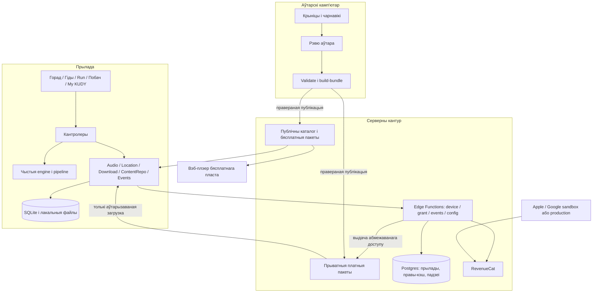
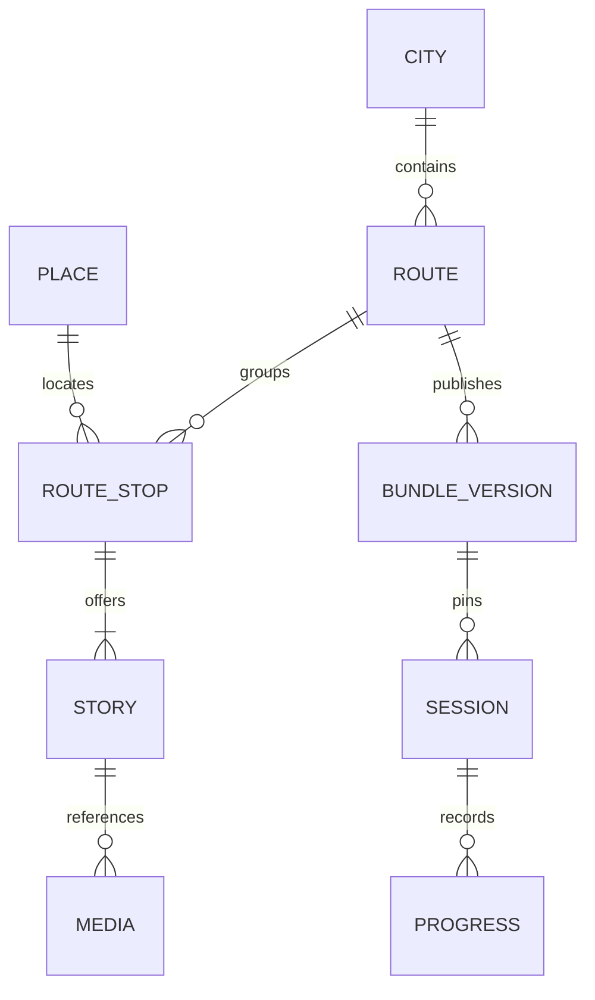
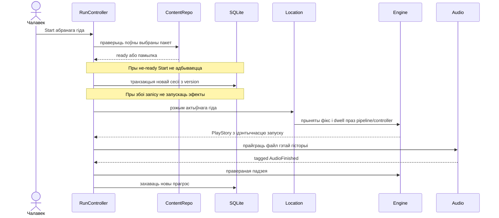
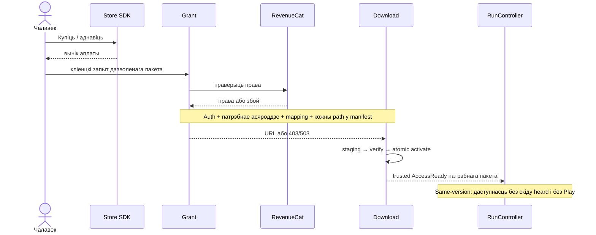

# Архітэктурная схема і межы рэалізацыі

**Дата:** 2026-09-07. **Статус:** структурная схема паводле прынятых рашэнняў `09/15`; не доказ працы стэку на прыладах. **Сфера:** MVP аўдыёгіда, ручныя Moments, foreground-падказкі гідаў. Канчатковыя тыпы прагрэсу і падзей закрываюцца атамарнымі G01-задачамі.

Крыніцы: [09](09_technical_architecture.md), [прадуктовыя правілы](../15_guide_decisions.md), [заданні](../agent-tasks/atomic/README.md). Гэта схема сувязяў, не другі незалежны набор палёў. Пры змене тыпу яго кананічная крыніца — вынік адпаведнай G01-задачы і сінхранізаваны `09`.

## 1. Кантуры і межы даверу

Аўтарскі інструмент не дзеліць БД або runtime з дадаткам. UI не ходзіць у Storage/RevenueCat напрамую. Кліент не мае service-role або store-server сакрэту. Сінтэтычныя sandbox-правы не адкрываюць production-файлы. Ніякай LLM у дадатку.

## 2. Кампаненты і ўладальнікі

Планавыя шляхі з `09`, не сцвярджэнне, што код ужо існуе.

| Кампанент | Адказнасць і ўласны стан | Уваход → выхад | Не робіць |
|---|---|---|---|
| `app/` | Адлюстраванне прынятага UI-стану, жэсты | дзеянне чалавека → каманда кантролеру | fetch, аўтарызацыю, persistent progress |
| `useRunController` | Аркестрацыя адной сесіі, выкананне каманд і запіс прагрэсу | ручныя/OS падзеі → reducer → эфекты сэрвісаў | другую копію правіл heard/аўтатрыгера |
| `core/engine` | Станы сесіі, прыдатнасць кропак, прагрэс, чарга, suspension | state + event + now + config → state + commands | GPS, сетку, файлы, React, схаваны гадзіннік |
| `core/pipeline` | Адкід дрэннай пазіцыі, згладжванне, dwell | фікс + кандыдаты → прынятыя падзеі | мутацыю heard і auto_fired |
| `services/audio` | Адзіны фізічны плэер і OS audio focus | каманда з токенам запуску → tagged callback | залік гісторыі чужому owner |
| `services/location` | Адзіная OS-падпіска, акно геафенсаў, watchdog | рэжым ад кантролера → фіксы/стан даступнасці | другі GPS для Moments або падказак |
| Nearby controller | Публічныя прапановы, групаванне, shown/dismissed | прыняты фікс + каталог + UI-стан → картка | Start, куплю, аўдыё, перазбройванне Run |
| `services/contentRepo` | Чытанне правераных пакетаў і вытворная даступнасць | ключ пакета → валідны кантэнт / недаступнасць | рашэнне пра пакупку з client-булева |
| `services/download` | Staging, хэшы, resume і атамарная актывацыя | дазволены маніфест → правераны пакет → AccessReady | падмену version сесіі, аўтагук |
| `services/entitlement` | Store SDK + запыт сервернага grant | дзеянне purchase/restore → стан права/памылка | самастойную выдачу права |
| `services/db` | Транзакцыі і міграцыі SQLite | запыты ўладальнікаў → durable запіс/derived індэкс | выдаленне прагрэсу пры ачыстцы кэшу |
| `services/eventLog` | Лакальная чарга і адпраўка са згодай | валідная падзея → локальны запіс/батч | уплыў consent на працу гіда |
| Сервер `grant` | Device auth, права, mapping прадукту і manifest membership | route/version/locale/tier/paths → кароткія URL або адмова | давер да чужога product_id, URL або path |

Гукавы owner/tagging і durable-палі не выдумляюцца аўтарамі сэрвісаў: іх кантракты даюць G01.02.a і G01.03.a. `AudioFinished(session_id, play_id)` — сённяшняя мяжа guide-model; яна патрабуе пашырэння для ручнога кантэнту без сесіі. Да гэтага нельга сцвярджаць, што інтэграцыя Moments гатовая.

## 3. Дадзеныя і ідэнтычнасць

Дыяграма паказвае сувязі, не гатовую SQL-схему: кантэнт дастаўляецца пакетамі, а не абавязкова асобнымі server-табліцамі. ROUTE — гід у UI; position толькі рэкамендаваны парадак. Ключ дастаўкі — route/version/locale/tier. Ключ сесіі — асобны session_id. У story асобны ID, у запуску асобная ідэнтычнасць; stop, story і playback нельга выкарыстоўваць узаемазаменна.

| Дадзеныя | Крыніца праўды | Захаванне / аднаўленне |
|---|---|---|
| Апублікаваны кантэнт | нязменны правераны пакет | лакальныя файлы; derived індэкс адбудоўваецца |
| Купля | крама / RevenueCat, правераныя серверам | пазітыўны кэш у дакладных межах; не client bought |
| Прагрэс, version сесіі, shown/dismissed R07 | лакальны durable стан | толькі міграцыі; не сціраецца cache purge |
| Бягучы фізічны гук і focus | audio service з tagged callbacks | пасля restart няма аўтаматычнага гуку; exact offset не абавязковы |
| Пазіцыя | апошні прыняты свежы фікс | не крыніца сервернай аналітыкі; stale не дае права запускаць |
| Серверная аналітыка | дастаўленыя consent-gated падзеі | не доказ усіх актыўных офлайн-сесій |

Падрабязная семантыка PROGRESS па stop/story — вынік G01.01.a; гэта адзначаная залежнасць, а не схаваная прадуктовая здагадка. Будучы imported namespace не можа падрабіць official origin або атрымаць grant; runtime-імпарт па-за MVP.

## 4. Тры асноўныя паслядоўнасці

UI-ўзаемадзеянне ў другой дыяграме скарочана: запыт grant робіць entitlement/download service пасля яўнага дзеяння, не чалавек уручную і не UI з серверным ключом.

**Аднаўленне:** прачытаць durable session → праверыць яе замацаваны пакет → аднавіць вытворны стан → прапанаваць працяг. Ні новая версія каталога, ні стары callback не мяняюць сесію. Няма патрэбнага файла — аднавіць загрузку або паказаць недаступнасць, не пазначаць гісторыю праслуханай. Паўза вызваляе GPS, чаргу і wakelock; R07 не ўключае іх назад. Чалавек можа завяршыць сесію нават пры непраслуханых гісторыях.

## 5. Памылкі і бяспечны бок збою

| Памылка | Абавязковае паводзіна | Праверка |
|---|---|---|
| Permission denied / stale GPS | ручны шлях, няма аўтагуку або R07 | G00.01, G05, G07.06 |
| Паўтор/стары callback | ніякай мутацыі новага запуску | G01.02.b |
| Няма entitlement / праверка недаступная | 403 / 503; няма fail-open | G00.03.b, G08.02 |
| Абрыў/хэш не супаў/месца скончылася | не-ready, папярэдні пакет захаваны | G01.03.b, G04.02 |
| Міграцыя durable не атрымалася | памылка без ачысткі прагрэсу | G04.01 |
| Consent адкліканы | серверная адпраўка спынена, лакальнае працуе | G09.02 |
| Каталог абноўлены або rollback | session.version не мяняецца | G01.03.b, G02.04 |

Нявырашаныя hardware/API-паводзіны не зачыняюцца новай дыяграмай. Пастаўшчык тайлаў, offline-manager/pack і версіі SDK патрабуюць вынікаў G00.02.c/G00.04.c. API endpoints, шляхі і коды — `09`, раздзел 5; не ствараць дадатковы backend дзеля схемы.

## 6. Што можна перадаваць агентам

Структурная архітэктура, межы і залежнасці вызначаныя. Першая хваля падзеленая ў [atomic/README](../agent-tasks/atomic/README.md). Толькі заданне з гатовымі ўваходамі і сваімі файламі прыдатнае да запуску. Наступныя эпікі G02–G14 застаюцца бэклогам: пасля закрыцця кантрактаў яны атрымліваюць такія ж асобныя briefs; гэта не дазвол рэалізаваць усю сістэму адначасова.
