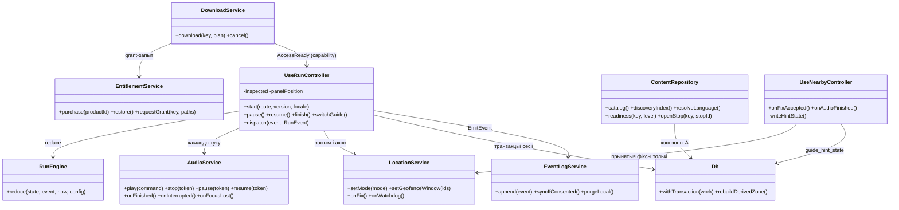
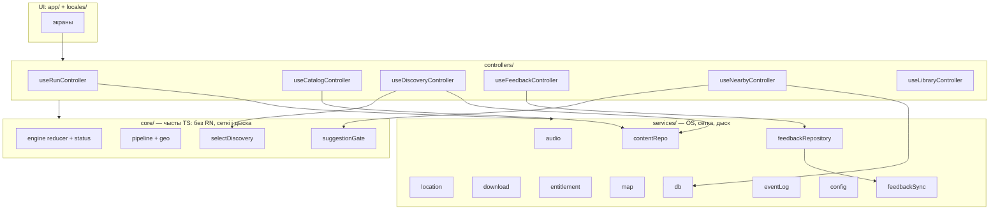

# Класы, модулі і інтэрфейсы: мапа рэалізацыі

**Дата:** 2026-09-15. **Задача:** [architecture-class-map](../agent-tasks/architecture-class-map.md). **Тып:** мапа рэалізацыі — файлы, экспартаваныя імёны, тыпы, залежнасці, уладальнікі стану і жыццёвы цыкл. **Статус:** дакументацыя, не код; production-файлаў у рэпазіторыя пакуль няма (scaffold — G00.04), і наяўнасць гэтай мапы не робіць ніводную задачу G02–G11 гатовай да старту.

| | |
|---|---|
| Што гэта | канкрэтная мапа «шлях → экспарт → адказнасць → уладальнік стану → задача» паверх прынятых кантрактаў |
| Чым не з'яўляецца | не другім наборам правіл; не схемай кампанентаў (яе крыніца — [18](18_component_blueprint.md)); не сервернай спецыфікацыяй ([09](09_technical_architecture.md), [21](21_discovery_feedback_architecture.md)); не дозвалам пачынаць заблакаваныя задачы |
| Кананічныя кантракты | [ADR G01.01](decisions/G01.01-narration-progress.md), [ADR G01.03](decisions/G01.03-session-access.md), `09`, [21](21_discovery_feedback_architecture.md), [11](../11_run_interaction.md), [20](../20_discovery_and_feedback.md), [run-model](../run-model/README.md), [15](../15_guide_decisions.md) R01–R10 |
| Мовы імёнаў | JSON-кантракты пакета і HTTP — `snake_case`; тыпы engine ў гэтым дакуменце — `camelCase`, як у прынятай выканальнай мадэлі (`run-model.mjs`); пераклад імёнаў робіць адзін адаптар уваходу ў engine (G05.01), не кожны сэрвіс асобна |

Кожны кантрактны тып тут цытуе сваю крыніцу; дзе мапа прапануе новы шлях або імя, якіх няма ў `09`/`21`, пазначана «прапанова мапы» — іх зацвярджэнне ідзе разам з задачай-уладальнікам, не да яе.

## 1. Статус дызайну і межы рашэнняў

### 1.1 Прынятыя крыніцы (канан, перавыкарыстоўваецца даслоўна)

| Крыніца | Статус | Чым кіруе ў гэтай мапе |
|---|---|---|
| [ADR G01.01](decisions/G01.01-narration-progress.md) (варыянт A, issue #12) | прынята 2026-09-14 | ідэнтычнасці `stop_id`/`story_id`/`play_id`/`session_id`; манатонныя `heard`/`auto_fired`; вытворны асноўны наратыў; маркеры і «Яшчэ можна адкрыць» |
| [ADR G01.03](decisions/G01.03-session-access.md) (issue #18) | прынята 2026-09-14 | durable-полі сесіі і моманты запісу; транзакцыйныя межы Start/Pause/Resume/switch/End; поўная ідэнтычнасць `AccessReady` і capability-канал; `play_seq` write-through; R07-сховішча shown/dismissed |
| `09` v1.1 + §20/§21 | рабочы кантракт | слаі, сэрвісы, API, зоны A/B SQLite, інварыянты валідатара, забаронены спіс §17, watchdog, падзеі §10 |
| [21](21_discovery_feedback_architecture.md) + фікстуры [G01.06](../agent-tasks/results/G01.06.md) | праектны кантракт, фікстуры ў main | `DiscoveryIndexV1`, ліміты схем, envelope каталога, `selectDiscovery` §4, feedback-табліцы і CAS §5 |
| [11](../11_run_interaction.md) | прынята | станы панэлі, `inspected` ≠ `nowPlaying`, правілы аўтазапуску 5.1–5.3, дэградацыя |
| [15](../15_guide_decisions.md) R01–R10, P01 | прынята | свабодны парадак, асобныя файлы, ручныя Moments, R07-межы, `be`+`en` старт |
| [run-model](../run-model/README.md) | прыняты кантракт у выканальнай форме | дакладныя пераходы і прыярытэт адхілення ўводу; імёны каманд, якія эмітуе мадэль |
| [ADR G00.01](decisions/G00.01-platform-evidence.md) | `blocked-external` | платформавыя абяцанні маюць сілу кантракту, **не** вымеранага факту: адаптары пішуцца па кантракце, доказы — G00.01.b-хвост і M0 |
| [ADR G00.02](decisions/G00.02-offline-map.md) | `decision-required` | выбар карты A/B/C не зроблены; мапа праектуе `services/map` так, каб выбар не мяняў яго кліентаў |

### 1.2 У рэв'ю (не зацверджана ў main)

- **G01.02.a** (уладальнік гуку, P02-кантракт, токены запуску) — вынік і ADR існуюць на галіне `zcode/14`, не злитыя ў main → па правілах `agent-tasks` гэта **не** зацверджаны кантракт. У мапе P02-дэталі (паўза-пазіцыя, вяртанне пасля Moment, чарга ручнога гуку) — адкрытая мяжа з уладальнікам G01.02; інварыянты фокуса (`09` §6.1, правіла 10 хвілін) — прыняты кантракт.
- **G01.03.c** (сінхранізацыя `09/11/14/15/16/18` з кантрактам G01.03) — **злітая ў main 2026-09-15 (PR #52)**: `09` §6.1 нясе поўную ідэнтычнасць `AccessReady` праз канал `services/download` і `play_seq` write-through. Каманды `UnsubscribeLocation`/`ReleaseWakelock`, якія эмітуе прынятая мадэль на Pause/End, у пераліку `09` §6.1 не названыя — мапа ідзе за мадэллю (G01.03.b); перанумарацыя пераліку каманд — з наступнай G01-зменай, не гэтай мапай.

### 1.3 Нявырашаныя дэталі: уладальнік → дакрануты інтэрфейс → што блакуе

Незалежныя межы ніжэй працуюць ужо цяпер; нявырашаная дэталь блакуе толькі названую рэалізацыю, не суседнія рашэнні. Паралельных альтэрнатыўных імёнаў палёў у дакуменце няма — адно імя, адна крыніца.

| Дэталь | Уладальнік | Дакрануты інтэрфейс | Што блакуе |
|---|---|---|---|
| Уладальнік гуку для ручнога Moment, паўза-пазіцыя аўдыё, вяртанне пасля Moment, чарга ручнога гуку | G01.02 (вынік у рэв'ю, §1.2) | `AudioService` API, каманды `PauseAudio`/`ResumeAudio`, engine-апрацоўка `FocusLoss`/`FocusRegain` (інварыянты 5–6 фокуса — прыняты `09` §6.1) | G05.03, G07.02–G07.03; адкрыццё Moment без гуку (R04) працуе ўжо цяпер |
| Парогі R07: блізкасць, accuracy, dwell, cooldown, групаванне | G07.04 (+ палявая каліброўка G11.02) | параметры `SuggestionGate` (§3.9) | G07.05–G07.06; само сховішча `guide_hint_*` ужо вызначана ADR G01.03 §3.9 |
| Спосаб офлайн-карты A/B/C і тайл-хостынг | G00.02.c (`decision-required`) → G00.04 (версіі) | унутранасэрвісныя дэталі `MapService`; readiness-склад варыянту A | G04.03 (картка гатоўнасці), G06.02; кліенцкі інтэрфейс карты ад выбару не залежыць |
| Адзіная схема падзей і памылак | G01.05 | `EventMap` (payload-allowlist §3.8), коды `eventLog` | G09.01–G09.05; сховішча і ідэмпатэнтнасць вызначаны `09` §10 ужо цяпер |
| Навігацыйны кантракт Горад → Гіды → Run | G01.04 | маршруты `app/`, склад кантролераў | G06.01, G06.06–G06.08, G10.01 |
| Vерсіі SDK/стэку і scaffold | G00.04 (уваход — кандыдаты [ADR G00.01 §5](decisions/G00.01-platform-evidence.md)) | адаптары сэрвісаў, не іх інтэрфейсы | уся production-рэалізацыя |
| Склад `uk`-рэлізу | пакет G14.04.a (`decision-required` за заснавальнікам) | allowlist локаляў (`uk` запланаваная, не апублікаваная, `21` §8) | G14.04.b–f; BE/EN правілы застаюцца дзеючымі |

## 2. Карта файлаў і адказнасцяў

Шляхі — планавыя (`09` §6, `21` §2); нідзе няма сцвярджэння, што файл існуе. Пазнака «прапанова мапы» — шлях/імя, якіх крыніцы не называлі.

```
app/                        # Expo Router — экраны
  (tabs)/explore.tsx  (tabs)/my.tsx
  city/[id]/guides.tsx  route/[id].tsx  run/[id].tsx  map.tsx
  demo/reviewer.tsx
controllers/                # hooks — адзінае месца мутабельнага стану UI
  useRunController.ts  useCatalogController.ts  useLibraryController.ts
  useDiscoveryController.ts  useFeedbackController.ts  useNearbyController.ts
services/                   # усё, што дакранаецца OS, сеткі, дыска
  location.ts  audio.ts  download.ts  entitlement.ts
  contentRepo.ts  map.ts  eventLog.ts  config.ts  db.ts
  feedbackRepository.ts  feedbackSync.ts
core/                       # ЧЫСТЫ TS, без RN
  engine/{state,events,commands,reducer,status}.ts
  pipeline/pipeline.ts  geo/{haversine,polyline}.ts
  discovery/selectDiscovery.ts  nearby/suggestionGate.ts   # гл. §3.9
contracts/                  # агульныя з вэбам і CLI: схемы і тыпы
  bundle/ (JSON Schema)  discovery.ts  feedback.ts  events.ts
tools/                      # ноўтбук: validate · build-bundle · simulate · readiness · feedback-report
supabase/functions/         # device · grant · events · config · feedback · rc-webhook
supabase/migrations/
web/                        # вэб-чытач бясплатнага пласта
locales/                    # be.ts · en.ts (uk — запланаваная, G14.04.d)
fixtures/discovery-contract/  fixtures/content/
```

### 2.1 contracts/ — публічны кантракт даных

| Адзінка | Тып | Адказнасць і забароны | Уваход → выхад | Стан | Задача / папярэднікі |
|---|---|---|---|---|---|
| `contracts/bundle/*.schema.json` (`Place`, `Story`, `Route`, `RouteStop`, `Moment`, `Media`, `Voice`, `Recommendation`) | JSON Schema | адзінае апісанне пакета для `validate`, дадатку і вэба; інварыянты `09` §3 (транскрыпт да аўдыё, allowlist локаляў, стабільны `RouteStop.id`, ніякіх extended-шляхоў у base-маніфесце) | файлы аўтара → правераная схема | няма (нязменныя версіі) | G02.01–G02.02 / G01.01✓, G01.03 (у рэв'ю .c), G01.04, G01.06✓ |
| `contracts/discovery.ts` (`DiscoveryIndexV1`, `DiscoveryRef`, `DiscoveryOffer`, `detail_ref` варыянты) | тыпы | трымае фікстуры G01.06 як канон; нічога пра UI/OS | build → індэкс; індэкс → selector і кэш | няма | G02.01 (спажывае G01.06✓) / G01.06✓, G01.03, G01.04 |
| `contracts/feedback.ts` (`FeedbackTarget`, шкала, прычыны, HTTP-коды §5.3) | тыпы | дыскрымінаваныя мэты; не выводзіць аўтара з `device_id` | кліент ↔ feedback API | няма | G02.01, G16.01 / G01.06✓, G08.01 |
| `contracts/events.ts` (`EventMap` payload-allowlist) | тыпы | адна табліца падзей `09` §10 + `discovery_offer_*` `21` §7; без каардынат/вольнага тэксту | сэрвісы → падзеі → `/v1/events` | няма | **G01.05** (брыфа яшчэ няма — гл. §7) / G01.01✓, G01.02, G01.03 |

### 2.2 core/ — чыстыя функцыі, без RN і сеткі

| Адзінка | Тып | Адказнасць і забароны | Уваход → выхад | Стан | Задача / папярэднікі |
|---|---|---|---|---|---|
| `core/engine/state.ts` (`RunState`, `SessionState`, тыпы палёў) | тыпы | канон палёў: ADR G01.01 §4.2 (манатонныя наборы, вытворны прэдыкат `storyAccessible`) + ADR G01.03 §3.1–3.2 (durable vs вытворныя; `playing`/`queued`/`suspended` не аднаўляюцца) | — | апісанне стану, без логікі | G05.01 / G01.01✓, G01.03✓ |
| `core/engine/events.ts` (`RunEvent`) | тыпы-union | канон `09` §6.1 + поўная ідэнтычнасць `AccessReady` (ADR §3.5); забаронена дадаваць поле-сінанімы | — | — | G05.01 / тымсама |
| `core/engine/commands.ts` (`RunCommand`) | тыпы-union | канон `09` §6.1; мадэль G01.03.b дадае `UnsubscribeLocation`/`ReleaseWakelock` на Pause/End — у пераліку `09` іх няма, мапа ідзе за прынятай мадэллю (§1.2) | — | — | G05.01 / тымсама |
| `core/engine/reducer.ts` (`reduce(state, event, now, config) → {state, commands[]}`) | чыстая функцыя | адзіны ўладальнік `heard`/`auto_fired`/`playing`/`queued`/`suspended`; прыярытэт адхілення ўводу `11` §5.1.1; `playId` — write-through `++playSeq` да каманды аўдыё; `AccessReady` прымае толькі праз capability-канал загрузкі і толькі пры поўным супадзенні ідэнтычнасці; гадзіннік і эфекты — звонку | стан + падзея + `now` + config → новы стан + каманды | манатонныя наборы, `playing`, `queued`, `suspended`, `playSeq` | G05.01 / G01.01✓, G01.02, G01.03✓ |
| `core/engine/status.ts` (`stopStatus`, `storyState`, `missedStories`) — **прапанова мапы** | чыстыя функцыі | вылічаныя статусы кропкі/story і «Яшчэ можна адкрыць» дакладна па ADR §4.5–4.6 і `11` §3.1; нічога не захоўвае і не мутуе | `RunState` + пакет → статусы | няма (вытворнае) | G05.01, G06.02 / G01.01✓ |
| `core/pipeline/pipeline.ts` (`processFix`) | чыстыя функцыі | 5 стадый `09` §6.2 па парадку; дрэнны фікс адкідваецца да любой мутацыі; пра `auto_fired`/`heard` не ведае; кандыдатаў атрымлівае звонку | фікс + кандыдаты + папярэдняе згладжванне → прынятыя падзеі (`DwellCompleted`) | толькі акно згладжвання і акумулятар dwell | G05.02 / G05.01, G00.01 |
| `core/geo/haversine.ts`, `core/geo/polyline.ts` | чыстыя функцыі | адлегласць і раскадроўка рэкамендаванага шляху; не ўладальнік пазіцыі | каардынаты → метры/кропкі | няма | G05.02 |
| `core/discovery/selectDiscovery.ts` (`selectDiscovery(index, criteria)`) | чыстая функцыя | дакладна правілы `21` §4 (тэмы OR, час AND, сезон па яўным выбары, exact/alternatives, парадак `editorial_order`→`offer_id`); не чытае GPS, дату, сетку, рэйтынгі; не стварае Run | `DiscoveryIndexV1` + `DiscoveryCriteria` → `DiscoveryResult` | няма | G15.01 / G01.06✓, G02.01, G00.04 |
| `core/nearby/suggestionGate.ts` — **прапанова мапы** | чыстая функцыя | адно рашэнне «паказаць/не паказаць/адкласці» па `09` §20 і `11` §15: свежы прыдатны фікс, блізкасць да любой кропкі, suppression (аўдыё/`FocusLoss`/`suspended`/купля), пераправерка адкладзенай, ліміт па `guide_id`; ніякіх аўдыёкаманд і другой падпіскі GPS | прыняты фікс + каталог previews + `guide_hint_*` + config → рашэнне карткі | няма (ліміты чытае, піша кантролер) | G07.04–G07.05 (парогі — G07.04) / G01.03✓ (сховішча), G01.04, G01.05 |

### 2.3 services/ — OS, сетка, дыск; класы толькі дзе ёсць уласны рэсурс

| Адзінка | Тып | Адказнасць і забароны | Уваход → выхад | Стан | Задача / папярэднікі |
|---|---|---|---|---|---|
| `services/audio.ts` (`AudioService`) | клас (адзіны фізічны рэсурс) | адзіны плэер і OS audio-focus (speech-рэжым, ducking аддае OS); пазіцыя ў мілісекундах; стан прайгравання вылічаецца з плэера, не дублюецца; tagged callback з ідэнтычнасцю `(sessionId, playId)`; dispose → перастварэнне, не reset; **не** залічвае гісторыю і не ведае `heard` | каманды engine (PlayStory/Stop/Pause/Resume) → tagged `onFinished`/`onInterrupted`/`onFocusLoss` | жывы plэер, бягучы токен запуску | G05.03 (дэталі ўладальніка — G01.02, §1.2) / G01.02, G00.01 |
| `services/location.ts` (`LocationService`) | клас (адзіная OS-падпіска) | дазволы, рэжым ад кантролера, акно геафенсаў ≤ 20 рэгіёнаў (пералік па свежай пазіцыі, пасля спрацоўкі і `AccessReady`), watchdog `acquiring→live→recovering→stalled` (15 с, backoff, generation counter мінулай сесіі); ручны Play і R07 не перазбройваюць акно Run; без сесіі падпіска толькі ў адкрытым foreground | рэжым/акно ад кантролера → фіксы ў pipeline + стан даступнасці/дазволаў | акно рэгіёнаў, watchdog, апошні рэжым | G05.02 / G00.01, G01.03✓ |
| `services/download.ts` (`DownloadService`) | клас | grant → `staging/` (сусед фінальнай дырэкторыі) → пер-файлавы `sha256` на ляту → атамарны rename → **толькі потым** `AccessReady(routeId, version, locale, tiers, stopIds, issuer='services/download')` праз тыпізаваны capability; рэзюмаванне па хэшы; пласты незалежныя; дэдуплікацыя запытаў, backoff з jitter; няўдалы upgrade не выдаляе стары пласт | маніфест/шляхі ад grant → правераны пакет + `AccessReady` | чарга загрузкі, `.part`-стан, адзін in-flight | G04.02 / G02.03, G04.01, G08.02 |
| `services/entitlement.ts` (`EntitlementService`) | клас | RevenueCat SDK (`app_user_id = device_id`), `purchase`/`restore`; grant-запыт да `/v1/grant` пасля яўнага дзеяння; кліент **не** вырашае права; лакальна толькі «пласт на диску = даступны» | дзеянне чалавека → стан пакупкі/памылка; адказ grant → `DownloadService` | бягучая аперацыя пакупкі | G08.03–G08.04 / G00.03, G08.01–G08.02 |
| `services/contentRepo.ts` (`ContentRepository`) | клас | чытанне каталога (envelope `21` §3.3: legacy v0/v1, невядомая major → толькі гіды), індэкса (памер/хэш да загрузкі, валідны кэш пры збоі), пакетаў; **трохузроўневая** праверка `sha256` (`09` §4); ланцужок выбару мовы — адно месца (яўны выбар → мова прылады ў бандле → `en` → `be`); вылічальная поўнасць пер-локаля; выдае толькі правераны кантэнт | ключ пакета/версіі → кантэнт, гатоўнасць, даступныя лакаля | кэш каталога і індэкса (зона A) | G04.03 / G02.03, G04.02, G01.03✓ |
| `services/db.ts` (`Db`, module-level singleton promise) | клас (зонавая мяжа) | адкрыццё і міграцыі (`user_version`, крок = транзакцыя; памылка міграцыі не сцірае базу); **drop-і-перастварыць — асобная функцыя зоны A, якая фізічна не бачыць табліц зоны B**; транзакцыі Start/Pause/Resume/switch/End/checkpoint па ADR §3.3 (readiness да транзакцыі, эфекты пасля commit); частковы ўнікальны індэкс `one_live_session`; **не** робіць сеткавых/OS-выклікаў | запыты ўладальнікаў → durable/derived запісы | злучэнне, міграцыі | G04.01 / G01.03✓, G00.04 |
| `services/eventLog.ts` (`EventLogService`) | клас | лакальная чарга (`event_queue`, зона B) з кліенцкім `event_id` (ідэмпатэнтнасць), батчавая адпраўка толькі са згодай; адмова/адкліканне спыняюць адпраўку, лакальны запіс працуе; payload — `contracts/events.ts`, без каардынат | валідныя падзеі сэрвісаў → лакальны запіс / батч | чарга, стан адпраўкі | G09.01–G09.02 / G01.05, G08.01 |
| `services/config.ts` (`ConfigService`) | клас | `GET /v1/config` + кэш і бяспечныя default; радыусы/dwell/кулдаўны без рэлізу; не можа адкрыць кантэнт або змяніць правілы сесіі | сервер → значэнні для pipeline/nearby | кэш канфіга | G09.05 / G00.04 |
| `services/map.ts` (`MapService`) | клас (адкладзеныя дэталі) | MapLibre RN; style/sprites/**гліфы** копіруюцца з бандла ў файлавую сістэму; атрыбуцыя ODbL бачная і клікабельная, у т.л. офлайн; спосаб офлайну A/B/C — па выніку G00.02.c; гатоўнасць тайлаў у агульнай гатоўнасці пакета — кандыдатны крытэр выбару ([ADR G00.02](decisions/G00.02-offline-map.md) §3.1), не прынятае правіла; без другога рэндэрара/ключа ў ассетах (§17) | бандл/рэгіён → рэндэрынг, панарама | офлайн-рэгіён (па варыянце A — уласнае сховішча рэндэрара) | G06.02 / G00.02.c, G00.04, G04.03 |
| `services/feedbackRepository.ts` (`FeedbackRepository`) | клас | уласная ацэнка, чарнавік, стан; `feedback_local` (зона B); максімум адзін in-flight на мэту; рэдагаванне падчас адпраўкі захоўваецца як наступнае жаданае значэнне; ніколі не чысціцца з кэшам | форма → чарнавік/аперацыя; ACK → стан | чарнавікі і станы водгукаў | G16.02 / G16.01, G04.01 |
| `services/feedbackSync.ts` (`FeedbackSync`) | клас | серыялізаваная адпраўка па мэце (`mutation_id`, `expected_revision` CAS), retry backoff 2/4/8…с да 5 хв з jitter, аўтаадпраўка спыняецца праз 7 дзён; 409 → `conflict` без аўтарэтрая; 401/422 → `action_required`; не стварае device нанова | чарга рэпазіторыя → HTTP `21` §5.3 → ACK/памылка | transport-state адной мэты | G16.02 / G16.01, G08.01 |

### 2.4 controllers/ — hooks; адзіныя месцы стыку

| Адзінка | Тып | Адказнасць і забароны | Уваход → выхад | Стан | Задача / папярэднікі |
|---|---|---|---|---|---|
| `controllers/useRunController.ts` | hook (Zustand) | **адзіны пісьменнік сесіі і адзіны мост engine↔свет**: чытае падзеі аўдыё/лакацыі/чалавека → `reduce` → выконвае каманды → checkpoint-транзакцыі ў `Db`; трымае чыста UI-стан: становішча панэлі (Peek/Half/Full), `inspected`, абяцанне аўтазапуску адзін раз; Start/Pause/Resume/switch/End праз транзакцыйныя межы ADR §3.3; **не** мае другой копіі правіл `heard`/аўтатрыгераў | падзеі + каманды → эфекты сэрвісаў і SQL | UI-стан панэлі, `inspected`; стан сесіі жыве ў engine + зоне B | G05.05, G06.03–G06.04 / G01.01✓, G01.02, G01.03✓, G04.01 |
| `controllers/useCatalogController.ts` | hook | каталог, прэв'ю, наяўныя лакаляў/пласты, стан «загружанае/купленае/гатовае» для экранаў; не вырашае пакупку і Start сам | `ContentRepository` + `DownloadService` стан → адлюстраванне | актыўныя фільтры экрана | G06.01 / G04.03, G02.01 |
| `controllers/useLibraryController.ts` | hook | My KUDY: загрузкі, памеры, выдаленне (адмаўляе выдаленне версіі жывой сесіі — ADR §3.4), мова, незавершаныя маршруты | `ContentRepository`/`Db` → дзеянні | выбар экрана | G06.04, G04.04 / G04.03 |
| `controllers/useDiscoveryController.ts` | hook | выбар чалавека (час/тэмы/сезон), `selectDiscovery`, `discovery_cache` (зона A) праз `ContentRepository`; показ exact/alternatives з `differences`; **не** кранае Run, GPS-уласніка і пакупку | выбар + індэкс → карткі | актыўныя крытэрыі выбару | G15.03 / G15.01, G04.03, G06.08 |
| `controllers/useFeedbackController.ts` | hook | форма, раскрыццё мэты (`disclosure_version`), edit/delete, delivery-станы рэпазіторыя; адпраўка толькі па яўным Send | форма → `FeedbackRepository` | стан формы | G16.03 / G16.02, G06.08 |
| `controllers/useNearbyController.ts` | hook | падказкі гідаў (R07): групаванне, ліміты паказу/адхілення, запіс `guide_hint_state`/`guide_hint_last` (зона B) па факце бачнасці, перанос ліміту ў Start праз транзакцыю ADR §3.9; рашэнне паказу — `SuggestionGate`; **ніколі** не запускае аўдыё і не аднаўляе GPS | `SuggestionGate` + каталог previews → картка + запіс лімітаў | бягучае акно падказак | G07.05–G07.06 / G07.04, G01.03✓, G09.02 |

### 2.5 app/ — экраны і лакаляў

| Адзінка | Тып | Адказнасць і забароны | Задача / папярэднікі |
|---|---|---|---|
| `app/(tabs)/explore.tsx`, `app/city/[id]/guides.tsx` | UI | куратарскі ўваход, рубрыка «Гіды», прэв'ю; адкрыццё — не гук | G06.01 / G01.04, G06.08 |
| `app/route/[id].tsx` | UI | вокладка, кропкі, **адна галоўная кнопка** Download→Start, памеры/пласты | G06.01 / G04.03 |
| `app/run/[id].tsx` | UI | адна паверхня: карта-фон + панэль Peek/Half/Full; транскрыпт у Full належыць `inspected`; жэсты і ✕ ≡ Back | G06.03 / G06.02 |
| `app/map.tsx` | UI | «Побач»: вольная прагулка, Moments, падказкі R07; асобная ад Run мова інтэрфейсу | G07.01–G07.02, G06.02 |
| `app/(tabs)/my.tsx` | UI | загрузкі, гісторыя сесій, мова, згода, выдаленне даных | G06.04 |
| `app/demo/reviewer.tsx` | UI | сімуляваны маршрут для рэвю; не абыходзіць production-аўтарызацыю | G11.04 |
| `locales/be.ts`, `locales/en.ts` | дадзеныя | усе радкі UI, нічога зашытага; `uk` — трэці файл толькі пасля рашэнняў пакета G14.04.a | G06.05; G14.04.d |

Усе экраны: адлюстроўваюць прыняты стан, жэст → каманда кантролера; ніякіх `fetch`, аўтарызацыі або persistent-прагрэсу ўнутры.

### 2.6 сервер — `supabase/functions/` + міграцыі

| Адзінка | Адказнасць | Забароны | Задача / папярэднікі |
|---|---|---|---|
| `device` (POST/DELETE) | рэгістрацыя ўстаноўкі; выдача `device_secret` адзін раз; каскаднае выдаленне `09` §5 | rate-limit; service role толькі тут | G08.01 / G00.04, G01.03✓ |
| `grant` | `RevenueCat` прама ў момант гранта (не webhook); mapping product→route/tier; кожны `path` — дакладна ў маніфесце `route_id × version × locale × tier`; fail-closed `403 no_entitlement` / `503 entitlement_unavailable` + `Retry-After`; пазітыўны кэш TTL 24 г | не давярае client product_id/URL/path; sandbox ≠ production | G08.02 / G08.01, G02.04, G00.03 |
| `events` | ідэмпатэнтны батч па `event_id` | payload-allowlist `contracts/events.ts` | G09.02 / G08.01, G01.05 |
| `feedback/` (read/PUT/delete) | CAS па `expected_revision`, `mutation_id`-ідэмпатэнтнасць, ліміты 8 KiB / 30-120 rpm, `disclosure_version` | `feedback_target_registry` піша толькі publisher; RLS deny-by-default | G16.01 / G01.06✓, G02.03, G08.01, G09.03 |
| `config` | remote config | тое ж, што `services/config` | G09.05 |
| `rc-webhook` (апцыянальна) | бухгалтэрыя: рэфанды, `TRANSFER`; HMAC па сырым целе, вакно 5 хв, ідэмпатэнтнасць | **не** на крытычным шляху гранта | G08.06 / G08.03 |
| міграцыі Postgres | `devices`, `entitlements`, `receipt_events`, `event_log`; feedback-табліцы `21` §5.2 з RLS і FK-cascade device-delete | additive; кожны UPDATE/DELETE — селектыўны WHERE | G08.01, G16.01 |

### 2.7 tools/ — ноўтбук; імпартуюць production-функцыі

| Адзінка | Адказнасць | Канон | Задача / папярэднікі |
|---|---|---|---|
| `tools/validate/` | JSON Schema + інварыянты `09` §3 + discovery-правілы `21` §3.2; спажывае фікстуры G01.06 у тэстах (блакуючы крытэр G02.02) | `contracts/bundle` | G02.02 / G02.01 |
| `tools/build-bundle/` | хэшы, `lock.json`, раскладанне public/private, discovery-index і registry-экспарт, каталог апошнім крокам | `09` §4, `21` §3.3, §5.2 | G02.03 / G02.02 |
| `tools/simulate/` | GPX-трэк праз тыя самыя `pipeline` + `reduce`; дэтэрмінізм (адна чарга адкладзеных дзеянняў, без `Date.now()`/`Math.random()`) | `09` §11 | G05.06 / G05.05 |
| `tools/readiness/` | даўжыня начыткі супраць хады, перакрыццё радыусаў | `09` §11 | G02.02–G02.03 |
| `tools/feedback-report/` | аўтарская агрэгацыя (count, гістаграма, прычыны, версія/мова) праз read-only аперацыю з admin-роллю; без сырых радкоў і device IDs | `21` §6 | G16.04 / G16.01 |

### 2.8 web/ і аўтарскі інструмент

- `web/` — вэб-чытач бясплатнага пласта (Vercel): той самы public-пакет і `contracts/`, BE/EN тэкст + транскрыпт, ручны Play, locked-кантэнт фізічна адсутнічае; ніякага checkout і фонавага GPS. G10.01–G10.02 / G02.03, G01.04.
- **Аўтарскі інструмент (`07`)** — асобны асяродак: Source → Fragment → Claim → Draft → approved; пераклад — новы Draft з паўторным рэвю. Не дзеліць код/БД/runtime з дадаткам; звязка толькі праз фармат бандла. G03.01–G03.04.

### 2.9 Па-за мяжой мапы (будучае, без класаў цяпер)

Імпарт чужога гіда (G12), артыкульныя рубрыкі (G13), акаўнт/`/v1/link` (G14.01), дасягненні (G14.02), рэклама (G14.03), фонавыя падказкі пры закрытым дадатку (G14.07), навучаны ранжынг (G14.08), частковы Start (G14.05). На іх не ствараюцца папярэднія класы, флагі або «агульныя інтэрфейсы на ўсё» — гэта забаронены спіс `09` §17 і межы R05/P03.

## 3. Каталог інтэрфейсаў

Прынцыпы: асінхроннае — толькі мяжа сэрвісаў; чыстае ядро — сінхроннае. Кожная аперацыя мае поспех/памылку; ідэмпатэнтнасць і адкідаць састарэльнае — у знаку. Таксамія праявы: адсутны дазвол (`permission_denied`), няма права (`no_entitlement`/403), праверка недаступная (`verification_unavailable`/503), няпоўны кантэнт (`content_incomplete`), няправільны ўвод (`invalid_input`/422), канфлікт (`conflict`/409), ліміт (`rate_limited`/429).

### 3.1 Ідэнтычнасці і прымітывы (канон: ADR G01.01 §4.1, ADR G01.03 §3.1)

```typescript
type StopId = string;        // RouteStop.id — стабільны паміж версіямі; не гісторыя і не файл
type StoryId = string;       // адзін наратыў: асобны тэкст, транскрыпт, аўдыё
type SessionId = string;     // адна прагулка; version і locale замацаваныя да End
type PlayId = number;        // лічыльнік запускаў унутры сесіі (playSeq); з session_id — токен запуску
type ContentVersion = string;
type Locale = 'be' | 'en' | 'uk';   // allowlist MVP; uk — запланаваная, не апублікаваная (`21` §8)
type Tier = 'base' | 'extended';
type Layer = 'base' | 'extended';
```

### 3.2 Стан engine (канон: ADR G01.01 §4.2 + ADR G01.03 §3.1–3.2)

```typescript
type SessionState = 'Idle' | 'Active' | 'Paused' | 'Ended';   // у SQLite 'finished' — адна мапа ў db-слаі
type PlayingRef = { readonly stopId: StopId; readonly storyId: StoryId; readonly playId: PlayId };

type RunState = {
  readonly sessionId: SessionId;
  readonly routeId: string;
  readonly version: ContentVersion;          // нязменны да End (ADR §3.4)
  readonly locale: Locale;                   // нязменны да End; UI-мова яго не мяняе
  readonly tier: readonly Layer[];           // інфармацыйны запіс старта (ADR §3.1)
  readonly tierAvailable: readonly Layer[];  // расце толькі праз AccessReady
  readonly accessibleStopIds: readonly StopId[]; // увод толькі ад даверанай гатоўнасці дыска
  readonly state: SessionState;
  readonly heard: readonly StoryId[];        // манатонны; толькі прыняты AudioFinished
  readonly autoFired: readonly StopId[];     // манатонны; толькі скончаная аўтаматычная спроба
  readonly playing: PlayingRef | null;       // null пасля аднаўлення: аднаўленне не гучыць
  readonly queued: { stopId: StopId; radius: number; at: number } | null; // адна ячэйка, найноўшы
  readonly autoplaySuspended: boolean;       // пасля аднаўлення заўжды true (ADR §3.2)
  readonly playSeq: number;                  // write-through да высоўкі каманды аўдыё
  readonly lastFix: AcceptedFix | null;
};
```

Durable (зона B, радок `session`): `session_id, route_id, version, locale, tier, state, started_at, finished_at, auto_fired[], heard[], last_stop_id, play_seq`. Вытворныя, не захоўваюцца: `accessible_stop_ids`, `tier_available` (вывад з дыска), `playing`, `queued`, `autoplay_suspended`, прэдыкат `storyAccessible` — па ADR §3.2.

### 3.3 Падзеі і каманды (канон: `09` §6.1; пашырэнні — прынятая мадэль G01.03.b)

```typescript
type RunEvent =
  | { type: 'Start' }
  | { type: 'Pause' } | { type: 'Resume' } | { type: 'End' }
  | { type: 'LocationAccepted'; fix: AcceptedFix }
  | { type: 'DwellCompleted'; stopId: StopId; radius: number }
  | { type: 'AudioFinished'; sessionId: SessionId; playId: PlayId; storyId?: StoryId }
  | { type: 'UserSelectedStop'; stopId: StopId }                    // асноўны наратыў
  | { type: 'UserSelectedStory'; stopId: StopId; storyId: StoryId } // названы, у т.л. дадатковы
  | { type: 'UserPausedAudio' } | { type: 'FocusLoss' } | { type: 'FocusRegain' }
  | { type: 'Timer'; id: string }
  | { type: 'AccessReady'; routeId: string; version: ContentVersion; locale: Locale;
      tiers: readonly Layer[]; stopIds: readonly StopId[];
      issuer: 'services/download' };  // прымаецца толькі праз capability-канал загрузкі

type RunCommand =
  | { type: 'PlayStory'; sessionId: SessionId; stopId: StopId; storyId: StoryId;
      path: string; playId: PlayId }
  | { type: 'StopAudio' } | { type: 'PauseAudio' } | { type: 'ResumeAudio' }
  | { type: 'SetGeofenceWindow'; stopIds: readonly StopId[] } | { type: 'ClearGeofences' }
  | { type: 'UnsubscribeLocation' } | { type: 'ReleaseWakelock' }   // Pause/End — мадэль G01.03.b
  | { type: 'ScheduleTimer'; id: string; ms: number } | { type: 'CancelTimer'; id: string }
  | { type: 'PersistProgress' }                                      // checkpoint кантролера
  | { type: 'EmitEvent'; event: EventMap[keyof EventMap] }           // згода-гейт у eventLog
  | { type: 'ShowArrivalCard'; stopId: StopId };                     // UI; R07 — не гэта

function reduce(state: RunState, event: RunEvent, now: number, config: RunConfig):
  { state: RunState; commands: readonly RunCommand[] };
```

Сінхронна; чыста. Гарантіі: невядомы/чужы ўвод ігнаруецца цалкам (`AudioFinished` — пара `(sessionId, playId)` + супадзенне `storyId` пры наяўнасці; `AccessReady` — поўная ідэнтычнасць і канал; спозненыя падзеі для `Ended` — no-op). Паўторны `AccessReady` той самай ідэнтычнасці — no-op; паўторны `DwellCompleted` той самай кропкі не выцясняе яе саму з чаргі. `reduce` ніколі не кідае выключэнне на валідны тып уводу — адхіленне ёсць зыход.

### 3.4 Аўдыё — `AudioService` (канон: `09` §6.3; дэталі ўладальніка — G01.02, §1.2)

```typescript
type AudioPlayToken = { readonly sessionId: SessionId; readonly playId: PlayId };

interface AudioService {
  // Толькі адзін актыўны токен; новы play спыняе папярэдні (інварыянт «не два наратывы»).
  play(command: Extract<RunCommand, { type: 'PlayStory' }>): Promise<void>;
  // Памылка занятасці — звычайны вынік (09 §14.7), не crash; хуткія Play/Stop норма.
  stop(token: AudioPlayToken): Promise<void>;      // невядомы/стары токен — no-op
  pause(token: AudioPlayToken): Promise<void>;     // пазіцыя паўзы і аднаўленне таго ж файла — G01.02
  resume(token: AudioPlayToken): Promise<void>;
  onFinished(cb: (t: AudioPlayToken & { storyId?: StoryId }) => void): () => void;
  onInterrupted(cb: (t: AudioPlayToken) => void): () => void;  // перапыненае ≠ AudioFinished
  onFocusLost(cb: () => void): () => void;         // звук аддае OS; уваход у suspended робіць engine
}
```

Тэгіраванне: кожны callback нясе пару `(sessionId, playId)`; callback старой пары адкідаецца ўладальнікам (кантролерам праз `reduce`), не самім сэрвісам.

### 3.5 Лакацыя — `LocationService` (канон: `09` §6.3, §9)

```typescript
type Fix = { lat: number; lng: number; accuracy: number; at: number }; // ва ўваходзе; ніякага схаванага гадзінніка
type AcceptedFix = Fix & { acceptedAt: number };  // прайшоў accuracy gate; ужо ў RunState.lastFix

type LocationMode = 'off' | 'foreground' | 'activeGuide'; // activeGuide толькі пасля Start-транзакцыі
type PermissionState = 'granted' | 'denied' | 'restricted';
type WatchdogState = 'acquiring' | 'live' | 'recovering' | 'stalled'; // парог цішыні 15 с

interface LocationService {
  setMode(mode: LocationMode): void;             // Pause/End → 'off' (аднаўленне GPS толькі яўнае)
  setGeofenceWindow(stopIds: readonly StopId[]): void; // ≤ 20 рэгіёнаў; пералік па свежай пазіцыі
  permission(): Promise<PermissionState>;
  onFix(cb: (fix: Fix) => void): () => void;     // сырыя фіксы → pipeline; адбор робіць pipeline
  onWatchdog(cb: (s: WatchdogState) => void): () => void;
}
```

Адзіная OS-падпіска; падказкі R07 бяруць прынятыя фіксы з `RunState.lastFix` і не перазбройваюць акно Run. Сцэнары збою OS (забіты працэс, battery saver) — па матрыцы M0 ([ADR G00.01](decisions/G00.01-platform-evidence.md) §7): кантракт — чэсны стан + ручны шлях, не абяцанне фоне.

### 3.6 Кантэнт і гатоўнасць — `ContentRepository` (канон: `09` §3–§4, §7; ADR G01.03 §3.6)

```typescript
type PackageKey = { routeId: string; version: ContentVersion; locale: Locale; tier: Tier };
type ReadinessLevel = 'full' | 'cheap';   // поўная на загрузцы; дэшавая на адкрыцці (09 §4)

type ContentError =
  | { kind: 'content_incomplete'; missingFiles: number }   // partial ніколі не ready
  | { kind: 'verification_unavailable' }
  | { kind: 'invalid_input' };

interface ContentRepository {
  catalog(): Promise<Catalog>;                                   // envelope `21` §3.3, legacy-сумяшчальны
  discoveryIndex(): Promise<DiscoveryIndexV1 | null>;            // null = валіднага кэшу няма → горад без падбору
  resolveLanguage(requested: Locale | null, bundle: Bundle): Locale; // ланцужок: выбар → прылада → en → be
  readiness(key: PackageKey, level: ReadinessLevel): Promise<Readiness>; // гатоўнасць = дыск + lock.json
  openStop(key: PackageKey, stopId: StopId): Promise<StopContent | ContentError>;
}
```

Гатоўнасць не мае сцягу ў зоне B — яна выводзіцца з дыска (`09` §7; ADR §3.6). `storyAccessible` лічыць engine з `accessibleStopIds` + `tierAvailable`, куды ўвод ідзе толькі ад даверанай гатоўнасці.

### 3.7 Загрузка і права — `DownloadService`, `EntitlementService` (канон: `09` §5–§6.3; ADR G01.03 §3.5)

```typescript
type GrantResult =
  | { ok: true; lockUrl: string; urls: readonly { path: string; url: string; expiresAt: number }[] }
  | { ok: false; error: { kind: 'no_entitlement' } }             // 403
  | { ok: false; error: { kind: 'verification_unavailable'; retryAfter?: number } }; // 503

interface EntitlementService {
  purchase(productId: string): Promise<{ ok: true } | PurchaseError>;  // non-consumable; SDK → RevenueCat
  restore(): Promise<{ ok: true } | PurchaseError>;                    // тая ж крама; cross-platform — не MVP
  requestGrant(key: PackageKey, paths: readonly string[]): Promise<GrantResult>; // пасля яўнага дзеяння
}

interface DownloadService {
  download(key: PackageKey, plan: GrantResult & { ok: true }): Promise<DownloadOutcome>;
  cancel(): void;                                   // толькі адна актыўная загрузка; паўтор — dedup
}
type DownloadOutcome =
  | { ok: true }                                    // пасля гэтага DownloadService эмітуе AccessReady
  | { ok: false; error: ContentError | { kind: 'storage_full' | 'network_unavailable' } };
```

`AccessReady` дасягае engine **толькі** пазначаным capability-каналам уладальніка `DownloadService` аднаго запуску дадатку (ADR §3.5: сапраўднасць дае канал, не радковае поле `issuer`). Мінтованне URL — порцыямі з перамінваннем; адкліку падпісанага URL няма.

### 3.8 Падзеі — `EventLogService` (канон: `09` §10; схема — G01.05)

```typescript
interface EventLogService {
  append(event: { type: string; payload: EventMap[keyof EventMap] }): void;
  // Кліенцкі event_id (UUID) → ідэмпатэнтнасць; новы ручны паўтор = новая падзея, не дубль.
  syncIfConsented(): Promise<void>;   // адмова/адкліканне згоды: лакальны запіс працуе, адпраўкі няма
  purgeLocal(): Promise<void>;        // частка DELETE /v1/device (G09.03); бандлы і прагрэс не кранае
}
```

Payload — толькі `contracts/events.ts` (ідэнтыфікатары + бакетаваныя лічбы); каардынат, вольнага тэксту, URL з токенамі няма. `EventMap` — адкрытая мяжа G01.05.

### 3.9 Дыск і транзакцыі — `Db`; падказкі — `SuggestionGate`; водгукі

```typescript
// Зона A (аднаўляльнае): bundle_asset, catalog_cache, discovery_cache — дроп дазволены асобнай функцыяй.
// Зона B (незаменнае): session, event_queue, settings, device, guide_hint_state, guide_hint_last,
//                      feedback_local, feedback_outbox — толькі міграцыі (user_version), дроп недасяжны.
interface Db {
  withTransaction<T>(work: (tx: DbTx) => Promise<T>): Promise<T>;
  // Транзакцыйныя межы Start/Pause/Resume/switch/End/checkpoint — ADR G01.03 §3.3:
  // readiness да транзакцыі; эфекты (геафенсы, гук, wakelock) толькі пасля commit.
  rebuildDerivedZone(): Promise<void>;  // адзіны шлях ачысткі; фізічна не бачыць табліц зоны B
}

interface SuggestionGateInput {
  fix: AcceptedFix | null;               // стары фікс не дае прапановы
  permission: PermissionState;
  sessionActive: boolean;                // Paused → падказак няма (R07)
  suppressed: boolean;                   // аўдыё, FocusLoss, suspended, аперацыя пакупкі
  nearbyGuides: readonly { guideId: string; distanceM: number }[];  // публічныя previews толькі
  hints: { shownThisScope: readonly string[]; lastShownAt: number | null };
  thresholds: SuggestionThresholds;      // кананічныя лічбы — G07.04; тут толькі тып
}
type SuggestionDecision =
  | { kind: 'show'; guideIds: readonly string[] }   // адна згрупаваная картка
  | { kind: 'defer' }                               // пераправерка пасля аўдыё па свежым фіксе
  | { kind: 'none' };
function suggest(input: SuggestionGateInput): SuggestionDecision;  // чыста; ліміты піша кантролер

// Feedback (кліентскі бок; серверны CAS — `21` §5.3, табліцы §5.2):
type FeedbackDelivery = 'draft' | 'pending' | 'sending' | 'sent' | 'conflict' | 'action_required';
interface FeedbackRepository {
  saveDraft(target: FeedbackTarget, draft: OwnRating): Promise<void>;
  enqueueSend(target: FeedbackTarget, op: { mutationId: string; expectedRevision: number }): Promise<void>;
  stateOf(target: FeedbackTarget): Promise<{ delivery: FeedbackDelivery; acknowledged?: OwnRating }>;
}
```

### 3.10 Discovery — `selectDiscovery` (канон: `21` §4, перавыкарыстоўваецца даслоўна)

```typescript
type DiscoveryCriteria = {
  city_id: string;
  content_locale: string;
  max_minutes?: number;
  theme_ids: readonly string[];
  preferred_season?: "spring" | "summer" | "autumn" | "winter";
};
type DiscoveryResult = {
  exact: readonly DiscoveryMatch[];
  alternatives: readonly DiscoveryMatch[];
};
type DiscoveryMatch = {
  offer_id: string;
  reasons: readonly ("editorial" | "theme_match" | "within_time" | "season_recommended")[];
  differences: readonly ("duration_unknown" | "over_time" | "theme_mismatch" | "season_unassessed" | "season_not_recommended")[];
};
function selectDiscovery(index: DiscoveryIndexV1, criteria: DiscoveryCriteria): DiscoveryResult;
```

## 4. Дыяграмы

### 4.1 Класы і сувязі (кампазіцыя; спадкавання няма дзе няма канкрэтнай прычыны)



### 4.2 Модульныя залежнасці і межы даверу



Правілы: стрэлкі ўгору забаронены — `core/` не імпартуе ні RN, ні сэрвісаў; UI не ходзіць у сетку/дыск/RevenueCat мінуючы кантролеры і сэрвісы; адзіны ўвод `AccessReady` у engine — capability-канал `DownloadService`; адзіны ўладальнік OS-падпіскі GPS і плэера.

### 4.3 Жыццёвы цыкл: сесія, плэер, лакацыя

```mermaid
sequenceDiagram
  actor User as Чалавек
  participant RC as useRunController
  participant DB as Db (зона B)
  participant LOC as LocationService
  participant ENG as reduce()
  participant AUD as AudioService
  User->>RC: Start (готоўнасць пацверджаная раней)
  RC->>DB: INSERT сесіі (version, play_seq=0)
  RC->>LOC: setMode(activeGuide) + SetGeofenceWindow
  LOC->>ENG: прыняты фікс → DwellCompleted
  ENG-->>RC: PlayStory(playId=+1)
  RC->>AUD: play(token)
  AUD-->>RC: onFinished(token)
  RC->>ENG: AudioFinished → heard +1
  RC->>DB: checkpoint (PersistProgress)
  User->>RC: Паўза прагулкі
  RC->>DB: UPDATE state=paused
  RC->>AUD: StopAudio
  RC->>LOC: setMode(off) + ClearGeofences
  Note over RC,AUD: Перапыненне званком: FocusLoss → suspended, без чаргі
  User->>RC: Завяршыць / забіты працэс
  RC->>DB: state=finished (End)
  Note over RC,DB: Рэстарт: чытаем сесію → гатоўнасць пакета →
  Note over RC,DB: suspended=true, playing=null, queued=null; аўдыё толькі па яўным дзеянні
```

## 5. Уладальнікі і правілы цэласнасці

### 5.1 Адзіны ўладальнік на кожны факт

| Факт | Адзіны ўладальнік | Як да яго трапляюць падзеі | Хто чытае |
|---|---|---|---|
| Прагрэс сесіі (`heard`, `auto_fired`) | рэдуктар `core/engine`; durable копія — радок `session` праз checkpoint кантролера | падзеі → `reduce` → каманда `PersistProgress` → `Db.withTransaction` | UI, «Яшчэ можна адкрыць», гісторыя My KUDY |
| Ідэнтычнасць запуску (`session_id`, `play_id`) | engine (`playSeq` write-through да каманды аўдыё) | `PlayStory` каманда нясе пару; callback без той пары адкідаецца | `AudioService`, падзеі §10 |
| Аўдыё-фокус і фізічны гук | `AudioService` (аддае OS, speech-рэжым) | каманды engine; `FocusLoss` вяртаецца tagged callback-ам | панэль Peek, lock-screen |
| Чарга трыгераў (`queued`, адна ячэйка) | engine | `DwellCompleted` падзея; выцясненне → `auto_fired` | engine (адкладзены запуск) |
| Бягучы разгляданы кантэнт (`inspected`, становішча панэлі) | `useRunController` (UI-стан, **не** engine) | жэсты і тапы экрана | Run-экран; транскрыпт заўжды `inspected` |
| Версія кантэнту сесіі | engine пры Start (замацаваная да End); фізічная праўда — дыск | `AccessReady` іншай версіі адхіляецца цалкам; каталог не падмяняе файлы | `ContentRepository`, download, My KUDY |
| Правераная гатоўнасць асетаў | дыск + `lock.json`; лічыць `ContentRepository.readiness` і вывад engine | загрузка (`DownloadService`) → актывацыя → гатоўнасць з дыска; ніякай калонкі «ready» у зоне B | картка гатоўнасці, Start-gate, `storyAccessible` |
| Аўтарызацыя / права | сервер (`grant` праз RevenueCat); кліент толькі запрашае | `EntitlementService.requestGrant` пасля яўнага дзеяння чалавека | `DownloadService` |
| Стан падказак R07 (shown/dismissed) | `guide_hint_state`/`guide_hint_last` (зона B) праз `useNearbyController` | факт бачнасці карткі, не адпраўка падзеі | `SuggestionGate`, перанос у Start (ADR §3.9) |
| Згода на аналітыку | `settings` (зона B) | форма згоды да першай адпраўкі; адкліканне спыняе `syncIfConsented`, не працу гіда | `EventLogService` |

### 5.2 Як падзеі дасягаюць уладальніка і што робяцца са збоем

- **Адзін шлях уводу:** кожная падзея свету (`onFix`, `onFinished`, `onFocusLost`, дзеянні чалавека, `AccessReady`) трапляе ў `reduce` праз `useRunController.dispatch` — другога каналу мутацыі стану няма. Эфекты выконваюцца толькі па камандах, высоўваных рэдуктарам, і толькі пасля commit адпаведнай транзакцыі (ADR §3.3).
- **Састарэлыя callback:** пара `(sessionId, playId)` у кожным аўдыё-тэзе; watchdog мае generation counter; `AccessReady` — поўная ідэнтычнасць; падзея для `Ended` сесіі не мае адрасата і ігнаруецца. Нічога са старой сесіі не мутируе новую.
- **Часткова завершаныя запісы:** checkpoint ідэмпатэнтны (паўторны/навейшы запіс бяспечны); crash паміж падзеяй і checkpoint губляе апошні факт чэсна; `play_seq` write-through нуляве рызыку колізіі токенаў; partial загрузка ніколі не выдаецца за ready (ADR §3.7).
- **Дзве спробы Start/switch адначасова:** частковы ўнікальны індэкс `one_live_session` — другую жывую сесію адхіляе база, не ўзаемнай блакіроўкай у кодзе.

### 5.3 Класіфікацыя сховішча

| Клас | Што | Правілы жыцця |
|---|---|---|
| Durable (зона B) | `session`, `event_queue`, `settings`, `device`, `guide_hint_state`, `guide_hint_last`, `feedback_local`, `feedback_outbox` | толькі міграцыі; дроп фізічна недасяжны; выдаленне чалавека — яўная аперацыя (device-delete), загружаныя бандлы і прагрэс яна не кранае |
| Аднаўляльнае (зона A) | `bundle_asset`, `catalog_cache`, `discovery_cache`, файлы staging | перабудова з дыска/каталога; ачыстка кэшу не датычыцца зоны B |
| Ніколі не аднаўляецца аўтаматычна | `playing`, `queued` (заўжды null пасля аднаўлення), `autoplay_suspended` (заўжды true) | аднаўленне не запускае гук; рашэнне прымае новая свежая пазіцыя або яўнае дзеянне |

## 6. Праходы сцэнараў

Кожны выклік — з каталога §3; сесійныя крокі ідуць праз `useRunController` (адзіны пісьменнік).

1. **Готовы пакет → Start → любая кропка → завяршэнне аўдыё.** `ContentRepository.readiness(full)` → `Db.withTransaction(Start: INSERT, play_seq=0, перанос R07-лімітаў)` → каманды `SetGeofenceWindow` + `LocationService.setMode('activeGuide')` пасля commit → `onFix` → `processFix` → `reduce(DwellCompleted)` (умовы ADR §4.8, прыярытэт адхілення `11` §5.1.1) → `PlayStory(playId=++playSeq)` → `AudioService.play(token)` → `onFinished(token)` → `reduce(AudioFinished)`: `heard += storyId`, `playing=null`, чарга па правілах §5.3 → `PersistProgress` → `EmitEvent(story_audio_completed)`.
2. **Ручны паўтор, перарваны на сярэдзіне.** `UserSelectedStop` → `PlayStory` (без `auto_fired` — ручны шлях) → перапыненне `UserPausedAudio`/`FocusLoss` → `StopAudio`, `autoplaySuspended=true` → факт `heard` не мяняецца; статус кропкі — вылічаны (`played`, калі асноўны ў `heard`); паўторны запуск — з пачатку файла (R03), токен новы (`playId` рос).
3. **Аўдыё гіда → адкрыць Moment → яўны Play Moment → вяртанне.** Адкрыццё карткі Moment ніколі не гучыць (R04). Яўны Play Moment ідзе праз тое самае адзінае `AudioService` — новы токен спыняе папярэдні; вяртанне да гіда — яўнае дзеянне чалавека, не аўтапрацяг. **Мяжа:** дакладныя паводзіны пераключэння і вяртання — кантракт G01.02 (вынік у рэв'ю, §1.2); гэты праход свядома не завяршае яго выдуманымі дэталямі, і да закрыцця G01.02 G07.03 не пачынаецца.
4. **Пакупка → збой загрузкі → retry → актывацыя той самай версіі.** `EntitlementService.purchase` → store ok → `requestGrant` → `503 verification_unavailable` (або абрыў) → UI «Куплена · трэба загрузіць», без паўторнай аплаты (пазітыўны кэш гранта TTL 24 г) → `DownloadService.download` retry → staging → пер-файлавы `sha256` → атамарны rename → `AccessReady(routeId, version, locale, [extended], stopIds, issuer='services/download')` праз capability → `reduce`: `tierAvailable += extended`, `accessibleStopIds` пералічаны, геафенсы пералічаны; **Play няма**, `heard`/`auto_fired` цэлыя (праверкі той самай версіі, ADR §3.5).
5. **Стары callback пасля End і новай сесіі.** `onFinished({sessionId: старая, playId: стары})` → у старой сесіі стан `Ended` — падзея no-op; у новай сесіі пара не супадае (новы `sessionId`; `playSeq` пачаўся з 0 на новым радку, таму адзін `playId` не адрознівае — адрознівае пара) → ігнараванне, нічога не залічваецца (ADR §4.11).
6. **Рэстарт з замацаванай старой версіяй пры новым каталогу.** Аднаўленне: `Db` чытае радок сесіі (`version=vN`) → `ContentRepository.readiness(vN)` з дыска → сесія аднаўленая, `playing=null`, `queued=null`, `suspended=true` → «Працягнуць захаваную прагулку?»; абнаўленне каталога і `AccessReady` новай версіі адхіляюцца (ідэнтычнасць §3.3, праверка 2); адсутны файл → чэсны недаступны стан, не Play і не `heard` (ADR §3.7).
7. **Адкладзеная падказка R07 падчас аўдыё → адыход або адхіленне.** Падчас аўдыё `SuggestionGate` вяртае `defer` (suppressed) → пасля `AudioFinished` кантролер пераправярае **новым** рашэннем па свежым фіксе: чалавек сышоў → `none`, стратная картка выкінутая (не чарга); адхіленне → `useNearbyController` піша `guide_hint_state` (адзін паказ `guide_id` за scope), перажывае restart сесіі; перад Start ліміты пераносяцца ў сесійны scope у транзакцыі Start (ADR §3.9).
8. **Няма дазволу на лакацыю і згоды на аналітыку.** `LocationService.permission() = 'denied'` → Start дае ручны рэжым: бачны радок «аўтаматычныя гісторыі не працуюць», спіс кропак, ручны Play тым самым `UserSelectedStop`; аўтатрыгеры і R07 выключаныя, wakelock не трымаецца марна. `EventLogService.append` піша лакальна (зона B), `syncIfConsented()` не адпраўляе; прагрэс, загрузкі і водгукі працуюць поўнасцю.

## 7. Перадача агентам-рэалізатарам

### 7.1 Модуль → задача → статус папярэднікаў

| Модуль/інтэрфейс | Задача-уладальнік | Папярэднікі і іх факт |
|---|---|---|
| `core/engine/*` production | G05.01 | G01.01✓ (main); G01.02 — вынік у рэв'ю; G01.03✓ ADR + мадэль (сінхранізацыя .c у рэв'ю) |
| `core/pipeline` + `services/location` | G05.02 | G05.01, G00.01 (`blocked-external`: матрыца not-run) |
| `services/audio` | G05.03 | G01.02 (у рэв'ю), G00.01 |
| Чарга і suspended | G05.04 | G05.02, G05.03 |
| Durable Start/Pause/Resume/End | G05.05 | G04.01, G04.03, G05.04 |
| `tools/simulate` | G05.06 | G05.05 |
| `services/download`, staging/verify/activate | G04.02 | G02.03, G04.01 |
| `services/db`, міграцыі | G04.01 | G01.03✓, G00.04 |
| `services/contentRepo`, картка гатоўнасці | G04.03 | G04.02 |
| `contracts/bundle`, `contracts/discovery.ts`, `contracts/feedback.ts`, `tools/validate` | G02.01–G02.02 | G01.01✓, G01.03 (рэв'ю .c), **G01.04 (брыфа няма)**, G01.06✓ |
| `tools/build-bundle`, публікацыя | G02.03–G02.04 | G02.02, G00.04 |
| `services/entitlement`, сервер grant/device | G08.01–G08.04 | G00.03.b✓ (PR #53); G00.03.c/.d `blocked-external` (sandbox-акаўнты), G02.04, G08.01 |
| `services/eventLog`, `config`, згода/выдаленне | G09.01–G09.05 | G01.05 (брыфа няма), G08.01, G04.01 |
| `app/` экраны і кантролеры каталога/бібліятэкі | G06.01–G06.05 | G01.04 (брыфа няма), G06.08, G04.03 |
| `useNearbyController`, `suggestionGate`, падказкі | G07.04–G07.06 | G01.03✓ (сховішча), G01.04, G01.05, G02.01 |
| `core/discovery/selectDiscovery`, discovery UI | G15.01, G15.03 | G01.06✓, G02.01, G00.04, G06.08 |
| feedback-сервер, `feedbackRepository`/`Sync`, форма | G16.01–G16.04 | G01.06✓, G02.03, G08.01, G09.03, G16.02, G06.08 |
| `web/` | G10.01–G10.02 | G02.03, G01.04, G03.05 |
| Скразная прыёмка і поле | G11.01–G11.04 | поўны ланцуг вышэй |

### 7.2 Што рэальна пачынаецца цяпер

- **Production-код дадатку: нічога.** Усе шляхі кліента замыкаюцца на G01.02 (рэв'ю), G00.04 (scaffold/версіі) або G01.04/G01.05 (брыфаў яшчэ няма — іх напісанне асобная праца пасля закрыцця G01.02 і зварнай ўзгадненасці G01.02.c з кантрактам G01.03, без перанумароўвання).
- **Незалежнае цяпер:** G03.01 (аўтарскі пайплайн — асобны інструмент, папярэднікаў няма); хвостовыя прыладавыя доказы G00.01.a/.b і G00.02.a (замер варыянту A паводле [ADR G00.02](decisions/G00.02-offline-map.md) §4) — `blocked-external` да з'яўлення прылад/акаўнтаў; G00.03.c/.d — тое ж.
- **Патрэбныя рашэнні да пачатку:** уладальнік гуку (G01.02), сінхранізацыя G01.03.c, scaffold G00.04, навігацыйны кантракт G01.04, схема падзей G01.05, выбар карты G00.02.c.

### 7.3 Агульныя файлы і межы адначасовасці

Адначасова іх піша толькі адна задача: `09`, `11`, `15`, `16`, `17`, `18`, `21`, `run-model/*`, `contracts/` (план 2026-09-13 §7; `agent-tasks/README.md`). G00.04 адзін інтэгруе высновы спайкаў у `09` і root-канфіг. Гэтая мапа (`19`) уводзіцца адной задачай і далей чытаецца; яе змена пры змене кантракту — у складзе задачы, што мяняе кантракт, адным наборам правак разам з яго крыніцай.

### 7.4 Прапановы новых дзіцячых задач

Мапа не дадае новых ID і не перанумароўвае бэклог. Дзве **адсутныя** (не залішнія) адзінкі бачныя ўжо ў `16`, але брыфаў не маюць: **G01.04** (навігацыйны кантракт) і **G01.05** (адзіная табліца падзей) — іх краткія брыфы (`agent-tasks/`) — наступная планавальная праца пасля закрыцця G01.02/G01.03; іх інтэрфейсы тут апісаны як межы (`EventMap`, склад кантролераў), не як зацверджаныя схемы. Лішніх/надмерных задач мапа не выявіла: кожны модуль §2 мае аднаго ўладальніка-эпік і адзін незалежна прымальны вынік.

## 8. Што гэтая мапа не дублюе

Гэтая мапа не дублюе: схему кампанентаў (`18`), серверны кантракт (`09` §5, `21` §5), правілы Run (`11`) або правілы выбару (`21` §4 — перавезены даслоўна як кантракт, не пераказ). Дзе тэкст цытуе кантракт — спасылка ідзе ў крыніцу; змена кантракту мяняе крыніцу і гэтую мапу разам, ніколі толькі мапу.
