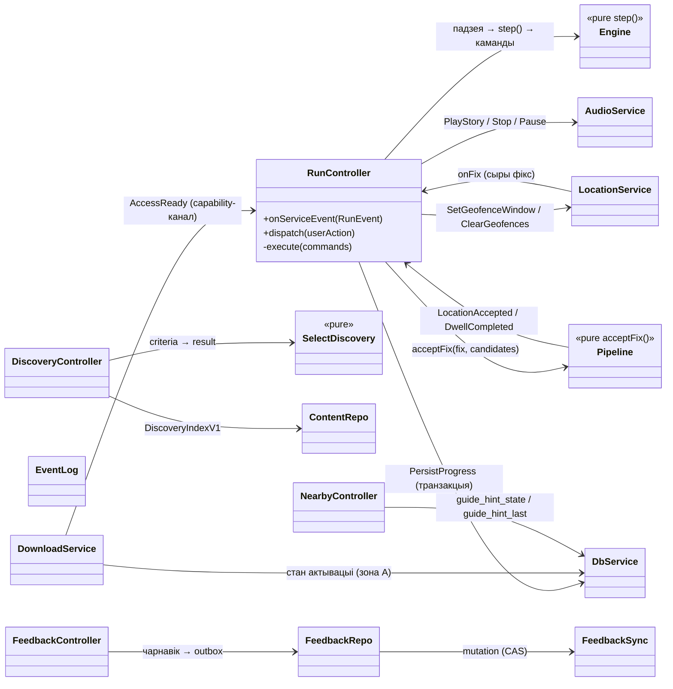

# Мапа класаў, модуляў і інтэрфейсаў

**Дата:** 2026-09-15. **Статус:** выкананае заданне [architecture-class-map](../agent-tasks/architecture-class-map.md); дакументацыя, не код. **Месца ў герархіі:** [18](18_component_blueprint.md) задае кампаненты і патокі, [09](09_technical_architecture.md) — кантракт распрацоўкі, [21](21_discovery_feedback_architecture.md) — кантракт discovery/feedback. Гэтая мапа дадае файлавы ўзровень (шляхі, подпісы, уладальнікаў стану) і не стварае другой крыніцы правілаў: кожны кантракт тут спасылаецца на сваю кананічную крыніцу. Выканаўчая праверка логікі — [`docs/run-model/`](../run-model/README.md); спайкі `G00.*` — ізаляваныя доказы платформы. Тэхнічны архітэктурны рэвю рантайм-коду 2026-09-15 (дакумент 22, PR #84) — індэкс знаходак, не кантракт.

## 1. Статус праектавання і межы рашэнняў

### 1.1 Што прынята і пераўжываецца даслоўна

| Крыніца | Што кананічнае | Як выкарыстоўваецца ніжэй |
|---|---|---|
| [ADR G01.01 §4](decisions/G01.01-narration-progress.md) (варыянт A, прыняты 2026-09-14) | `heard` — `Set<story_id>`, `auto_fired` — `Set<stop_id>`, вытворны `primary_story_id`, маркеры кропак, умовы аўтазапуску | раздзелы 2–3, 5, усе сцэнары |
| [ADR G01.03 §3](decisions/G01.03-session-access.md) (прыняты, issue #18) | durable-полі `session`, транзакцыйныя межы, `AccessReady(route_id, version, locale, tier, stop_ids[], issuer='services/download')`, `play_seq` write-through, табліцы R07 і `migration_log`, зоны A/B | раздзелы 2, 3, 5 |
| [09](09_technical_architecture.md) §5–§7 | API, закрыты спіс кодаў, слаі, planned-шляхі, інварыянты engine | раздзелы 2–4 |
| [21](21_discovery_feedback_architecture.md) §2–§6 | `DiscoveryIndexV1`, `selectDiscovery`, feedback-табліцы, CAS API, ліміты, `discovery_cache` (зона A) | раздзелы 2–3, 5 |
| [15](../15_guide_decisions.md) R01–R10 | прадуктовыя правілы (свабодны парадак, адзіны голас гіда ў аўтаматыцы, R07-ліміты) | раздзел 6 |

### 1.2 Што адкрытае — і што гэта блакуе

Мапа працуе з незалежнымі межамі: модуль праектуецца цяпер, яго канкрэтныя паводзіны чакаюць рашэнне. Ніякі адкрыты кантракт не абыходзіцца вынайдзеным палем.

| Адкрыты кантракт | Што фіксуе | Інтэрфейс, які чакае | Блакуе рэалізацыю |
|---|---|---|---|
| [G01.02](../16_delivery_backlog.md) (P02) — уладальнік гуку | пераключэнне Run ↔ ручны Moment, токен запуску, фон | tagged callbacks `services/audio` (поўны набор) | G05.03, G07.02–G07.03 |
| G01.04 — навігацыя Горад → Гіды | пераходы, вяртанне ў Run, пустыя станы | маршруты `app/`, `useCatalogController` | G06.01+, G02.01 |
| G01.05 — табліца падзей | allowlist падзей/памылак, абавязковыя палі | `EmitEvent(type, payload)` payload-тыпы | G09.01+ |
| G00.01.b/.c — прыладавыя доказы GPS/аўдыё | фактычныя OS-абмежаванні | канфіг watchdog, абяцанні фону | G05.02, G05.03, G00.04 |
| G00.02.c — рашэнне пра карту (ADR напісаны, **не прыняты**) | спосаб офлайну, пастаўшчык тайлаў | `services/map` рэалізацыя | G06.02, G00.04 |
| G00.03.c/.d — рэальныя sandbox-пакупкі | store-факты | `services/entitlement` production | G08.03+ |
| G07.04 — лікі R07 (парог, dwell, cooldown) | канфігурацыйныя значэнні | `services/config` схема падказак | G07.05 |
| G06.06–G06.08 — зацверджаны дызайн | візуальны набор | усе UI-экраны `app/` | G06.01+, G15.03, G16.03 |

Дэталі, якія гэта блакуе, названыя ў раздзеле 7. Пры гэтым чыстыя модулі (`core/engine`, `core/pipeline`, `core/discovery/selectDiscovery`) праектуюцца цяпер без гэтых залежнасцяў — іх уваходы і выхады ўжо зафікаваныя прынятымі кантрактамі.

### 1.3 Адзіны ўладальнік правілаў прыёму пазіцыі і вытрымкі (AR-5)

Правіла «якая пазіцыя дае права на аўтазапуск» мае **адзін уладальнік па слаях**, а не адну функцыю ў кожным модулі:

- **`core/pipeline`** валодае прыёмам фікса: accuracy gate (адкід > 40 м), spike rejection (> 12 км/г ці > 5 м), згладжванне па 3 фіксах, dwell-акумулятар (старт `dwell_ms = 6000`) — [09 §6.2](09_technical_architecture.md). Ён **не ведае** `heard`/`auto_fired` і не мутуе стан.
- **`core/engine`** валодае пераправеркай на мяжы трыгера: свежасць ≤ 30 000 мс, `accuracy ≤ radius`, адкладзеная адлегласць ≤ 2 × radius — умовы §4.8 ADR G01.01 і інварыянты 7–8 `09`.
- **`services/config`** — адзіны дастаўнік значэнняў (радыус, dwell, cooldown, свежасць) без рэлізу; заяўленыя ліміты калібруюцца ў поле [G11.02](../16_delivery_backlog.md).

Лакальныя лікі ў іншых месцах — **не правілы дадатку**:

| Месца | Значэнні | Статус |
|---|---|---|
| `docs/run-model/run-model.mjs` `located()` | свежасць 30 000 мс, accuracy ≤ radius, чарга ≤ 2 × radius | мадэлюе engine-межу; супадае з ADR; пасля пераносу ў engine мадэль замярзае як гістарычная ([README мадэлі](../run-model/README.md)) |
| `spikes/G00.01-location-audio/src/session.mjs` | `MAX_ACCURACY_M = 40` (pipeline-gate), `MAX_FIX_AGE_MS = 15 000`, `DWELL_MS = 6 000` | legacy значэнні спайку: правяралі жыццяздольнасць слаёў на прыладзе, не з'яўляюцца кантрактам; 15 000 мс свежасці — строгая ўмова тэставага замеру спайку, не мяжа engine |

Спайкі наўмысна ізаляваныя і **не зліваюцца** ў агульныя класы: яны аднаразовыя доказы платформавых паводзін з уласнымі тэстамі. Кансалідацыя дубляў адбываецца ў момант напісання engine паводле гэтай мапы, не праз рэфакторынг спайкаў (рэвю 2026-09-15, дакумент 22, PR #84 — раздзел 4, правіла 3).

## 2. Мапа файлаў і адказнасцей

Шляхі — planned з `09` §6 і `21` §2; коду яшчэ няма, акрамя `run-model` і спайкаў. Скарачэнні: **клас** — рэсурс з уласным станам і жыццёвым цыклам; **чыста** — функцыі без I/O; **сэрвіс** — мяжа OS/сеткі/дыска; **кантролер** — аркестрацыя і адзінае месца мутабельнага стану.

### 2.1 Ядро — чысты TypeScript, без RN-імпартаў

| Модуль | Тып | Адказнасць (і яўнае «не робіць») | Уваход → выхад | Стан: валодае / чытае | Задача | Папярэднікі |
|---|---|---|---|---|---|---|
| `core/engine/reducer.ts` | чысты `step()` | адна мутацыя стану на падзею; умовы аўтазапуску; чарга | `(state, event, now, config) → { state, commands[] }` | валодае `heard`, `auto_fired`, `playing`, `queued`, `autoplay_suspended`, `tier_available`, `accessible_stop_ids`; чытае `last_fix` | G05.01 | ADR G01.01, G01.02, G02.01 |
| `core/engine/{events,commands,state}.ts` | тыпы | адна кананічная назва кожнага поля/падзеі | раздзел 3 | — | G05.01 | тое самае |
| `core/pipeline/pipeline.ts` | чысты | прыём фікса: gates → smoothing → dwell → кандыдаты (AR-5, §1.3) | фікс + кандыдаты → прынятыя падзеі (`LocationAccepted`, `DwellCompleted`) | валодае толькі Акном згладжвання і dwell-акумулятарам | G05.02 | G00.01.c |
| `core/geo/{haversine,polyline}.ts` | чысты | адлегласці і лінія маршруту | каардынаты → метры | без стану | G05.02 | — |
| `core/discovery/selectDiscovery.ts` | чысты | дэтэрмінаваны падбор з тлумачэннямі | `(index, criteria) → DiscoveryResult` | без стану | G15.01 | G01.06, G02.01 |

Забарона слаю: `core/` не імпартуе React Native, сетку, дыск, схаваны гадзіннік; эфекты толькі як каманды ([09 §6](09_technical_architecture.md)).

### 2.2 Кантролеры (Zustand; адзінае месца мутабельнага стану UI)

| Модуль | Адказнасць | Не робіць | Уладальнік якога стану | Задача |
|---|---|---|---|---|
| `controllers/useRunController.ts` | аркестрацыя адной сесіі: прыём падзей ад сэрвісаў → `step()` → выкананне камандаў → checkpoint; **адзіны пісьменнік** радка `session` | другую копію правілаў `heard`/аўтатрыгера; прамыя OS-выклікі | жывой сесіі (праз engine), парадку checkpoint-аў | G05.05 |
| `controllers/useCatalogController.ts` | каталог, прэв'ю, наяўныя локалі/пласты | рашэнне пра пакупку з client-сцягу | стан экранаў каталога | G06.01 |
| `controllers/useLibraryController.ts` | My KUDY: загрузкі, памеры, выдаленне, мова | выдаленне замацаванай версіі актыўнай сесіі (ADR G01.03 §3.4) | стан бібліятэкі | G06.04 |
| `controllers/useNearbyController.ts` | R07: групаванне, shown/dismissed, перанос у Start | Start, куплю, аўдыё, перазбройванне геафенсаў Run | запісы `guide_hint_state`/`guide_hint_last` | G07.05 |
| `controllers/useDiscoveryController.ts` | выбар чалавека, стан індэкса/кэшу | змену Run, пакупку, чытанне GPS | крытэрыі падбору, `discovery_cache`-кантракт | G15.03 |
| `controllers/useFeedbackController.ts` | форма, раскрыццё мэты, edit/delete, станы адпраўкі | адпраўку да яўнага Send | чарнавік і стан формы | G16.03 |

### 2.3 Сэрвісы — мяжа OS, сеткі і дыска

| Модуль | Тып | Адказнасць / валодае | Жыццёвы цыкл | Задача |
|---|---|---|---|---|
| `services/location.ts` | клас | адзіная OS-падпіска, акно геафенсаў ≤ 20 рэгіёнаў, watchdog `acquiring → live → recovering → stalled` (парог 15 с); валодае падпіскай, не пазіцыяй | узбройванне на Start/Resume; `ClearGeofences` на Pause/End; generation counter гасіць callback мінулай сесіі | G05.02 |
| `services/audio.ts` | клас | адзіны фізічны плэер, audio focus (speech-рэжым), lock-screen; tagged callbacks па `(session_id, play_id)` | стварэнне на першы Play; dispose → перастварэнне, не reset | G05.03 (поўны кантракт — G01.02) |
| `services/download.ts` | клас | грант → staging → пер-файлавы хэш → атамарны rename → **адзіны выдаўца `AccessReady`** (capability-канал ADR G01.03 §3.5) | чарга на пакет; resume па хэшу; пласты незалежныя | G04.02 |
| `services/entitlement.ts` | клас | RevenueCat SDK + запыт сервернага гранта; не вырашае права сам | сесія пакупкі; restore асобны | G08.03 |
| `services/contentRepo.ts` | сэрвіс | чытанне правераных пакетаў, каталог, fallback моў, вытворная гатоўнасць з дыска | кэш каталога; нічога не піша ў зоне B | G04.03 |
| `services/db.ts` | клас | SQLite-адкрыццё (module-level singleton promise), транзакцыі §3.3, міграцыі зоны B | адно злучэнне на працэс; памылка міграцыі не дазваляе дроп базы | G04.01 |
| `services/device.ts` | функцыі + адаптар `services/device-secure-store.ts` | рэгістрацыя прылады адзін раз: сакрэт → expo-secure-store, `device_id` → зона B праз services/db; crash-window аднаўляецца свежай identity; bearer-кантракт агульны з feedback (`21` §2) | чакае першага спажыўца (G08.03/G09.02/G16.02); без паўторнай рэгістрацыі пры жывой паре | G08.01 |
| `services/eventLog.ts` | клас | лакальная чарга падзей з захаваннем у `event_queue` (зона B) праз `services/db`, батч, адпраўка толькі са згодай; без каардынат | чарга перажывае restart; згода брамуе толькі адпраўку | G09.01–G09.02 |
| `services/config.ts` | сэрвіс | remote config + кэш + бяспечны default; адзін дастаўнік лікаў AR-5 | кэш перажывае офлайн | G09.05 |
| `services/map.ts` | сэрвіс | MapLibre, офлайн-рэгіён, style/glyphs з бандла, атрыбуцыя ODbL | **gated:** рашэнне G00.02.c не прынятае | G06.02 |
| `services/feedbackRepository.ts` | сэрвіс | уласная ацэнка, `feedback_local`/`feedback_outbox`, транзакцыі; не чысціць durable разам з кэшам | чарга перажывае restart; макс 1 in-flight на мэту | G16.02 |
| `services/feedbackSync.ts` | клас | серыялізаваная адпраўка па мэце, CAS, backoff 2…8 с (мяжа 5 хв), stop праз 7 дзён | адна перадача за раз; без аўтарэгістрацыі на 401 | G16.02 |

### 2.4 Сервер (Supabase) і аўтарскі інструмент

| Адзінка | Адказнасць | Задача |
|---|---|---|
| `supabase/functions/device/` | рэгістрацыя прылады, хэш сакрэта, rate-limit | G08.01 |
| `supabase/functions/grant/` | device auth → права праз RevenueCat → mapping → manifest membership → кароткія URL; закрыты спіс кодаў | G08.02 (спайк-гатовая логіка — `spikes/G00.03-sandbox-grant/server/`) |
| `supabase/functions/feedback/` | auth, валідацыя мэты праз registry, CAS, ліміты | G16.01 |
| `supabase/functions/{events,config}/` | прыём consent-gated падзей; remote config | G09.02, G09.05 |
| `supabase/migrations/` | табліцы прылад/права-кэша/падзей; `feedback_target_registry`/`_current`/`_mutations` з RLS deny-by-default | G08.01, G16.01 |
| `contracts/` | JSON Schema бандла (`G02.01`) + `discovery.ts`/`feedback.ts` (`21` §2) — агульныя з вэбам і CLI | G02.01 |
| `tools/{validate,build-bundle,simulate,readiness}/` | аўтарская зборка і праверка; **асобны працэс без агульнага коду/БД з дадаткам** | G02.02–G02.04, G05.06 |
| `tools/feedback-report/` | admin-only справаздача аўтара (агрэгаты, без device IDs) | G16.04 |
| `web/` | вэб-плэер бясплатнага пласта той самай крыніцы пакета | G10.01 |

### 2.5 UI-экраны

`app/(tabs)/explore.tsx`, `app/city/[id]/guides.tsx`, `app/route/[id].tsx`, `app/run/[id].tsx`, `app/(tabs)/my.tsx`, `app/map.tsx` — адлюстраванне прынятага стану і жэсты → каманды кантролераў; без fetch, аўтарызацыі і persistent-прагрэсу. Уся візуальная рэалізацыя **gated** праз G06.06–G06.08.

### 2.6 Што наўмысна адсутнічае

- Імпарт чужых гідаў (`services/import.ts`, `tools/import-guide/`) — будучы эпік G12, патрабуе асобнага зацверджанага рашэння; тут не праектуецца.
- Гарадскія рубрыкі (G13), сістэмныя падказкі ў фоне (G14.07), падбор з водгукаў (G14.08) — не ствараюць модуляў да рашэнняў.
- Немаў base-service герархіі, generic event bus, DI-фрэймворка: кантролеры — хукі, сэрвісы — звычайныя класы, злучнасць праз яўныя інтэрфейсы раздзела 3.

## 3. Каталог інтэрфейсаў

Подпісы — спецыфікацыя для агентаў, не ўжо створаныя файлы. Кожная падзея/поле мае адну кананічную крыніцу (раздзел 1.1).

**Межа напісання імёнаў:** кананічныя кантрактныя імёны (`session_id`, `route_id`, `stop_id`, `story_id`, `play_id`, `auto_fired`, `heard`, `accessible_stop_ids`…) застаюцца snake_case даслоўна ў ADR, `09`, SQL-калонках і задакументаваных падзеях. TypeScript-ідэнтыфікатары ніжэй — camelCase па канвенцыі мовы (`sessionId`, `stopId`, `autoFired`…) — гэта механічнае пераўтварэнне таго самага імя, не другі кантракт. Мапаванне жыве ў адным месцы: мяжа кантролер ↔ `services/db` (запіс durable-радка) і кантролер ↔ сэрвісы (тэгі callback'аў). Трэцяе напісанне вынайджаць забаронена; імя палі заўжды правяраецца па сваёй кананічнай крыніцы з раздзела 1.1.

### 3.1 Engine: падзеі, каманды, рэдуктар

```typescript
// Канон: 09 §6.1 + ADR G01.01 §4 + ADR G01.03 §3.5. Сінхранізацыя забаронена рукамі — толькі праз змену крыніцы.
type RunEvent =
  // 'Start' тут — рэдуктарная форма ўводаў start() мадэлі (ADR G01.03 §3.3: readiness да транзакцыі);
  // у пераліку падзей `09` §6.1 Start пазначаны без палёў — гэта дапаўненне мапы, не другі канон.
  | { type: 'Start'; sessionId: SessionId; routeId: RouteId; version: VersionId; locale: Locale; tier: Tier[]; accessibleStopIds: StopId[] }
  | { type: 'Pause' } | { type: 'Resume' } | { type: 'End' }
  | { type: 'LocationAccepted'; fix: AcceptedFix }
  | { type: 'DwellCompleted'; stopId: StopId }                    // pipeline ужо пацвердзіў вытрымку
  | { type: 'AudioFinished'; sessionId: SessionId; playId: number; storyId?: StoryId }
  | { type: 'UserSelectedStop'; stopId: StopId }
  | { type: 'UserSelectedStory'; stopId: StopId; storyId: StoryId }
  | { type: 'UserPausedAudio' }
  | { type: 'FocusLoss' } | { type: 'FocusRegain' }               // FocusRegain > 10 хв → закрыццё кропкі
  | { type: 'Timer'; id: string }
  | { type: 'AccessReady'; routeId: RouteId; version: VersionId; locale: Locale;
      tier: Tier; stopIds: StopId[]; issuer: 'services/download' };  // толькі праз capability-канал (§3.2)

type RunCommand =
  | { type: 'PlayStory'; storyId: StoryId; path: string; sessionId: SessionId; playId: number }
  | { type: 'StopAudio' } | { type: 'PauseAudio' } | { type: 'ResumeAudio' }
  | { type: 'SetGeofenceWindow'; stopIds: StopId[] } | { type: 'ClearGeofences' }
  | { type: 'ScheduleTimer'; id: string; ms: number } | { type: 'CancelTimer'; id: string }
  | { type: 'PersistProgress' }
  | { type: 'EmitEvent'; payload: EventPayload }                  // allowlist — G01.05 (адкрыта)
  | { type: 'ShowArrivalCard'; stopId: StopId };

function step(previous: RunState, event: RunEvent, now: number, config: EngineConfig):
  { state: RunState; commands: RunCommand[] };
```

`RunState` — палі §4.2 ADR G01.01 даслоўна: `heard: Set<story_id>` (манатонны), `auto_fired: Set<stop_id>` (манатонны), `playing: { stop_id, story_id, play_id } | null`, `queued: { stop_id, radius, at } | null`, `accessible_stop_ids`, `tier_available`, `autoplay_suspended`, `last_fix`, `focus_lost_at?` (транзітнае поле `09` §6.1: час FocusLoss для інварыянту 5 — FocusRegain пазней за 10 хв закрывае кропку), `play_seq` (write-through лічыльнік запускаў ADR G01.03 §3.1: на кожным PlayStory расце на +1 і пішацца ў durable радок; ён і ёсць `play_id` каманды PlayStory), плюс замацаваныя `session_id`/`route_id`/`version`/`locale`. Забароненыя сінонімы (`consumed`, `played`-калонка, `heard: Set<stop_id>`) — ADR §4.2.

`EngineConfig` — толькі значэнні з `services/config` (свежасць, множнік чаргі, вакно FocusRegain 10 хв — інварыянт 5 `09`); без функцый і без чытання гадзінніка.

### 3.2 Межа даверу `AccessReady` (capability-канал)

```typescript
// Выдавец — адзін: services/download, адзін запуск дадатку (ADR G01.03 §3.5).
// Сапраўднасць дае тыпізаваны канал, не радок issuer; эмуляцыя кантролерам/UI/entitlement немагчымая.
export interface DownloadAccessPort {
  onAccessReady(handler: (event: Extract<RunEvent, { type: 'AccessReady' }>) => void): void;
}
```

- Сінхроннасць: падзея аднаразовая, дастаўляецца кантролеру пасля commit актывацыі; **ідэмпатэнтнасць** на баку engine: паўтор той самай ідэнтычнасці — no-op.
- Памылкі да гэтай мяжы — раздзел 3.6; сам `AccessReady` не мае «памылковага» выніку: непадобная падзея ігнаруецца цалкам.

### 3.3 Location і pipeline

```typescript
// Значэнні LocationMode — прапанова гэтай мапы; кананічны кантракт «рэжым ад кантролера» — 09 §6.3/§18,
// канчатковы набор станаў фіксуе G01.04/G00.01.c.
type LocationMode = 'idle' | 'city-surface' | 'active-guide' | 'paused';
interface FixInput { lat: number; lng: number; accuracy: number; at: number }   // недаступныя/будучыя/адмоўныя значэнні не прымаюцца
interface AcceptedFix { lat: number; lng: number; accuracy: number; at: number; distances: Map<StopId, number> }

interface LocationService {
  setMode(mode: LocationMode): void;          // узбраенне/вызваленне падпіскі і геафенсаў
  setGeofenceWindow(stopIds: StopId[]): void; // ≤ 20 рэгіёнаў; пералік па свежым фіксе
  onFix(handler: (fix: FixInput) => void): void;   // сыры фікс → кантролер (далей acceptFix у pipeline, §5.2)
  status(): 'acquiring' | 'live' | 'recovering' | 'stalled';       // watchdog, парог 15 с
}
// Выхад pipeline'а кантролер правярае праз step(): падзеі ўжо сабраныя ў формы RunEvent з §3.1,
// у тым лічбе LocationAccepted несце прыняты fix (крыніца last_fix для праверак свежасці, 09 інварыянт 8).
function acceptFix(fix: FixInput, candidates: ReadonlyMap<StopId, number>, config: PipelineConfig):
  { fix: AcceptedFix; events: Array<Extract<RunEvent, { type: 'LocationAccepted' } | { type: 'DwellCompleted'; stopId: StopId }>> };
```

- Памылка «дазволу няма» — асобны стан `status()`, не выкітак; UI дае ручны шлях (G00.01.c дакажа OS-дэталі).
- Стары generation пасля перазапуску падпіскі адхіляецца (stale-result rejection).

### 3.4 Аўдыё (gated: G01.02)

Зафіксаванае ўжо цяпер: адзіны фізічны плэер; кожны callback несце `playId` запуску; **перапыненне — ніколі не completion** (R03, `09` інварыянт 6); стан прайгравання вылічаецца, не дублюецца.

```typescript
interface AudioService {
  play(request: { storyId: StoryId; path: string; sessionId: SessionId; playId: number }): Promise<void>;
  stop(): void; pause(): void; resume(): void;
  onEvent(handler: (cb: AudioTaggedEvent) => void): void;   // тэг: (sessionId, playId)
}
// AudioTaggedEvent — канчатковы tagged union: G01.02 (адкрыта). Мінімум, які ўжо можна лічыць абавязаным:
// завершэнне файла, збой прайгравання (→ story_play_failed, не AudioFinished), UserPausedAudio, FocusLoss/FocusRegain.
```

### 3.5 Кантэнт, загрузка, гатоўнасць

```typescript
interface ContentRepo {
  catalog(): Promise<CatalogEnvelope>;                      // {catalog_schema_version: 1, routes, discovery_index?} — 21 §3.3
  route(routeId: RouteId, version: VersionId, locale: Locale): Promise<RoutePackage | null>;
  readiness(routeId: RouteId, version: VersionId): Promise<{ base: boolean; extended: boolean }>; // вывадзіцца з дыска: lock.json + факт файлаў
}
interface DownloadService {
  requestGrant(r: { routeId: RouteId; version: VersionId; locale: Locale; tier: Tier; paths: string[] }):
    Promise<GrantUrls | GrantError>;                        // раздзел 3.6
  activate(r: { routeId: RouteId; version: VersionId; locale: Locale; tier: Tier }): Promise<ActivationResult>;
  // ActivationResult — лакальны вынік загрузкі (гл. правілы крэшаў: ADR G01.03 §3.7): поўны/частковы/хэш-несупадзенне/недаступнае месца.
  // Гэта не серверны код з закрытага спісу §3.6 — памылкі актывацыі лакальныя і ідэмпатэнтна паўторныя рэтраем.
  // паспяховая актывацыя — адзінае месца эмісіі AccessReady (§3.2); паўтор тае самай версіі — no-op для сесіі
}
```

Гатоўнасць ніколі не захоўваецца як калонка/сцяг зоны B — толькі вывад з дыска (ADR G01.03 §3.2, §3.6).

### 3.6 Аўтарызацыя: серверныя адказы (закрыты спіс)

```typescript
type GrantError =
  | { status: 400; code: 'invalid_request' }                 // форма/памер цела, невалідны JSON
  | { status: 403; code: 'device_auth_failed' | 'unknown_route_tier' | 'manifest_not_found'
      | 'path_not_allowed' | 'no_entitlement' | 'environment_mismatch' | 'url_expired' | 'url_invalid' }
  | { status: 404; code: 'not_found' }
  | { status: 503; code: 'entitlement_unavailable' };        // + Retry-After; кліент рэтраіць
```

Адрозненне прычын для UI: няма дазволу (GPS) → ручны шлях; няма права (`no_entitlement`, `403`) → прапанова пакупкі; праверка недаступная (`503`) → рэтрай, не адмова; кантэнт няпоўны (`readiness() = false`) → экран загрузкі; невалідны ўвод (`invalid_request`) → памылка выканаўца, не карыстальніка. Новыя коды па-за спісам забароненыя (`09` §5.1).

### 3.7 Durable-захаванне: транзакцыі і міграцыі

```typescript
interface DbService {
  transact<T>(work: (tx: Transaction) => T): Promise<T>;     // уладальнік транзакцый ADR G01.03 §3.3; без сеткі/OS
  migrate(): Promise<{ from: number; to: number }>;          // PRAGMA user_version; крок = адна транзакцыя
}
// У транзакцыі Start/Pause/Resume/switch/End/checkpoint — палі §3.1 ADR; каманды эфектаў — толькі пасля commit (кантролер).
// checkpoint PersistProgress: UPDATE набораў/last_stop_id/play_seq; паўторны запіс — ідэмпатэнтны; crash паміж падзеяй і checkpoint
// чэсна губляе апошні факт (ADR §3.3, §3.7).
```

### 3.8 Discovery і feedback (канон — `21` §4–§5)

```typescript
// Дакладна як у 21 §4 — не пераказваць іншымі імёнамі:
function selectDiscovery(index: DiscoveryIndexV1, criteria: DiscoveryCriteria): DiscoveryResult;
// FeedbackTarget = {kind:'guide', route_id, version, locale} | {kind:'place', place_id, content_version, locale}
// HTTP: POST /v1/feedback/read · PUT /v1/feedback (CAS) · POST /v1/feedback/delete (CAS-tombstone)
// Коды: 401 · 409 (revision/idempotency) · 413 · 422 · 429 (+Retry-After) · 503
// Лакальныя станы: draft → pending → sending → sent; 409 → conflict; 401/422 → action_required
```

Сінхроннасць/памылкі/ідэмпатэнтнасць/стал-вынікі для гэтых слаёў зададзеныя ў `21` §5.3–§5.4 (адзін in-flight на мэту; страчаны ACK → рэтра таго самага `mutation_id`; чарнавік перажывае адпраўку) і тут не дублююцца.

## 4. Дыяграмы

### 4.1 Класы/інтэрфейсы і адносіны (кампазіцыя, без спадкавання)



### 4.2 Дазволеныя залежнасці і межы даверу

```mermaid
flowchart TB
  subgraph UI["app/ (Expo Router)"]
    SCREENS["экраны і жэсты"]
  end
  subgraph C["controllers/ (Zustand)"]
    RC[useRunController]
    NC[useNearbyController]
    DC[useDiscoveryController]
    FC[useFeedbackController]
  end
  subgraph CORE["core/ — чысты TS, без RN"]
    E[engine step]
    P[pipeline acceptFix]
    SD[selectDiscovery]
  end
  subgraph S["services/ — OS/сетка/дыск"]
    LOC[location] AUD[audio] DL[download] ENT[entitlement]
    CR[contentRepo] MAP[map] EV[eventLog] CFG[config] DB[db]
    FBR[feedbackRepository] FBS[feedbackSync]
  end
  LOCAL[(SQLite і файлы — зоны A/B)]
  SRV["Supabase: device / grant / events / config / feedback"]
  SCREENS --> C
  RC --> E
  RC --> LOC
  RC --> AUD
  RC --> DB
  LOC --> RC
  RC --> P
  P --> RC
  DL --> RC
  DL --> SRV
  ENT --> SRV
  EV --> SRV
  FBS --> SRV
  DC --> SD
  NC --> DB
  FC --> FBR
  FBR --> DB
  DB --> LOCAL
  CR --> LOCAL
  DL --> LOCAL
  AUD --> LOCAL
```

Правілы краю: UI ніколі не дакранаецца `services/` напрамую — толькі кантролеры; `core/` не імпартуе ні RN, ні `services/`; цыклаў залежнасцей няма — адзіны «зваротны» шлях (сэрвіс → кантролер) ідзе праз тыпізаваныя callback/`AccessReady`-канал, не праз агульны bus. Серверныя сакрэты і service-role — толькі ў Edge Functions; кліент трымае `device_secret` у SecureStore.

### 4.3 Жыццёвы цыкл сесіі, плэера і ўладальніка пазіцыі

```mermaid
sequenceDiagram
  participant U as Чалавек
  participant RC as useRunController
  participant DB as services/db (транзакцыя)
  participant LOC as services/location
  participant P as core/pipeline acceptFix()
  participant E as core/engine step()
  participant AUD as services/audio
  participant DL as services/download
  participant CR as services/contentRepo

  U->>RC: Start(guide)
  RC->>CR: readiness(route, version) — паўны выбраны пласт
  RC->>DB: транзакцыя: INSERT session (version, play_seq=0) + перанос R07
  RC->>LOC: setMode('active-guide') + SetGeofenceWindow
  LOC->>RC: onFix(сыры фікс)
  RC->>P: acceptFix(fix, кандыдаты, config)
  P-->>RC: LocationAccepted(fix) / DwellCompleted(stop) — толькі прынятыя
  RC->>E: step(падзея)
  E-->>RC: каманды, сярод іх PlayStory(session_id, play_id)
  RC->>AUD: play(...) — адзіны плэер
  AUD-->>RC: AudioFinished(session_id, play_id, story_id?) — тэг запуску; story_id правяраецца, калі прысутнічае
  RC->>E: AudioFinished → heard +1
  RC->>DB: PersistProgress (checkpoint)
  U->>RC: Pause
  RC->>DB: UPDATE state='paused'
  RC->>LOC: ClearGeofences (GPS і чарга вызваленыя)
  U->>RC: Resume
  RC->>DB: UPDATE state='active'
  Note over RC,AUD: аўдыё не стартуе: autoplay_suspended=true да яўнага дзеяння
  U->>RC: End
  RC->>DB: UPDATE state='finished' + фінальны checkpoint
  RC->>AUD: stop(); RC->>LOC: setMode('idle')
  Note over DL: загрузка, завершаная пасля End, не мае адрасата: толькі дыск
```

Паўторны Start пасля End — новы `session_id` і новы радок; `Ended` не вяртаецца ў `Active` (`09` інварыянт 9). Restart працэсу: чытаецца durable радок, `playing = null`, `queued = null`, `autoplay_suspended = true` (ADR §3.2), `play_id` працягваецца з write-through `play_seq`.

## 5. Правілы ўладання і кансістэнтнасці

### 5.1 Адзіны ўладальнік кожнага бізнес-факту

| Факт | Уладальнік (пісьменнік) | Захаванне | Хто толькі чытае |
|---|---|---|---|
| Прагрэс (`heard`, `auto_fired`) | рэдуктар `core/engine`; у дыск — толькі кантролер checkpoint-ам | durable `session` (зона B) | UI, маркеры, «Яшчэ можна адкрыць» |
| Ідэнтычнасць запуску (`playing`, `play_seq`) | рэдуктар; `play_seq` — write-through да эфекту | durable + жывы плэер | `services/audio` (тэг) |
| Фізічны гук і audio focus | `services/audio` | нідзе не персістуецца | UI, engine праз падзеі |
| Чарга трыгераў (`queued`) | рэдуктар | толькі ў памяці; пасля crash — новая свежая пазіцыя | — |
| Inspected кантэнт (адкрытая картка) | UI-стан кантролера экрана | памяць; транскрыпт належыць адкрытай гісторыі | — |
| Версія кантэнту | `core/engine` у Start (адзін раз, да End); ключы пакетаў — `services/download` | durable `session.version`; файлы пад ключам пакета | усе |
| Правераная гатоўнасць | дыск + `lock.json` праз `services/download`/`contentRepo` | зоны A (`bundle_asset` — адбудова); **няма сцягу ready у зоне B** | engine, UI |
| Аўтарызацыя/права | сервер (RevenueCat у момант grant); кліенцкае «куплена» — не крыніца | серверны пазітыўны кэш TTL | `services/entitlement`, `download` |
| Shown/dismissed R07 | `useNearbyController` | durable `guide_hint_state`/`guide_hint_last` (зона B) | UI «Побач» |
| Згода на аналітыку | My KUDY праз `services/eventLog` (кантракт G09) | `settings` (зона B) | `eventLog` (гейт адпраўкі) |
| Уласная ацэнка feedback | `useFeedbackController` → `feedbackRepository` | durable `feedback_local`/`feedback_outbox` (зона B); сервер — CAS | `feedbackSync` |

Забаронена другая незалежна мутуемая копія любога радка: pipeline, сэрвісы і UI не пішуць у радок сесіі і не трымаюць уласных набораў `heard`/`auto_fired` (`09` §6.2 «адзіны ўладальнік набораў — рэдуктар»).

### 5.2 Як падзеі даходзяць да ўладальніка і як выконваюцца эфекты

Прыём падзей ад OS/сэрвісаў ідзе адным шляхам: сэрвіс → кантролер → `step()` → каманды → сэрвісы. Ручны тап і GPS-трыгер ідуць аднолькава падзеяй у engine ([09 §6.4](09_technical_architecture.md)) — таму няма «запаснога» кода прайгравання. Умовы правяраюцца да транзакцыі, эфекты высоўваюцца толькі пасля commit (ADR G01.03 §3.3).

### 5.3 Старыя callback'ы і частковыя запісы

- Аўдыё: callback прымаецца толькі пры супадзенні пары `(session_id, play_id)` з бягучым `playing` (ADR G01.01 §4.11); `play_seq` write-through робіць пары ўнікальнымі і праз restart. Чужое завершэнне не залічвае `heard` і не стартуе чаргу.
- Location: generation counter падпіскі гасіць фіксы мінулай сесіі; непрыгодны фікс адкідваецца pipeline-ам да мутацыі стану.
- Feedback: адзін in-flight на мэту; рэдагаванне падчас адпраўкі — «наступнае жаданае значэнне»; позні ACK не перацірае новы чарнавік (`21` §5.4).
- Запісы: усе запісы ў радок сесіі — у транзакцыях §3.3; crash паміж падзеяй і checkpoint губляе апошні факт чэсна, гісторыя не пашкоджваецца; частковы файл/`staging/` ніколі не лічыцца ready (ADR §3.7).

### 5.4 Durable супраць аднаўляльнага

| Зона | Змест | Аднаўленне |
|---|---|---|
| **B — durable** | `session` (у т. л. `heard`, `auto_fired`, `play_seq`), `event_queue` (неадпраўленыя падзеі — таксама незаменныя, `09` §7: дэдуплікацыя і захаванне не патрабуюць згоды), `guide_hint_state`/`guide_hint_last`, `migration_log`, `feedback_local`/`feedback_outbox`, `settings` (налады і згода), `device` (толькі `device_id`; сакрэт жыве ў SecureStore, не ў базе) | толькі міграцыі дадаваннем; памылка міграцыі не дазваляе дроп базы; cache purge не даходзіць да зоны B |
| **A — аднаўляльная** | пакеты/файлы кантэнту пад ключам, `bundle_asset`, `discovery_cache`, `catalog_cache` | перахэшаванне/перахадбованне з сервера; страта не губляе прагрэс і пакупкі |

Ніколі не аднаўляецца аўтаматычна: гук пасля restart, аўтаматыка (толькі яўнае дзеянне здымае `autoplay_suspended`), чарга трыгераў, замена версіі кантэнту пад жывой сесіяй.

## 6. Сцэнары (walkthroughs)

Кожны выклік — подпіс з раздзела 3; уладальнікі — раздзел 5.1.

### 6.1 Гатовы пакет → Start → любая кропка → завяршэнне аўдыё

1. `ContentRepo.readiness(route, version) → { base: true }` — Start дазволены (адсутнасць → экран загрузкі, сцэнар 6.4).
2. `RunController` стварае `session_id` → транзакцыя Start (ADR §3.3: INSERT + перанос R07) → пасля commit `location.setMode('active-guide')` + `SetGeofenceWindow`.
3. `location.onFix` → `acceptFix()` (pipeline: accuracy gate 40 м → spike rejection → smoothing → dwell 6000 мс) → `DwellCompleted(stop)`.
4. `step()`: умовы §4.8 ADR (Active, не suspended, `playing = null`, `stop ∉ auto_fired`, `primary ∉ heard`, свежасць ≤ 30 000 мс, `accuracy ≤ radius`, `story_accessible(primary)`) → каманда `PlayStory` + write-through `play_seq+1`.
5. `audio.play({sessionId, playId, ...})` → `AudioFinished(session_id, play_id)` → `step()` дадае `primary_story_id ∈ heard` → `PersistProgress`.

### 6.2 Ручны паўтор, перарваны напалову

1. `UserSelectedStop(stop)` на `played`-кропцы дазволены: каманда `PlayStory` з новым `playId`; `heard`/`auto_fired` не чапаюцца (R03).
2. `FocusLoss` (званок): `step()` ставіць `autoplay_suspended = true`, каманда `PauseAudio`; фікс не лічыцца `AudioFinished`.
3. Паўторны `UserSelectedStop` пасля званка — яўнае дзеянне: здымае блакіроўку, запуск з пачатку (аднаўленне офсэта не абавязковае). Ранейшы `heard` захаваны.

### 6.3 Гід гучыць → Moment адкрыты → яўны Play → вяртанне

1. Адкрыццё карткі Moment — **толькі** прэв'ю: ніякага выкліку аудыё-сэрвіса (R04).
2. Яўны Play Moment: **прынятае** — аўтаматычны голас толькі ў гіда; кіраванне плэерам (спыніць бягучы файл, прыпыніць аўтаматыку, вярнуць кнопкай «Працягнуць гід») — **прапанова P02, кантракт G01.02 яшчэ адкрыты**. Рэалізацыя гэтага пераходу чакае кантракту; вынайдзеныя тут паводзіны забароненыя.
3. Вяртанне: сесія і прагрэс непашкоджаныя (сцэнар G07.03); чужы `AudioFinished` Moment не залічваецца гіду пры любой рэалізацыі G01.02 (фільр па пары `(session_id, play_id)`).

### 6.4 Пакупка → загрузка падае → рэтрай → той самай версіі актывацыя

1. `entitlement` → сервер grant → `download.requestGrant() → GrantUrls`.
2. Актывацыя падае на хэшы (катэгорыя «хэш-несупадзенне» з §3.5; дакладныя радковыя значэнні ўласныя рэалізацыі G04.02/G05) → пласт **не** ready; папярэдні гатовы пласт не чапаецца (ADR G01.03 §3.7).
3. Рэтрай: паўторны `requestGrant` без паўторнай аплаты (серверны пазітыўны кэш) → staging/resume па хэшу → атамарны rename.
4. `AccessReady` той самай версіі: `tier_available += extended`, `accessible_stop_ids` пералік, геафенсы пералічваюцца; **Play няма**, `heard`/`auto_fired` не мяняюцца (same-version unlock, `11` C34).

### 6.5 Стары callback пасля End і новай сесіі

1. Сесія A завершана (`state='finished'`); транзакцыя Start сесіі B стварае **новы радок з `play_seq = 0`** (ADR G01.03 §3.3) — лічыльнік B нічога не ўспадкоўвае ад A. Write-through толькі трымаў пары `(session_id, play_id)` унікальнымі ўнутры гісторыі A, у тым лічбе праз restart.
2. Прыходзіць `AudioFinished(sessionA, playId)` — гэта пара з гісторыі A, не з пачатковага стану B: `session_id` пары (A) не супадае з `session_id` у `playing` сесіі B → падзея ігнаруецца цалкам (раздзел 5.3, ADR G01.01 §4.11); нічога не залічваецца, чарга не стартуе.
3. Файлы, дасланыя пасля End, застаюцца на диску пад ключам пакета — даступныя будучай сесіі той самай версіі (ADR §3.5 «позняя загрузка»).

### 6.6 Restart з замацаванай старой версіяй пры новым каталогу

1. Durable радок чытаецца: `version = v2026-09-01`, `heard`/`auto_fired` поўнае аднаўленне.
2. Каталог ужо рэкламуе `v2026-10-01` — ні поле сесіі, ні файлы не мяняюцца (ADR §3.4).
3. `ContentRepo.readiness(route, v2026-09-01)` выводзіць гатоўнасць з дыска; ёсць файлы → працяг; няма → чэсны экран загрузкі/праверкі, **не** падмена кантэнтам новай версіі і **не** пазнака гісторый праслуханымі.
4. Новая версія патрабуе яўнай новай сесіі.

### 6.7 R07-падказка: адкладзеная падчас аўдыё → адыход/dismissal

1. Падчас аўдыё падказка **не паказваецца** (R07); кандыдат трымаецца кантролерам.
2. Пасля `AudioFinished` кантролер пераправярае: новы прыняты фікс (не стары), дазвол, стан; чалавек яшчэ не адхіляў `guide_id` → картка; факт бачнасці → `guide_hint_state` (унікальнасць = адзін паказ за сесію).
3. Адышоў → картка здымаецца без запісу паказу новага; dismissed → `guide_hint_last` + cooldown G07.04; паўторны ўваход не абыходзіць ліміт.
4. Падказка ніколі не Start, не аўдыё, не другі GPS; у Paused — выключана.

### 6.8 Няма дазволу на пазіцыю / згоды на аналітыку

1. `location.status() → 'acquiring'` + OS denial → UI: ручны каталог/карта, ручны Play працуе без блізкасці; ніякага аўтагуку і R07.
2. Сесія ствараецца тым жа транзакцыям Start; `last_fix` адсутнічае — умовы аўтазапуску заўжды false (чэсна).
3. Згода на аналітыку асобная: `eventLog` трымае чаргу лакальна і не адпраўляе; прайграванне, прагрэс і feedback ад гэтага не залежаць (`21` §6: водгук мае ўласны delete, не consent-events).

## 7. Перадача агентам рэалізацыі

### 7.1 Што рэалізуецца цяпер / што чакае

| Група | Статус | Умова пачатку |
|---|---|---|
| G01.02.a → G01.02.b/.c (уладальнік гуку) | **рэалізуемая цяпер** — папярэднік G01.01.c закрыты | — |
| G01.04, G01.05 (навігацыя, табліца падзей) | **рэалізуемыя цяпер** (кантрактныя задачы) | — |
| G02.01–G02.05 (схемы, валідатар, зборшчык) | чакае G01.04 (+G01.06 закрыты) | кантракт G01.04 |
| G04.01–G04.04 (SQLite, download, contentRepo) | чакае G01.03 (закрыты), G00.04, G02.03 | build-канфіг G00.04.b |
| G05.01–G05.06 (engine, pipeline, плэер, чарга, durable, сімулятар) | чакае G01.02, G02.01, G00.01.c | кантракт гуку + прыладавыя доказы |
| G06.01+ і G15.03/G16.03 (UI) | чакае G06.06–G06.08 | зацверджаны дызайн |
| `services/map` рэалізацыя | чакае прыняты ADR G00.02.c (напісаны, не прыняты) | рашэнне заснавальніка |
| G08.01–G08.06, G16.01 (сервер) | чакае G00.04, G00.03.c | sandbox-доказы |
| G12/G13/G14 — не пачынаць без асобнага рашэння | gated | заснавальнік |

Наступная канкрэтная задача: **G01.02.a** (кантракт уладальніка гуку) — адзіны адкрыты кантракт Run-кантура.

### 7.2 Агульныя файлы, якія нельга рэдагаваць паралельна

- Кантрактныя дакументы `09`, `11`, `15`, `16` — сінхранізацыя толькі адной задачай (узор: G01.03.c).
- `docs/run-model/run-model.mjs` + тэсты — замарожаны як эталон G01.01/G01.03; змена толькі праз асобную рашаную задачу (README мадэлі).
- Гэты файл `19` і `18` — змены кантрактаў адлюстроўваюцца адной задачай, не падчас рэалізацыі кода.
- Будучыя парныя файлы кода: `core/engine/{state,events,commands}.ts` — адзін уладальнік тыпаў; `contracts/` — агульныя з вэбам і CLI (задача G02.01 піша іх адной задачай).

### 7.3 Заўвагі да бэклога (не перанумароўванне)

- Пакрыццё мапы задачамі поўнае для Run-кантура і пашырэння `20/21`; дапаўненні G15/G16 і фікстуры G01.06 ўжо маюць заданні ў [agent-tasks/discovery/](../agent-tasks/discovery/README.md).
- Вузкая дзірка: прамой уладальнік схем `EngineConfig`/`PipelineConfig` (ліміты AR-5 §1.3) у бэклозе прадстаўлены толькі G09.05 (бяспечны remote config) і G11.02 (палявая каліброўка). Дастаткова — схемы маюць дзве задачы-брамы; асобны эпік не ствараецца.
- Гатоўнасць падрабязна (што чакае кантракт/прыладавы доказ/канфіг/дызайн) — [17](../17_development_readiness.md), актуалізавана разам з гэтай мапай.
