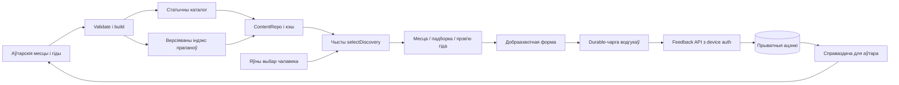

# Падбор прапаноў і непублічныя ацэнкі: тэхнічная спецыфікацыя

Дата: 2026-09-13. Статус: праектны кантракт для рэалізацыі; не апублікаваны API і не міграцыя, якая ўжо выкананая. Прадуктовыя патрабаванні — [20](../20_discovery_and_feedback.md). Задача G01.06 правярае машыначытальныя прыклады і сумяшчальнасць перад G02.01: прыклады ў `fixtures/discovery-contract/`, ліміты схем — §3.2, рашэнне пра envelope каталога — §3.3. Новыя кантракты ніжэй кананічныя ў сваёй сферы; існуючыя правілы Run, гуку, доступу і прагрэсу застаюцца ў [09](09_technical_architecture.md) і зацверджаных выніках G01.

## 1. Рашэнне і альтэрнатывы

| Варыянт | Выгада | Кошт і рызыка | Рашэнне |
|---|---|---|---|
| Толькі подпісы да гідаў | Самая малая рэалізацыя | Не дазваляе выбраць уласныя асобныя месцы, няма вызначанага падбору | Недастаткова для новага аб'ёму |
| Статычны публічны індэкс прапаноў + чысты лакальны падбор + асобныя непублічныя ацэнкі | Даступны без GPS, працуе з кэшу, аўтар кантралюе вынік, водгукі можна выправіць/выдаліць | Патрэбныя новы кантракт індэкса, чарга і аўтарызаваны сервер ацэнак | Абраны праектны падыход |
| Серверны персаналізаваны планавальнік | Дынамічныя планы і ранжыраванне | Новыя зменлівыя даныя, эксплуатацыя, профілі людзей і праблема малой выбаркі | Адкладзена; не ўключаць праз remote config |

Водгук — рэдагуемыя даныя з уласным жыццёвым цыклам. Не запісваць яго толькі як падзею аналітыкі: інакш цяжка змяніць ацэнку, спыніць паўторы і выдаліць яе ўплыў на агрэгат. Паводзінная аналітыка выкарыстоўвае існуючы `/v1/events`; адпраўка водгуку не патрабуе яе згоды і не ўключае яе.

## 2. Межы і ўладальнікі



Стрэлка ад справаздачы да аўтара азначае ручное рэдакцыйнае рашэнне. Аўтаматычнай сувязі DB → публічнае ранжыраванне няма.

| Модуль, планавы шлях | Валодае | Не мае права |
|---|---|---|
| `contracts/discovery.ts` | Тыпы індэкса, прапаноў і запыту | Імпартаваць UI/OS |
| `contracts/feedback.ts` | Дыскрымінаваныя мэты, шкала, прычыны, HTTP-памылкі | Выводзіць аўтара з client `device_id` |
| `core/discovery/selectDiscovery.ts` | Чысты выбар і тлумачэнні | Чытаць GPS, дату, сетку, рэйтынгі або схаваныя preferences |
| `services/contentRepo.ts` | Правераны індэкс і вытворная гатоўнасць | Даць Start на падставе discovery-карткі |
| `controllers/useDiscoveryController.ts` | Выбар чалавека і стан індэкса | Змяніць Run або зрабіць пакупку |
| `services/feedbackRepository.ts` | Уласная ацэнка, чарга, транзакцыі | Чысціць незаменныя даныя разам з кэшам |
| `services/feedbackSync.ts` | Серыялізаваная адпраўка па мэце, retry, auth | Ствараць новы device пасля выдалення дзеля старой чаргі |
| `controllers/useFeedbackController.ts` | Форма, раскрыццё мэты, edit/delete | Адправіць да яўнага націску |
| `supabase/functions/feedback/` | Auth, валідацыя, CAS, ліміты | Давяраць client aggregate/owner/visit proof |
| `tools/feedback-report/` | Унутраная справаздача | Публікаваць сырыя радкі, device IDs або змяняць каталог |

Гэта планавыя production-шляхі. Існуючыя spikes не пераносяцца сюды аўтаматычна. Няма новай падпіскі на GPS, другога плэера, асобнага сервера каталога або кліенцкай LLM.

Трасіроўка палёў пашырэння: вытворца → спажывец → зона даверу.

| Артэфакт / палё | Вытворца | Спажывец | Зона |
|---|---|---|---|
| `catalog.json` + спасылка `discovery_index` | G02.04 publish (з build G02.03) | `services/contentRepo.ts`, discovery-экран | публічная |
| `DiscoveryIndexV1` (offers, themes, collections) | G02.03 build з аўтарскага кантэнту | `selectDiscovery`, `discovery_cache` (derived-зона A), карткі UI | публічная |
| `detail_ref` (`place_public` / `collection_public` / `guide_preview`) | build, правярае шлях супраць public-маніфесту | картка і прэв'ю прапановы | публічная; толькі бяспечныя адносныя шляхі |
| `feedback_target_registry` | publisher (G02.03 → G16.01) | Edge Function feedback — праверка мэты; справаздача | серверная; кліенту не выдаецца |
| `feedback_current`, `feedback_mutations` | Edge Function (CAS) | `read` — толькі ўласны device; справаздача — толькі агрэгаты | прыватная; RLS deny-by-default |
| `feedback_local`, `feedback_outbox` | кліент (форма) | `services/feedbackSync.ts` | прыватная; durable-зона B |
| Транскрыпты, extended-медыяшляхі, сырыя ацэнкі, device IDs | — | — | ніколі не ў індэксе, не ў registry (ён трымае толькі ID/версію/локаль), не ў справаздзе і не ў event_log |

## 3. Аўтарскі кантэнт і публічны індэкс

### 3.1 Ідэнтычнасць

Захоўваюцца `city_id`, `route_id`, `place_id`, `story_id` і `RouteStop.id`; пазіцыя ў падборцы не становіцца ID. Для новай рэдакцыйнай падборкі — стабільны `collection_id`. Спасылкі толькі на афіцыйны KUDY-кантэнт; лакальны імпарт не ўваходзіць у агульныя падборкі або ацэнкі.

`DiscoveryRef` — аб'яднанне `{kind: "guide", route_id, version}`, `{kind: "place", place_id, content_version}` або `{kind: "collection", collection_id, content_version}`. У кожным варыянце дазволены толькі яго палі. Публічная версія Place належыць аўтарскай публікацыі месца, а не версіі выпадковага гіда. Змена месца стварае новую `content_version`; яго стабільны ID захоўваецца.

### 3.2 `DiscoveryIndexV1`

| Поле | Тып і ўмова |
|---|---|
| `schema_version` | literal `1`; невядомую major-версію не інтэрпрэтаваць |
| `revision` | непусты бяспечны ID нязменнага выпуску індэкса |
| `city_id` | вядомы горад; у MVP толькі актыўны Гданьск |
| `themes` | масіў `{id, labels}`; унікальныя ID, лакалізаваныя назвы; ніякіх трох паралельных слоўнікаў |
| `offers` | масіў `DiscoveryOffer`, унікальны `offer_id` |
| `collections` | масіў рэдакцыйных груп; членамі могуць быць толькі place/guide, без укладзеных collections |

`DiscoveryOffer` змяшчае: `offer_id`, `ref`, `city_id`, `editorial_order` (цэлы лік ≥ 0), `themes[]`, `localized` (загаловак, анонс, `why_recommended`, `conditions`), `estimated_duration?`, `distance_m?`, `suggested_start_place_id?`, `season_recommendations[]`, `availability`, `access`, `detail_ref`.

- `estimated_duration = {min_minutes, max_minutes, basis}`: цэлыя дадатныя хвіліны, min ≤ max; `basis = author_walk | author_estimate`. Гэта ўвесь прапанаваны досвед ад рэкамендаванага пачатку, уключаючы хаду, аўдыё і аўтарскі запас на прыпынкі. Не дарога да пачатку. Адсутнасць значыць unknown.
- Існуючыя `Route.duration_min`/`distance_m` застаюцца ацэнкай неабавязковага рэкамендаванага шляху. Для guide-прапановы новы дыяпазон мусіць уключаць `duration_min`; builder не дазваляе супярэчлівыя лічбы. Няма `time_bucket` як другой крыніцы працягласці.
- `season_recommendations = [{season: spring|summer|autumn|winter, reason: localized_text}]`; пусты масіў = not_assessed. Гэта прыдатнасць па меркаванні аўтара, не open-now. Няма аўтаdefault усіх сезонаў.
- `availability = {text_locales[], audio_locales[]}` вылічаецца з апублікаванага зместу. Картка не атрымлівае локаль толькі таму, што перакладзены загаловак. Для collection тэкст яе апісання і картак яе членаў мусіць быць даступны; аўдыё самой collection няма (`audio_locales` заўжды `[]`). Тэмы могуць несці `labels` на любой мове allowlist да таго, як offer апублікуе гэтую мову.
- `access = free | paid | mixed`. Guide — з кантракту прадукта/пласта; Place як самастойная картка — бясплатны публічны змест; collection — mixed пры любым платным члене, інакш free. Ніякіх hardcoded цэн або новага product_id для collection.
- `detail_ref` — ўнутраная тыпізаваная спасылка на вядомае прэв'ю або правераны public-файл месца. Не адвольны fetch URL. Няма поўных платных тэкстаў, транскрыптаў, медыяшляхоў extended або сырых ацэнак у індэксе.
- `audience_level` застаецца незалежным атрыбутам гісторыі/кропкі з `01`. G02.01 узгадняе яго з кантрактам кантэнту; у крытэрыі часу або доступу ён не пераносіцца.

Collection захоўвае `collection_id`, `content_version`, лакалізаванае апісанне, `members: DiscoveryRef[]` (толькі guide/place) і ўласную аўтарскую ацэнку часу. Парадак рэкамендаваны. Валідатар адхіляе дублікаты member ref і чужыя гарады. Уключаны гід і яго месца патрабуюць тэкставага тлумачэння, што гэта той самы досвед, а не два абавязковыя наведванні: калі члены ўтрымліваюць гід G і месца P, дзе P роўнае `suggested_start_place_id` апублікаванай guide-прапановы G, collection мае абавязковае лакалізаванае `overlap_note` (тыя ж ліміты даўжыні, што і `why_recommended`); адсутнасць гэтага поля ў такім складзе — памылка валідатара (`index-invalid-missing-overlap-note.json`).

**Ліміты схем і памер карыснай нагрузкі** (фіксуе G01.06 у `fixtures/discovery-contract/`; G02.01/G02.02 правяраюць дакладна іх, G15.01/G15.03 лічаць іх актыўнымі на ўваходзе). Мэта — вядомая верхняя мяжа да парсінгу: індэкс ≤ 512 KiB парсіцца пры ўваходзе ў горад за адзінкі мілісекунд і на кароткі момант трымае ≲ 2 MiB кучы, а `discovery_cache` у derived-зоне A не патрабуе асобнага бюджэту, бо ўвесь файл замяняецца адным запісам-паказальнікам у каталозе. Неабмежаваныя масівы і радкі дазволілі б збою build або падмененыму CDN-адказу стварыць нечаканы памер, таму кожная структура мае свой ліміт.

| Аб'ект | Ліміт |
|---|---|
| `offers` на адзін індэкс | ≤ 64 |
| `collections` на адзін індэкс | ≤ 32 |
| `members` у collection | ≤ 50, без дубляў |
| `themes` на адзін індэкс / тэм на offer | ≤ 32 / ≤ 8 |
| лакалаў на `labels`, `localized` і тэкст прычыны | ≤ 8; allowlist BCP-47 MVP = `be`, `en`, `uk`; `pl` і `de` зарэзерваваныя і не ўваходзяць |
| `title` | ≤ 140 знакаў |
| `summary`, `why_recommended`, `conditions`, `description`, `overlap_note` | ≤ 400 знакаў |
| `reason` сезоннай рэкамендацыі | ≤ 280 знакаў |
| `editorial_order` | цэлы лік 0–9999 |
| `estimated_duration` | цэлыя хвіліны, 1 ≤ min ≤ max ≤ 1440; для guide дыяпазон уключае `duration_min` |
| `distance_m` | ≤ 100000 |
| ідэнтыфікатары (`offer_id`, `place_id`, `collection_id`, `theme_id`, `route_id`) і `revision` | ≤ 64 знакаў з `[a-z0-9._-]` |
| файл індэкса | ≤ 512 KiB; каталог правярае `bytes` і `sha256` да загрузкі |

Негатыўныя прыклады лімітаў — `index-invalid-limits.json` (адзін named overflow на кожную мяжу) і `catalog-invalid-oversized.json` (`bytes` = 524289, адхіленне да fetch). Ліміт ≤ 8 лакалаў на аб'ект нельга незалежна перапоўніць пры 3 кодах allowlist; G02.01 усё роўна кадзіруе max 8.

Feedback-ліміты (8 KiB цела, максімум 3 унікальныя прычыны, 30/120 запытаў у хвіліну) зададзеныя ў §5.3 і тут не дублююцца.

### 3.3 Публікацыя, каталог і сумяшчальнасць

Існуючы `catalog.json` атрымлівае апцыянальную спасылку `discovery_index: {schema_version, revision, path, bytes, sha256}` на адпаведны гораду файл `public/discovery/<city_id>/<revision>/index.json`. **Рашэнне G01.06 пра envelope каталога (выконвае G02.01):** `catalog.json` — версіяваны envelope `{catalog_schema_version: 1, generated_at?, routes: [...], discovery_index?}`. Route-запісы (спіс «што існуе» з `09`, разд. 4) жывуць у масіве `routes` без зменаў сваёй формы; палі горада або індэкса не дадаюцца да асобных route-запісаў. Каталёг без `discovery_index` (fixture `catalog-legacy.json`) — паўнапраўны ўвод для звычайных гідаў. Палітыка reader: невядомыя палі верхняга ўзроўню ігнаруюцца; невядомая major-версія `catalog_schema_version` не інтэрпрэтуецца — працуе толькі route-спіс, discovery не падцягваецца, Run не блакуецца; босы масіў route-запісаў (legacy v0, fixture `catalog-legacy-v0.json`) чытаецца як каталог без discovery. Поле `path` у `discovery_index` — адносны шлях ад публічнага origin/CDN (без прэфікса `public/`); файл на дыску жыве ў `public/discovery/<city_id>/<revision>/index.json`. Route-запіс трымае `sizes` (па пластах), не `bytes`; `bytes` застаецца ў `discovery_index` як памер файла індэкса. Памер і хэш індэкса правяраюцца да загрузкі; нязгода адкрывае папярэдні валідны кэш, а не збой.

Парадак публікацыі: праверыць усе refs і public/private → запісаць нязменныя public-файлы месцаў/індэкса і патрэбныя пакеты → праверыць hash/size → абнавіць каталог апошнім крокам. Адкат вяртае папярэдні каталог і яго індэкс. Аўтарскі парадак і метаданыя падбору жывуць у індэксе: іх змена не патрабуе новай версіі кожнага route-бандла. Змена самой гісторыі або аўдыё патрабуе новай версіі адпаведнага бандла.

Стары каталог без discovery спасылкі застаецца прыдатным для звычайных гідаў. Невядомы schema, сапсаваны індэкс або адсутны файл не знішчаюць апошні валідны кэш і не блакуюць гатовы Run. Калі кэшу няма, паказваецца звычайная старонка горада без новага падбору. Кліент не запытвае індэкс з адвольнага host: толькі сканфігураваны public origin, HTTPS і правераны адносны шлях.

Шляхі, ID, URL і тэксты — недавераны ўваход нават з CDN. Толькі бяспечныя сегменты, allowlist палёў, абмежаванні памеру, колькасці прапаноў і даўжыні радкоў; канкрэтныя ліміты G01.06 запісвае ў схему з негатыўнымі прыкладамі. Ніякага выканальнага HTML. Гэты праект не дадае і не пашырае гістарычны прыняты рызык подпісу бандлаў у `09`.

## 4. Дэтэрмінаваны падбор

```typescript
type DiscoveryCriteria = {
  city_id: string;
  content_locale: string;
  max_minutes?: number;
  theme_ids: readonly string[];
  preferred_season?: "spring" | "summer" | "autumn" | "winter";
};
type DiscoveryResult = {
  exact: readonly DiscoveryMatch[];
  alternatives: readonly DiscoveryMatch[];
};
type DiscoveryMatch = {
  offer_id: string;
  reasons: readonly ("editorial" | "theme_match" | "within_time" | "season_recommended")[];
  differences: readonly ("duration_unknown" | "over_time" | "theme_mismatch" | "season_unassessed" | "season_not_recommended")[];
};
function selectDiscovery(index: DiscoveryIndexV1, criteria: DiscoveryCriteria): DiscoveryResult;
```

Інтэрфейсы — спецыфікацыя, не ўжо створаныя TS-файлы. Схема `DiscoveryIndexV1` з §3 павінна быць рэалізаваная ў G02.01; функцыя ў G15.01. Правілы ў фіксаваным парадку:

1. Невядомыя тэмы/локаль, неканечны або недадатны `max_minutes` адхіляюцца на мяжы кантролера. Ядро атрымлівае валідныя тыпы.
2. Выключыць чужы горад, неапублікаваныя/некарэктныя refs і прапановы без запытанай мовы зместу. Гэтыя абмежаванні не паслабляюцца ў alternatives. Мову UI выбіраюць асобна.
3. Пустыя `theme_ids` не абмяжоўваюць; непустыя — супадзенне хаця б адной тэмы (OR). Час і сезон да тэм прымяняюцца праз AND. Семантыка відаць у UI.
4. Для дакладнага часу патрэбна вядомая `max_minutes` прапановы ≤ запытанаму ліміту. Unknown або перавышэнне — толькі alternatives з прычынай.
5. Яўна выбраны сезон дае exact толькі пры рэкамендацыі аўтара для гэтага сезона. Без выбару сезон не ўплывае. Дата прылады не чытаецца.
6. Супадзенне ўсіх выбраных умоў → exact; астатнія дапушчальныя мовы/горада → alternatives. Абодва спісы сартаваць па `editorial_order`, затым `offer_id` для стабільнасці; адзін ref паказваць адзін раз. Платнасць і зоркі не ўплываюць.
7. UI паказвае exact, калі яны ёсць. Alternatives прапануе толькі пры нулі exact або яўным адкрыцці «Іншыя варыянты», з differences. Няма парога два або аўтаматычнага аслаблення запыту.

Падборка не генеруе новы Run/route_id/polyline. `suggested_start_place_id` не забараняе пачаць гід з іншай кропкі. Час «ад мяне» і сігналы nearby не ўваходзяць у гэтую функцыю; R07 па-ранейшаму мае свайго ўладальніка.

## 5. Водгукі: семантыка і захаванне

### 5.1 Мэта і шкала

`FeedbackTarget` = `{kind: "guide", route_id, version, locale}` або `{kind: "place", place_id, content_version, locale}`. `locale` — мова выкарыстанага зместу, не мова прылады. Версія гіда бярэцца з фактычнага выкарыстання/замацаванай сесіі, не са свежага каталога. Для Place — версія адкрытай карткі; падчас формы яе не падмяняюць.

Шкала — цэлы лік 1–5, без default. Прычыны з замкнёнага спісу: guide — `interesting_stories`, `clear_delivery`, `too_long`, `hard_to_navigate`, `audio_problem`, `description_mismatch`; place — `worth_visiting`, `description_mismatch`, `hard_to_reach`, `access_problem`. Максімум 3 унікальныя прычыны, толькі для свайго kind. Ацэнка гіда — усяго досведу; ацэнка месца — фізічнага месца. Не агрэгаваць іх разам. Ацэнкі асобных Story і Collection не ўваходзяць у гэты выпуск.

Адна актуальная ацэнка на `(authenticated_device, target_kind, target_id, target_version, locale)`. Рэдагаванне замяняе ацэнку, паўторная прагулка той самай версіі не стварае яшчэ адзін голас. Новая версія/мова мае асобны ключ; справаздача паказвае гэта. Гэта ўстаноўка дадатку, не правераны ўнікальны чалавек; пераўстаноўка можа даць новы голас. Публічных сцвярджэнняў «правераныя пакупнікі/наведванні» няма.

### 5.2 Серверныя табліцы

| Табліца | Полі / індэксы | Прызначэнне |
|---|---|---|
| `feedback_target_registry` | ключ target-kind/id/version/locale, status, published_at | Давераны пералік апублікаваных мэт і гістарычных версій; запаўняе publisher, кліент не піша |
| `feedback_current` | device FK, target key, `revision`, nullable `score`, `reason_codes`, `updated_at`, `deleted_at?`; UNIQUE(device,target key) | Актуальная ацэнка або tombstone выдалення |
| `feedback_mutations` | device FK, `mutation_id`, payload hash, target key, выніковая revision, created_at; UNIQUE(device,mutation_id) | Ідэмпатэнтны retry без паўторнага голасу |

`score = null` толькі ў выдаленым радку; у tombstone няма прычын або мінулага score. Серверны час, уладальнік і revision не прымаюцца як праўда ад кліента. Усе табліцы маюць RLS, deny-by-default для anon/authenticated роляў мабільнага кліента. Edge Function мае вузкія аўтарызаваныя аперацыі, `device_secret` правяраецца існуючым G08.01. Service key ніколі не трапляе ў кліент або справаздачу.

Registry утрымлівае толькі ID/версію/локаль, без прыватнага зместу. Недаступнасць праверкі → 503, невядомая мэта → 422. Апублікаваныя старыя версіі прымаюцца; зняцце з discovery не сцірае ўжо пакінуты водгук. Імпартаваныя або выдуманыя ID адхіляюцца. Device-delete мае FK cascade да current/mutations; транзакцыя feedback правярае жывую прыладу, таму паралельнае выдаленне не пакідае сірот. Фікстура `feedback-cases.json`: масіў `targets` — registry allowlist; `unknown_targets` — імпартаваныя ці зарэзерваваныя ID, якія мусяць атрымаць 422 (`ext-osm-981723`, `pl`).

**Першая публікацыя да feedback-сервера.** G02.03 генеруе нязменны registry-экспарт, G02.04 захоўвае яго разам з release-маніфестам; наяўнасць feedback-табліц не патрэбная, каб выпусціць першы гід. G16.01 імпартуе мэты з правераных ужо апублікаваных release-маніфестаў і толькі пасля гэтага дазваляе кліенцкі збор. Пасля ўключэння feedback publisher рыхтуе registry-запісы са status `prepared`, абнаўляе каталог і пераводзіць іх у `published` толькі пасля праверкі выпуску. Збой паміж гэтымі крокамі аднаўляецца паўторнай праверкай manifest/catalog; `prepared` не прымае ацэнкі (503), ранейшыя published-мэты працуюць. Адкат не сцірае гістарычныя published-мэты або водгукі. Ні кліент, ні адвольная URL-спасылка не могуць напоўніць registry. Так G02.04 не залежыць цыклічна ад гатовай UI/feedback-рэалізацыі.

**Якія рэвізіі мэтаў рэгіструе publisher.** На кожны апублікаваны выпуск registry атрымлівае ўсе мэты, якія фактычна ўваходзяць у release-маніфест: guide — `{route_id, version, locale}` для кожнай locale з апублікаваным тэкстам гіда (у гэтым наборы `uk` — толькі тэкст, без аўдыё); place — `{place_id, content_version, locale}` для апублікаванай public-праекцыі месца. Гістарычныя версіі, апублікаваныя раней і саступленыя новай, застаюцца ў registry і працягваюць прымаць водгукі паводле §5.1. Collection і асобныя Story мэтаў водгуку ў гэтым выпуску не маюць. Рэгістрацыя ідзе ў тым жа парадку `prepared → published`, што і першая публікацыя вышэй; рэвізія ў водгуку кліента бярэцца з фактычна выкарыстанай версіі, а не са свежага каталога.

### 5.3 API і канкурэнтнасць

Усе запыты — `Bearer <device_secret>`, TLS, без сакрэтаў у URL. Новыя endpoints не даюць доступу да кантэнту.

| Метад / шлях | Запыт | Вынік |
|---|---|---|
| `POST /v1/feedback/read` | `{target}` | Толькі ўласны `{revision, score, reason_codes, deleted}`; адсутнасць → revision 0, score null |
| `PUT /v1/feedback` | `{mutation_id, target, expected_revision, score, reason_codes, disclosure_version}` | CAS-замена або стварэнне, `{revision, saved: true}` |
| `POST /v1/feedback/delete` | `{mutation_id, target, expected_revision}` | CAS-tombstone, `{revision, deleted: true}` |

CAS — запіс толькі калі актуальная revision роўная expected_revision. Revision 0 дазваляе стварыць толькі адсутны радок. У адной транзакцыі: auth/live-device → idempotency lookup → праверка target → lock current/unique-key → CAS → increment revision → запіс mutation → commit. Аднолькавы mutation_id і payload вяртаюць той жа вынік; іншы payload з тым жа ID → 409. Калі revision ужо змянілася → 409, нічога не перазапісваць. Кліент чытае актуальны ўласны стан і паказвае канфлікт, не абыходзіць яго бясконцым аўтаretry.

Коды: 401 няправільны/выдалены device; 409 revision/idempotency conflict; 413 перавышаны памер; 422 невалідная шкала/мэта/прычына/disclosure; 429 ліміт з `Retry-After`; 503 часовая немагчымасць праверыць або захаваць. Поспех толькі пасля commit. Няма 200 для чаргі ў памяці сервера.

Пачатковыя тэхнічныя ліміты: 8 KiB на цела, 30 feedback-запытаў у хвіліну на device, 120 у хвіліну на IP. Гэта параметры абароны сэрвісу, не доказ унікальнасці людзей; агульны IP можа абмежаваць легітымных людзей, таму 429 мае зразумелы retry. Не ўводзіць fingerprinting, GPS-доказ або новы акаўнт дзеля зорак.

### 5.4 Лакальны стан і offline

`feedback_local` і `feedback_outbox` — SQLite durable-зона B. Першае захоўвае target, acknowledged revision/score, чарнавік і стан; другое — operation/mutation ID, expected_revision, payload, disclosure_version, created_at і transport-state. Сакрэт застаецца ў SecureStore. `discovery_cache` — аднаўляльная зона A.

Яўны Send транзакцыйна захоўвае чарнавік і аперацыю перад сеткай. Да Send сервернага запісу няма. Кожная мэта мае максімум адзін in-flight запыт; рэдагаванне падчас адпраўкі захоўваецца як наступнае жаданае значэнне, не мяняе payload існуючага mutation. Пасля ACK наступная аперацыя атрымлівае новую expected_revision. Згублены ACK → retry таго самага mutation. Restart аднаўляе чаргу; позні ACK не перацірае новы лакальны чарнавік.

Станы: draft → pending → sending → sent; часовы збой вяртае pending; 409 → conflict; 401/422 → action_required. UI адрознівае захаванне на прыладзе і серверы. Выдаленне яшчэ не адпраўленага чарнавіка ачышчае яго; калі запыт мог дасягнуць сервера, спачатку высветліць яго вынік, затым адправіць CAS-delete. Пакуль delete не пацверджаны, паведамляць «выдаленне чакае сеткі».

Паўторная адпраўка з backoff 2, 4, 8… секунд, мяжа 5 хвілін, з jitter; выконваць толькі пры сетцы і незаблакаваным device. Чарга спыняе аўтаадпраўку праз 7 дзён: прапануе пацвердзіць адпраўку актуальнага водгуку або сцерці, не адправіць стары нечакана. 401 не запускае аўтарэгістрацыю дзеля старой чаргі. Новая ўстаноўка не абяцае аднавіць старыя ацэнкі.

## 6. Прыватнасць, выдаленне і справаздача

Форма з версіяваным тэкстам раскрыцця мэты і кнопкай Send — асобнае яўнае дзеянне. `disclosure_version` правяраецца серверам супраць дазволеных версій; deprecated тэкст патрабуе новага пацверджання перад адпраўкай. Гэта не тэхнічны доказ юрыдычнай адпаведнасці; праверка рэлізных паведамленняў застаецца ў G11.04. Згода на аналітыку не патрэбная і не змяняецца. Адкліканне аналітыкі спыняе events; для водгукаў ёсць уласнае delete і агульнае device-delete.

У feedback няма GPS, трас, session_id, дакладнага часу наведвання, імёнаў, тэкставых каментароў, ключоў або прыватнага зместу. Target ID усё роўна звязвае чалавека з ацэненым месцам; гэта не называецца ананімнасцю. Не выводзіць фізічную прысутнасць з водгуку або ручнога Play.

Current, tombstones і mutation-дэдуплікацыя захоўваюцца не даўжэй 14 месяцаў з апошняй змены (існуючая верхняя мяжа назіранняў у `09`). Tombstone захоўвае толькі службовую ідэнтычнасць/revision для пазбягання позніх перазапісаў; пасля retention GC старое expected_revision > 0 атрымлівае conflict. Аўтаretry абмежаваны 7 днямі, не 14 месяцамі. Праз агульнае device-delete выдаляюцца адразу current/mutations, outbox, draft, уласныя ацэнкі і disclosure-стан; загружаны кантэнт і прагрэс не чысцяцца гэтым пашырэннем. Лакальны пералік водгукаў пасля выдалення не выкарыстоўваецца для аўтаматычнага аднаўлення сервера.

Справаздачы будуюцца запытам па актуальных невыдаленых радках, а не інкрэментальным лічыльнікам без адкату. Выдаленне або рэдагаванне адразу змяняе наступны разлік. Захаваныя feedback-агрэгаты не перажываюць выдаленне зыходных радкоў у першым выпуску. Экспарт не ўключае device IDs, mutation IDs або сырыя прыватныя водгукі. Захаваныя экспарты маюць перыяд і час разліку; runbook патрабуе іх выдалення/перастварэння пры data-delete, без публічных копій.

Аўтар чытае справаздачу праз існуючы адміністрацыйны доступ Supabase з MFA, не праз мабільны device-secret. SQL выкарыстоўвае асобную read-only аперацыю агрэгацыі з праверкай адміністрацыйнай ролі; public grants адсутнічаюць. Для MVP не патрэбныя асобны вэб-кабінет або новая сістэма адміністратараў. Запыт паказвае target/version/locale, count, mean, гістаграму 1–5 і reason counts. Не змешвае guide/place; агрэгат па розных версіях толькі яўны і падпісаны.

## 7. Назіранні пра падбор

G01.05 пашырае існуючы allowlist падзей: `discovery_offer_shown`, `discovery_offer_opened` з `{discovery_revision, offer_id, kind, content_locale, surface}` і апцыянальным бакетам часу. `surface = discovery | collection`. Няма каардынат, saved preference profile або сырых выбараў усіх інтарэсаў. `event_id` і transport — існуючы G09.

Shown залічваецца пры фактычнай бачнасці, адзін раз на offer у foreground-паказе паверхні. Адкрыццё гіда далей ідзе ў існуючы route_preview; не выдаваць адкрыццё за пакупку, Start або наведванне. У consent-denied стане выбар працуе, events не адпраўляюцца. Feedback не дублюецца ў events. Колькасць паказаў і ацэнак не лічыцца адной поўнай выбаркай.

## 8. Лакалізацыя

`uk` у рэестры запланаваных локаляў не азначае `published`. Адрозніваць `ui_locales`, `text_locales`, `audio_locales`; `authoring_locale=be` і `fallback_locale=en` захоўваюцца. Пераклад карткі не робіць украінскім поўны гід. Тэкставы fallback можа паказаць фактычную мову з магчымасцю змяніць выбар; exact discovery па яўнай мове не падмяняецца.

Start фіксуе фактычную locale поўнага гатовага аўдыёпакета. Калі на `uk` ёсць толькі тэкст, прапануюцца чытанне і яўны выбар наяўнай мовы аўдыё; `uk` не падстаўляецца ў AccessReady без файлаў. Змена мовы UI або індэкса не змяняе locale/version active/paused Run. Feedback захоўвае мову ацэненага кантэнту.

Новы пераклад патрабуе таго ж claims/review/license працэсу G03.01–G03.04. Цэны/entitlements не дублююцца паводле мовы; grant працягвае правяраць route/version/locale/tier. Выпуск украінскай і яго парадак — G14.04.a, не маўклівая змена стартовага BE-аўдыё.

## 9. Праверкі і збойныя сцэнары

| Праверка | Чаканы доказ | Уладальнік |
|---|---|---|
| Змешаны індэкс: guide/place/collection; дубль refs, укладзеная collection (якая структурна выключае і цыкл), чужы горад | Схема і builder адхіляюць неваліднае; адзін нарматыўны прыклад кожнага kind; негатыўныя прыклады — `fixtures/discovery-contract/` | G01.06, G02.01–G02.03 |
| 60 хв супраць [45,75], unknown time, theme OR, season unknown | Unit-тэсты exact/alternatives і стабільнага парадку; няма ўплыву платнасці | G15.01 |
| Стары каталог, hash mismatch, offline restart, rollback | Працуе валідны кэш або звычайныя гіды; Run не мяняецца | G02.04, G15.03–G15.04 |
| 5 зорак замест 6; дроб 3.5; wrong-kind reason; падроблены target/device | 422/401, у БД няма змены; cross-device read/delete немагчымы | G16.01 |
| Duplicate mutation / lost ACK / старое expected_revision / delete race | Адна ацэнка; 409 не перазапісвае; няма сірот або ўваскрашэння device | G16.01–G16.02 |
| Offline send/edit/delete → kill → restart | Захоўваецца апошняе жаданае значэнне; стан адпраўкі сумленны; кэш не чысціць outbox | G16.02–G16.03 |
| Палітыка RLS з anon/authenticated ключом | Ні прамога INSERT/SELECT, ні чытання чужой ацэнкі | G16.01 |
| Analytics denied + яўны feedback send | Няма events; адзін feedback; playback/download не блакуюцца | G16.03–G16.04 |
| Device-delete / retention / пераразлік | Сырыя ацэнкі і ўплыў у справаздачы выдаленыя, загрузкі захаваныя | G16.04 |
| UK-тэкст без аўдыё / новая версія падчас Run | Няма фальшывага Start і падмены locale; feedback на старую выкарыстаную версію | G15.04, G16.03, G14.04.a |

Рэальныя міграцыі, auth, захаванне і runtime-паводзіны патрабуюць Showboat паводле палітыкі праекта. Напісанне гэтай спецыфікацыі не даказвае працу API, SQL, платформы або адпраўкі.

## 10. Сумяшчальнасць і парадак укаранення

Спачатку G01.06 → існуючы G02.01 з дапоўненым кантрактам → validator/build/publish. Выхад G01.06, які спажывае G02.01: фікстуры `fixtures/discovery-contract/` (валідныя і негатыўныя прыклады), ліміты §3.2 і рашэнне пра envelope каталога §3.3. Discovery ўводзіцца праз апцыянальны каталогавы індэкс, таму старое прайграванне не залежыць ад яго. Feedback DB/API разгортваюцца да кліенцкай формы; няўдалая адпраўка не ўваходзіць у крытычны шлях прагулкі. Міграцыі additive: новыя табліцы і FK, без перапісвання session або выдалення старых данных. Адкат кліента захоўвае durable-табліцы; адкат сервера адключае прыём, але не дропае ацэнкі. Runbook фіксуе бэкап і аднаўленне перад міграцыяй.

Змены не закрываюць P01/P02, не выбіраюць бібліятэку карты і не дадаюць акаўнт. Статычны discovery-index дазволены ў межах `09` §17; дынамічны сервер-каталог застаецца забаронены. Feedback endpoints — вузкае новае пашырэнне, не moderation API і не рэйтынгавы сэрвіс для агульнага доступу. Будучая аўтаматычная перастаноўка мае асобны G14.08 з доказам паляпшэння і адкатам.
